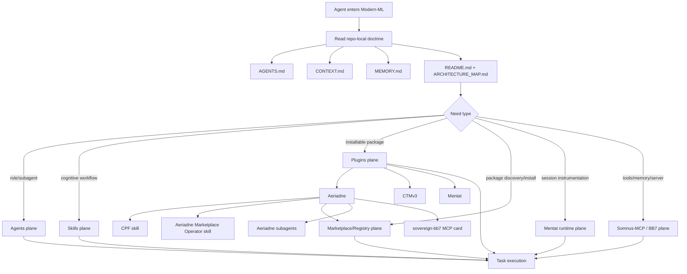
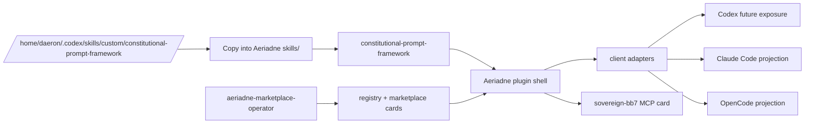

# ARCHITECTURE_MAP.md — Modern-ML Onboarding / Marketplace Stack

## Purpose

This document explains **how the stack fits together**, not just where the files live.

`Modern-ML` is the onboarding and private-marketplace staging layer Daeron uses so coding agents can function inside a larger sovereign ML ecosystem. The repo is therefore a topology map for agents, plugins, skills, marketplace registry surfaces, and MCP/server references — not a monolithic product repo.

If `5-22-2026-modernMlTools-filetree.md` is an older inventory snapshot, this file is the current interaction map. Prefer `CONTEXT.md` and `MEMORY.md` for latest state when historical inventory wording conflicts.

---

## One-Sentence Model

**Modern-ML is the visible onboarding shell around six planes:**

1. **Agents** tell an LLM what role/subagent workstream to assume.
2. **Skills** encode reusable cognitive workflows.
3. **Plugins** package skills/runtime affordances into installable surfaces.
4. **Marketplace/Registry** makes packages discoverable and installable later.
5. **Mentat** instruments the local coding session as a plugin/runtime substrate.
6. **Somnus-MCP / BB7** exposes the canonical server/MCP tool plane.

---

## Hard Ontology

These are not interchangeable:

- **Skill != plugin**
  - A skill shapes cognition and task entry.
  - A plugin is an installable/distribution/runtime package shell that may contain skills.

- **Agent prompt != skill**
  - An agent prompt defines a role or subagent workstream.
  - A skill defines a reusable cognitive workflow with trigger rules and references.

- **MCP/server card != vendored server**
  - A card documents canonical server/tool-plane capabilities.
  - It must not copy runtime DBs, auth files, data roots, or server source unless explicitly building a server package.

- **Mentat != Somnus-MCP / BB7**
  - Mentat is a plugin/runtime substrate.
  - Somnus-MCP / BB7 is the active MCP/tool/server plane.

- **Aeriadne != CTMv3 != Mentat**
  - Aeriadne handles CPF, marketplace packaging, and meta-operator capabilities.
  - CTMv3 handles workspace activation/codebase topology.
  - Mentat handles live session instrumentation and runtime state.

---

## Canonical Planes

### 1) Agents Plane

**Path:** `Agents/`  
**Typical canonical source:** `/home/daeron/.claude/agents/`

Purpose:

- inject role/posture
- define subagent workstreams
- constrain evidence and final report shapes
- support no-hierarchy parallel work

Use this plane when the question is:

- *What kind of operator/subagent should the model be right now?*

Aeriadne also stages package-specific subagent prompts under `Plugins/Aeriadne/agents/subagents/`.

### 2) Skills Plane

**Path:** `Skills/` and package-local `*/skills/` directories  
**Mixed source reality:** some local, many symlinked/mirrored from external roots.

Purpose:

- encode domain topology
- define entry vectors
- preserve prompt/constitution/package workflows
- provide failure grammar, references, tests, scripts, and templates

Use this plane when the question is:

- *Which reusable cognitive workflow should be activated?*

Important Aeriadne skills:

- `Plugins/Aeriadne/skills/constitutional-prompt-framework/`
- `Plugins/Aeriadne/skills/aeriadne-marketplace-operator/`

### 3) Plugin / Package Plane

**Path:** `Plugins/`

Purpose:

- package skills and runtime affordances
- provide client metadata and install surfaces
- stage local/private plugin packages before install
- preserve distribution boundaries and provenance

Current primary plugin/package surfaces:

```text
Plugins/
├── Aeriadne/               # CPF + marketplace operator (skill-activated)
├── Cognitive-Topology-Map/ # CTMv3 workspace activation / topology
├── Mentat/                 # live session/runtime substrate
└── old/                    # archived (Codex-Config-Topology, Parallax-Narthex, CPF-Plugin-Ariadne)
```

Use this plane when the question is:

- *What installable package or runtime support surface am I dealing with?*

### 4) Marketplace / Registry Plane

**Current package-local proof:** `Plugins/Aeriadne/registry/` and `Plugins/Aeriadne/marketplace/`  
**Future root-level direction:** `Registry/`, `Marketplace/`, `Adapters/`, `MCP/`

Purpose:

- index plugins, skills, agents, and MCP/server cards
- separate machine-readable registry from human-readable marketplace cards
- map canonical packages to Codex, Claude Code, and OpenCode adapters
- support future local/private marketplace installation flows

Use this plane when the question is:

- *How do packages become discoverable, validated, installable, or portable across clients?*

### 5) Mentat Runtime Plane

**Path:** `Plugins/Mentat/`

Purpose:

- watch the live coding session
- track state transitions
- detect drift
- persist session-level intelligence
- expose reflection/dispatch/debrief surfaces

Use this plane when the question is:

- *How is the coding session itself being instrumented and governed?*

### 6) Server / MCP Plane

**Active canonical root:** `/home/daeron/Somnus-MCP`  
**Active data root:** `/home/daeron/Somnus-MCP/data`

Purpose:

- expose BB7/Sovereign tool capabilities
- provide memory/context resurrection
- provide file/context persistence
- provide session continuity and provenance
- provide cognitive routing and orchestration

Use this plane when the question is:

- *What tools / memory / orchestration substrate is the agent actually using?*

`Servers/Muaddib -> /home/daeron/Repositories/Muaddib` remains a visible legacy mirror/symlink artifact. Do not treat it as the active Codex server root unless specifically working on that mirror.

---

## Interaction Flow



Core meaning:

- **Agents** shape posture/workstreams.
- **Skills** shape understanding and workflows.
- **Plugins** shape installable/runtime/distribution surfaces.
- **Marketplace/Registry** shapes discoverability and portability.
- **Mentat** shapes the live session.
- **Somnus-MCP / BB7** shapes tool affordances and continuity.

None of these layers alone is the full onboarding solution.

---

## Cold-Entry Protocol

Read in order:

1. `AGENTS.md`
2. `CONTEXT.md`
3. `MEMORY.md`
4. `README.md`
5. `ARCHITECTURE_MAP.md`
6. `ECOSYSTEM_ADOPTION_MAP.md`
7. `REPO_ENTRY_MATRIX.md`

Then branch:

- **Need constitution/prompt/private-marketplace packaging?** → `Plugins/Aeriadne/`
- **Need workspace activation/topology?** → `Plugins/Cognitive-Topology-Map/`
- **Need runtime/session instrumentation?** → `Plugins/Mentat/`
- **Need active MCP/server/tool plane?** → `/home/daeron/Somnus-MCP`
- **Need legacy Codex-Config-Topology?** → `Plugins/old/Codex-Config-Topology/`

---

## Aeriadne Package Flow



Expected future Codex exposure after install:

```text
aeriadne:constitutional-prompt-framework
aeriadne:aeriadne-marketplace-operator
```

---

## Failure Signatures

Slow down if you see any of these:

- A plugin described as replacing BB7/SovereignMCP.
- Aeriadne docs claiming installed status without `codex plugin list` / prompt-input evidence.
- Legacy `cpf-plugin-ariadne` installed alongside `aeriadne` unintentionally.
- BB7/SovereignMCP copied into `Plugins/Aeriadne/` instead of cataloged as canonical reference.
- `Skills/` described as all-local.
- `Servers/Muaddib` cited as active Codex server root instead of `/home/daeron/Somnus-MCP`.
- Client adapters treated as canonical source.

---

## Recommended Next Step

The repo now has a clean 3-plugin core: Aeriadne, CTMv3, Mentat. The next structural decision is:

- **Install** `aeriadne@local` using the proven local marketplace/cache pattern (same as `codex-config-topology@local`).
- **Or restructure first**: promote `Plugins/Aeriadne/registry/` and `Plugins/Aeriadne/marketplace/` to root-level `Registry/` and `Marketplace/` as the Modern-ML private-marketplace surface expands.
- The `Servers/` plane should gain a live pointer to `Somnus-MCP` so future cold-entry agents do not default to the legacy Muaddib wording.
