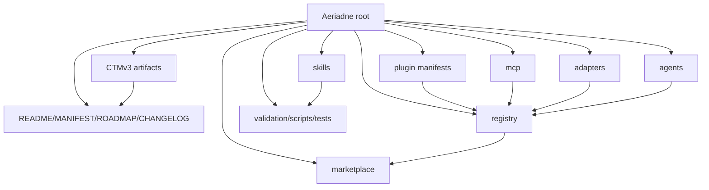

# ARCHITECTURE_MAP.md - Aeriadne

Purpose: traversal map for agents entering Aeriadne cold or warm. This is not a summary; it answers where to go for specific questions.

Root: `/home/daeron/Projects/Modern-ML/Plugins/Aeriadne`
Workspace role: outside staging/package surface for review and copy/paste
Canonical review repo: `/home/daeron/Repositories/Somnus-Intellligence-Stack/`

## Fast Entry

| Question | First file | Then read |
| --- | --- | --- |
| What is Aeriadne? | `README.md` | `MANIFEST.md`, `TOPOLOGY.md` |
| Is it installed? | `README.md` current status | `validation/validation_report.md`, `registry/aeriadne.plugin.json` |
| What does it package? | `MANIFEST.md` | `skills/*/SKILL.md`, `plugin.toml` |
| What is canonical package truth? | `plugin.toml` | `plugin.json`, `.codex-plugin/plugin.json`, `.claude-plugin/plugin.json` |
| What is machine-readable marketplace state? | `registry/plugins.yaml` | `registry/skills.yaml`, `registry/agents.yaml`, `registry/mcp_servers.yaml`, `registry/aeriadne.plugin.json` |
| What is the readable marketplace browse layer? | `marketplace/README.md` | `marketplace/cards/`, `marketplace/indexes/` |
| How does Codex/Claude/OpenCode consume it? | `adapters/README.md` | `adapters/codex/README.md`, `adapters/claude-code/README.md`, `adapters/opencode/README.md` |
| What does Aeriadne do with BB7/SovMCP? | `mcp/servers/sovereign-bb7.md` | `mcp/contracts/tool-capabilities.yaml`, `mcp/contracts/client-bindings.yaml` |
| Where are subagent prompts? | `agents/README.md` | `agents/subagents/*.md` |
| How do I validate it? | `README.md` validation section | `scripts/validate_package.py`, `validation/validation_report.md` |
| What failure modes matter? | `FAILURE_GRAMMAR.md` | `TOPOLOGY.md` Anti-Concepts |
| What was decided already? | `PROVENANCE.md` | `CHANGELOG.md`, `MARKETPLACE_ROADMAP.md` |

## Structural Map



## Dense Nodes

### `skills/constitutional-prompt-framework/`

This is the largest payload. Enter through `SKILL.md`. It contains references, templates, schemas, scripts, examples, tests, and agents. Use it for prompt/constitution architecture, audits, hardening, scoring, red-team probes, prompt-to-skill conversion, and platform-binding work.

Do not casually edit this subtree during marketplace work. It has its own validation scripts and provenance from `/home/daeron/.codex/skills/custom/constitutional-prompt-framework`.

### `skills/aeriadne-marketplace-operator/`

Enter through `SKILL.md`. This is the plugin-local package/marketplace operator. Use it for manifests, registries, adapters, marketplace cards, MCP/server cards, and release gates.

### `registry/`

Machine-readable package state. This is the first place to check if cards, docs, or manifests disagree. Keep paths absolute when they identify canonical local roots. Keep status values evidence-backed.

### `marketplace/`

Human-facing browse layer. Cards should be generated or maintained from registry facts. Cards are not source of truth.

### `mcp/`

Server/tool-plane catalog. It documents external canonical runtime surfaces. It must not contain server code, runtime data, credentials, or live state.

### `adapters/`

Client-specific projection docs. Use these when a task names Codex, Claude Code, or OpenCode. Do not move canonical package identity into an adapter.

### `.sovereign/`

CTMv3 session and topology state. Future agents should read `session_state.json` after boot and update it at clean session close.

## Native Plugin Expansion Traversal

When staging a new native plugin or server-plane surface for review:

1. Classify it: plugin, skill, agent-pack, MCP/server card, adapter, or mixed bundle.
2. Identify canonical root. Examples:
   - Aeriadne: `/home/daeron/Projects/Modern-ML/Plugins/Aeriadne`
   - Somnus-MCP / BB7: `/home/daeron/Somnus-MCP`
   - Mentat: `Plugins/Mentat/` from Modern-ML when present
   - CTMv3: `Plugins/Cognitive-Topology-Map/` or installed plugin cache, depending on task
   - Codex Config Topology: `Plugins/Codex-Config-Topology/`
3. Add or update registry entry.
4. Add or update marketplace card.
5. Add adapter notes only for clients with known consumption paths.
6. Add validation command/evidence.
7. Update `PROVENANCE.md` with the decision.

## Validation Routes

Package baseline:

```bash
python3 scripts/validate_package.py .
python3 -m json.tool plugin.json
python3 -m json.tool .codex-plugin/plugin.json
python3 -m json.tool .claude-plugin/plugin.json
python3 -m json.tool registry/aeriadne.plugin.json
python3 skills/constitutional-prompt-framework/scripts/validate_skill_package.py skills/constitutional-prompt-framework
```

CTMv3 status:

```bash
python3 -m ctmv3 boot --json --project-root /home/daeron/Projects/Modern-ML/Plugins/Aeriadne
python3 -m ctmv3 status --json --project-root /home/daeron/Projects/Modern-ML/Plugins/Aeriadne
```

## Do Not Enter Through

- `skills/constitutional-prompt-framework/references/` for ordinary package questions; use the CPF `SKILL.md` first.
- `marketplace/cards/` for canonical status; use `registry/` first.
- `.codex-plugin/` or `.claude-plugin/` for package identity; use root manifests first.
- `mcp/servers/sovereign-bb7.md` to edit Somnus-MCP; go to `/home/daeron/Somnus-MCP` for server work.
