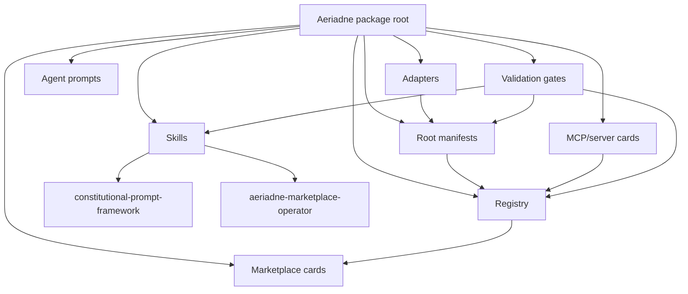
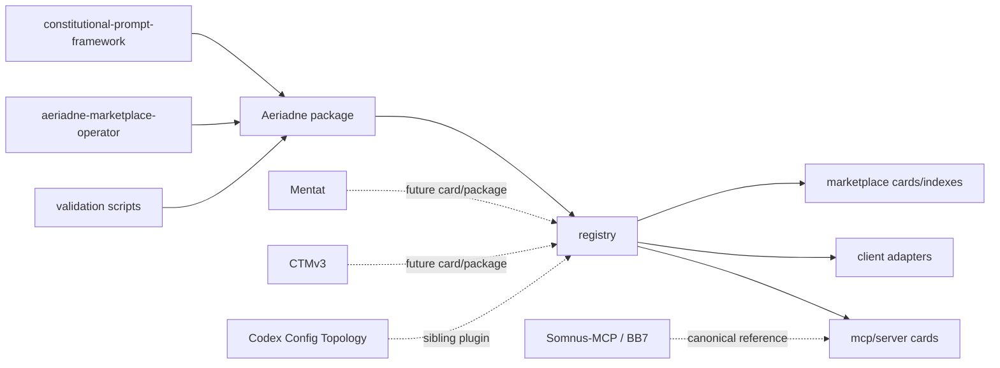

# TOPOLOGY.md - Aeriadne

Snapshot date: 2026-06-13
CTMv3 state before activation: COLD_START
Package state before activation: private-v1, locally validated, not installed
Current package state: validated-local, installed locally as `aeriadne@local`
Root: `/home/daeron/Projects/Modern-ML/Plugins/Aeriadne`
Workspace role: outside staging/package workspace for review and copy/paste
Canonical review repo: `/home/daeron/Repositories/Somnus-Intellligence-Stack/`
Repo edit rule: do not edit the canonical repo unless Daeron explicitly asks; prepare changes here first.

## Load-Bearing Concepts

### 1. Aeriadne Is A Marketplace Compiler, Not The Marketplace Empire

Aeriadne is the current proof package for Daeron's private/native plugin marketplace. It packages the Constitutional Prompt Framework, adds the marketplace-operator skill, and defines the pattern for registry entries, cards, adapters, agent prompts, and MCP/server references.

It does not replace the wider `Modern-ML` marketplace layer, the live Somnus-MCP server, Mentat, CTMv3, or Codex Config Topology. It is the package that teaches the environment how to make those surfaces discoverable, installable, auditable, and harder to misread.

Sequencing correction: Aeriadne is downstream of CTMv3 and Mentat stabilization. Work should harden `../Cognitive-Topology-Map/` and `../Mentat/` first, then rebuild Aeriadne into the proper package/marketplace compiler from their final staged shapes.

### 2. Artifact Ontology Is The Core Invariant

The package depends on keeping these categories separate:

- plugin: independent environment-intelligence package with its own runtime/state doctrine.
- skill: cognitive workflow payload under `skills/`.
- agent-pack: role/subagent prompt set under `agents/`.
- MCP/server card: canonical-reference card under `mcp/`, not vendored server code.
- registry: machine-readable inventory under `registry/`.
- marketplace: human-facing rendered cards and indexes under `marketplace/`.
- adapter: client-specific projection docs under `adapters/`, never canonical source.

Most failure modes are category errors.

Native plugin correction: plugins are not tools, hooks, or skills. They may expose those surfaces, but the package truth is the independent state loop, validation membrane, compensation/exclusion boundary, divergence monitor, and terminal boundary it carries. The local doctrine is `../PLUGIN_RUNTIME_DOCTRINE.md`, with the Golden Path whitepaper as the internal source anchor.

### 3. Registry And Cards Are Twin Surfaces

`registry/*.yaml` and `registry/aeriadne.plugin.json` carry machine-readable package state. `marketplace/cards/*.md` and `marketplace/indexes/*.yaml` carry the readable browse surface. The two surfaces must say the same thing about status, included artifacts, canonical paths, validation, and install readiness.

If a package is installed, validated, staged, or deprecated, the registry and cards must agree and cite evidence.

### 4. Client Adapters Are Projections

Codex, Claude Code, and OpenCode do not consume packages identically. Aeriadne therefore keeps client assumptions in `adapters/` and keeps canonical package metadata at the root plus `registry/`.

The adapter rule is strict: no Codex-only, Claude-only, or OpenCode-only projection becomes the source of truth.

### 5. Server Planes Are Cataloged, Not Vendored

Somnus-MCP / BB7 is represented by `mcp/servers/sovereign-bb7.md` as a canonical-reference server card. It remains rooted at `/home/daeron/Somnus-MCP` with data under `/home/daeron/Somnus-MCP/data`.

Aeriadne may add cards for owned plugins, staged plugin candidates, or canonical server planes, but it must not copy their runtime state, secrets, caches, logs, DBs, or implementation trees into this package. Non-owned local development tools are not attached as marketplace surfaces.

### 6. Validation Is A Promotion Gate, Not Decoration

The package validator, CPF validators, JSON/TOML parse checks, no-secret scan, registry consistency, and install verification are gates. Installed status is never inferred from package existence. Public-marketplace readiness is a later gate, not a v1 assumption.

## Three Things Agents Cannot Get Wrong

1. Do not flatten plugins, skills, agents, MCP cards, adapters, and registry files into one generic prompt folder.
2. Do not vendor Somnus-MCP / BB7, Mentat runtime state, CTMv3 engine state, secrets, session logs, auth files, or caches into Aeriadne.
3. Do not claim install status or client exposure without command evidence.

## Interface Map

| Surface | Path | Role | Write Sensitivity |
| --- | --- | --- | --- |
| Package docs | `README.md`, `MANIFEST.md`, `MARKETPLACE_ROADMAP.md`, `CHANGELOG.md` | Human orientation and staging decisions | Medium |
| Root manifests | `plugin.json`, `plugin.toml`, `.codex-plugin/plugin.json`, `.claude-plugin/plugin.json` | Package identity and client mirrors | High |
| CPF skill | `skills/constitutional-prompt-framework/` | Prompt/constitution cognitive payload | High |
| Marketplace operator skill | `skills/aeriadne-marketplace-operator/` | Packaging, registry, adapter, card workflow | High |
| Registry | `registry/` | Machine-readable package inventory | High |
| Marketplace cards | `marketplace/` | Human-facing browse/index layer | Medium |
| Agent prompts | `agents/subagents/` | Parallel workstream role prompts | Medium |
| Client adapters | `adapters/` | Client-specific projection docs | Medium |
| MCP cards/contracts | `mcp/` | Server/tool-plane references and capability contract | High |
| Validation | `scripts/`, `tests/`, `validation/` | Deterministic checks and recorded evidence | High |
| CTMv3 activation | `TOPOLOGY.md`, `FAILURE_GRAMMAR.md`, `ARCHITECTURE_MAP.md`, `PROVENANCE.md`, `.sovereign/` | Warm-start and agent-operability layer | High |

## Complexity Distribution

Complexity concentrates in four nodes:

- `skills/constitutional-prompt-framework/`: large doctrine library, schemas, scripts, and eval fixtures.
- `registry/` plus `marketplace/`: truth synchronization across machine and human package surfaces.
- `adapters/`: cross-client projection without making any client canonical.
- `mcp/`: cataloging live server/tool planes without importing their runtime substrate.
- Native plugin doctrine: representing stateful plugin loops without flattening them into hook/skill lists.

## Dependency Graph

## Baked-In Decisions

- Aeriadne v1 is staged, validated locally, and installed into Codex as `aeriadne@local`.
- The current Codex exposure is `aeriadne:constitutional-prompt-framework` and `aeriadne:aeriadne-marketplace-operator`.
- The direct authoring source for CPF remains `/home/daeron/.codex/skills/custom/constitutional-prompt-framework`; do not delete it just because this plugin copy exists.
- BB7/SovereignMCP is a canonical-reference MCP/server card, not vendored code.
- Client adapters document projections; they do not become canonical.
- The broader Modern-ML marketplace restructure is a separate pass. Aeriadne proves the package pattern first.
- Public marketplace assumptions are out of scope for v1.
- This path is an outside staging/package workspace, not the canonical repo. Validation and provenance must not assume branch safety or direct repo writes.

## Anti-Concepts

- Aeriadne as BB7.
- Aeriadne as Mentat.
- Aeriadne as CTMv3.
- Aeriadne as a generic prompt dump.
- MCP/server cards as plugin payloads.
- Adapter docs as canonical manifests.
- Registry status without validation/install evidence.
- Native plugin expansion as a reason to collapse boundaries.
- Treating plugins as merely the sum of their hooks, skills, commands, or tools.

## Config File Spine

Root config and manifest files:

- `plugin.json`: root plugin metadata.
- `.codex-plugin/plugin.json`: Codex plugin metadata mirror.
- `.claude-plugin/plugin.json`: Claude/local plugin metadata mirror.
- `plugin.toml`: canonical private marketplace manifest.
- `registry/aeriadne.plugin.json`: machine-readable package card.
- `registry/*.yaml`: marketplace inventory sets.
- `validation/validation_manifest.json`: recorded validation evidence.

Absent by design:

- `package.json`
- `pyproject.toml`
- `go.mod`
- `Cargo.toml`

The CTMv3 engine therefore sees no Tier 3 config spine even though the package has local plugin manifests. Future CTMv3 engine improvements should recognize `plugin.json`, `.codex-plugin/plugin.json`, `.claude-plugin/plugin.json`, and `plugin.toml` as plugin/marketplace config signals.

## Native Plugin Expansion Axis

The next expansion is not "more docs"; it is a smarter local plugin environment:

- Aeriadne: package compiler, CPF payload, marketplace operator, registry/card/adapters.
- Mentat: independent runtime/session plugin package/card with state-machine, Q-table, insight bus, monitors, hooks, adapters, MCP tools, reflective skills, commands, and evals.
- CTMv3: independent workspace activation plugin/package/card with topology artifacts, provenance, failure grammar, and warm-start state.
- Codex Config Topology: Codex control-plane package/card for config, hooks, plugins, skills, and local doctrine loading.
- Somnus-MCP / BB7: canonical MCP/server card and capability contract, not plugin-vendored runtime.
- Non-owned local development tools: excluded from marketplace attachment; keep only release-hygiene exclusions for stale local indexes or logs when needed.

The marketplace should make these native surfaces easier to install, discover, validate, and route without pretending they share one artifact type.

## Staging Before Public Copyover

The active staging root is `/home/daeron/Projects/Modern-ML/Plugins`.

Priority order:

1. Stabilize `Cognitive-Topology-Map/`.
2. Stabilize `Mentat/`.
3. Rebuild proper Aeriadne packaging/registry/cards/adapters around the stable plugin truth.
4. Copy reviewed artifacts into `/home/daeron/Repositories/Somnus-Intellligence-Stack/`.

Do not use Aeriadne to hide unresolved CTMv3 or Mentat structure. Aeriadne should expose finished package truth, not launder uncertainty into marketplace cards.
