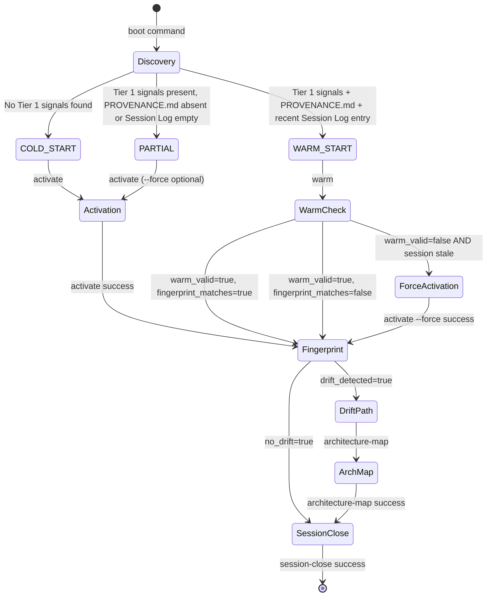

# CTMv3 PLUGIN SKILL — Cross-Runtime Codebase Activation Engine

**Version**: 1.3.0
**Date**: 2026-05-24
**Status**: Production
**Author/Origin**: CTMv3 Plugin — gemini-cli/ctmv3/skills/ctmv3/SKILL.md
**Replaces**: sovereign-skill-architect (docs/SKILL.md, skills/cognitive-topology-v3/SKILL.md)

---

## Table of Contents

1. [Identity Block](#1-identity-block)
2. [Quick Start](#2-quick-start)
3. [Semantic Router](#3-semantic-router)
4. [Command Reference](#4-command-reference)
5. [Boot State Machine](#5-boot-state-machine)
6. [Golden-Path Chain Signal Envelope](#6-golden-path-chain-signal-envelope)
7. [Signal Tier Taxonomy](#7-signal-tier-taxonomy)
8. [Failure Grammar — CTMv3 Operational Failures](#8-failure-grammar--ctmv3-operational-failures)
9. [Eight Outputs Contract](#9-eight-outputs-contract)
10. [Anti-Patterns](#10-anti-patterns)
11. [Reference Files](#11-reference-files)
12. [Install Reference](#12-install-reference)

---

## 1. Identity Block

### What CTMv3 IS

CTMv3 is a **codebase activation system**. Its job is to enter any repository and
transform it into a living, agent-operable workspace — in under 60 seconds, with zero
external Python dependencies, using stdlib only, on Python 3.10+.

A single invocation of `python3 -m ctmv3 activate` on a bare repository produces:

1. `TOPOLOGY.md` — cognitive map of the domain (load-bearing concepts, complexity distribution)
2. `FAILURE_GRAMMAR.md` — what wrong looks like before it is provable
3. `PROVENANCE.md` — decision log, rejected alternatives, session log
4. `ARCHITECTURE_MAP.md` — traversal map with file:line anchors
5. `AGENTS.md` — operational posture document for agent entry
6. `CLAUDE.md` — Claude-specific context extending AGENTS.md
7. `.sovereign/` — session continuity anchor (session_state.json, golden_paths.json, topology_fingerprint.txt)
8. `.claude/`, `.codex/`, `.github/` — dot-directory scaffolds with enforcement hooks

That is the complete set of eight outputs. No more, no less.

### What CTMv3 IS NOT

- NOT a skill maker. A skill may be one byproduct; the activated repository is the real output.
- NOT a code generator. It does not produce application code.
- NOT a documentation writer. It produces structural agent infrastructure, not prose.
- NOT a deployment system. It does not push, build, or release anything.

### Engine Constraints

| Constraint | Value |
|-----------|-------|
| Engine version | 1.3.0 |
| Python requirement | 3.10+ |
| External dependencies | Zero (stdlib only) |
| Idempotency | Safe to run `activate` twice — existing artifacts preserved unless `--force` |
| Execution time | Under 60 seconds on any normal repository |
| GPU requirement | None |
| Network requirement | None |

**The `--force` flag is the safety valve.** Without it, `activate` will never overwrite
existing artifacts. An agent must pass `--force` explicitly to overwrite anything.

---

## 2. Quick Start

The first three commands any agent needs:

```bash
# 1. Verify the engine is installed
python3 -m ctmv3 version --json
# Expected: {"version": "1.3.0", "protocol": "CTMv3"}

# 2. Discover the boot state of any repository
python3 -m ctmv3 boot --project-root "$PWD" --json
# Expected: {"branch": "COLD_START"|"WARM_START"|"PARTIAL", ...}

# 3. Run the complete golden-path chain in one shot
python3 -m ctmv3 chain --initial boot --project-root "$PWD"
# Walks: boot → activate/warm → fingerprint → architecture-map? → session-close
```

If step 1 fails, the engine is not installed. See Section 12 (Install Reference).

If step 2 returns `COLD_START`, the repo has never been activated. Run `activate`.

If step 2 returns `WARM_START`, a prior session exists. Run `warm` to validate and continue.

If step 3 is used, it handles the complete decision sequence automatically. Use step 3
when activating a fresh repo or running a full refresh. Use individual commands when
operating on a specific step.

---

## 3. Semantic Router

Classify the task before invoking any command. Load only what the task requires.

```
Task → Action → Command(s)
──────────────────────────────────────────────────────────────────────────────────

[ENTERING_A_NEW_REPO] — no CTM artifacts present
  1. python3 -m ctmv3 boot --project-root "$PWD" --json
     Read: {"branch": "COLD_START", "tier1_signals": [], ...}
  2. python3 -m ctmv3 activate --project-root "$PWD"
     Or shortcut: python3 -m ctmv3 chain --initial boot --project-root "$PWD"
  Outcome: all 8 outputs produced; session logged in PROVENANCE.md

[RESUMING_A_SESSION] — CTM artifacts exist, continuing prior work
  1. python3 -m ctmv3 warm --project-root "$PWD" --json
     Check output: warm_valid == true AND fingerprint_matches == true
  2. If warm_valid == false: run activate --force OR investigate PROVENANCE.md
     If fingerprint_matches == false: run fingerprint, then architecture-map
  3. Proceed with task. Close with session-close.

[CHECKING_DRIFT] — did topology change since last session?
  python3 -m ctmv3 fingerprint --project-root "$PWD" --json
  If drift_detected == true: run architecture-map, then session-close
  If drift_detected == false: proceed directly to session-close

[BUILDING_TRAVERSAL_MAP] — produce ARCHITECTURE_MAP.md from TOPOLOGY.md
  python3 -m ctmv3 architecture-map --from-topology --project-root "$PWD"
  Prerequisite: TOPOLOGY.md must exist. Run boot first if uncertain.

[CLOSING_A_SESSION] — log work to provenance, anchor state
  python3 -m ctmv3 session-close \
    --agent "Gemini CLI" \
    --action "<brief description of what was done>" \
    --next-action "<what the next agent should do>" \
    --project-root "$PWD"
  Note: Always pass --agent with a real agent identifier. Default "unknown" is
  operationally useless and degrades PROVENANCE.md quality.

[CHECKING_STATUS] — what is the current CTM state of this repository?
  python3 -m ctmv3 status --project-root "$PWD" --json
  Returns: activation status, session state, fingerprint validity, open tasks

[FULL_GOLDEN_PATH] — run the complete activation and close sequence
  python3 -m ctmv3 chain --initial boot --project-root "$PWD"
  The chain walks: boot → activate (or warm) → fingerprint →
    architecture-map (if drift) → session-close
  Use this for cold activations and periodic full refreshes.

[FORCE_REACTIVATION] — overwrite existing artifacts intentionally
  python3 -m ctmv3 activate --force --project-root "$PWD"
  Warning: This overwrites all protected artifacts. Use only when artifacts
  are known to be stale, corrupted, or from a different codebase.

[SOMETHING_IS_WRONG] — unexpected behavior, command failure, parse error
  1. python3 -m ctmv3 status --project-root "$PWD" --json
  2. Load docs/FAILURE_GRAMMAR.md — do this BEFORE any other investigative action
  3. Check .sovereign/session_state.json for last known good state
  4. If session_state.json is corrupted: delete it and run sovereign-init
  5. If artifacts are from a different codebase: activate --force

[ENGINE_NOT_INSTALLED] — python3 -m ctmv3 version fails with ModuleNotFoundError
  cd /path/to/ctmv3-plugin/core && pip install -e .
  Then verify: python3 -m ctmv3 version --json
  Expected output: {"version": "1.3.0", "protocol": "CTMv3"}

[MONOREPO] — multiple subdirectories each have CTM artifacts
  Use discover_all() Python API (not a CLI command):
    from pathlib import Path
    from ctmv3.core.boot import discover_all
    inventories = discover_all(Path("."), max_depth=3)
  For each inventory: run appropriate command based on inventory.branch
  Do NOT run activate on the monorepo root expecting cascade to subdirectories.
  See docs/BOOT_PROTOCOL.md Section 7 for full monorepo protocol.
```

**Hard rule**: Boot discovery is mandatory before any repo-entry task. The boot signal
inventory is the ground truth for what has already been done.

---

## 4. Command Reference

All commands follow this invocation pattern:

```bash
python3 -m ctmv3 <subcommand> [--project-root "$PWD"] [--json] [--force] [--no-golden-path]
```

Global flags available on all subcommands:

| Flag | Effect |
|------|--------|
| `--project-root PATH` | Target repository root (default: current directory) |
| `--json` | Route machine-readable output to stdout; human messages to stderr |
| `--no-golden-path` | Suppress `[CTMV3_GOLDEN_PATH]` signal emission |

---

### boot

```bash
python3 -m ctmv3 boot --project-root "$PWD" [--json] [--no-golden-path]
```

**Purpose**: Discovery sequence. Reads the repository read-only. Classifies boot state.
Emits a signal inventory. This command never writes to disk.

**JSON output fields**:

| Field | Type | Description |
|-------|------|-------------|
| `branch` | string | `"COLD_START"` \| `"WARM_START"` \| `"PARTIAL"` |
| `tier1_signals` | list[str] | Tier 1 paths found (strong CTM presence signals) |
| `tier2_signals` | list[str] | Tier 2 paths found (supporting signals) |
| `tier3_signals` | list[str] | Tier 3 paths found (config spine signals) |
| `provenance_present` | bool | PROVENANCE.md readable at repo root |
| `manifest_present` | bool | manifest.json present (Somnus snapshot lock) |
| `last_session` | str \| null | Last PROVENANCE.md Session Log row, or null |
| `warm_start_valid` | bool | Whether warm start conditions are met |
| `session_state_valid` | bool | Whether .sovereign/session_state.json is parseable |

**Exit codes**:
- `0` — success
- `1` — user error (project root not found or not a directory)

**Golden-path signal**: `command_status` is set to the value of `branch`.

**Agent action**: Read `branch`.
- `COLD_START` → run `activate`
- `WARM_START` → run `warm`
- `PARTIAL` → run `activate` (consider `--force` if artifacts are from a different codebase)
- Always read the golden-path signal. `next_command_suggested` tells you what to run next.

**Example**:
```bash
python3 -m ctmv3 boot --project-root "$PWD" --json
# Output (stdout):
# {"branch": "COLD_START", "tier1_signals": [], "tier2_signals": [], ...}
# [CTMV3_GOLDEN_PATH] {"command_name": "boot", "command_status": "COLD_START", "next_command_suggested": "activate", ...}
```

---

### activate

```bash
python3 -m ctmv3 activate --project-root "$PWD" [--force] [--json] [--no-golden-path]
```

**Purpose**: Cold-start orchestration. Runs Phase 0–5 activation on the repository.
Produces all 8 CTMv3 outputs. The most consequential command in the suite.

**JSON output fields**:

| Field | Type | Description |
|-------|------|-------------|
| `phase` | str | Last completed phase identifier |
| `project_name` | str | Inferred project name (from TOPOLOGY.md, pyproject.toml, or directory) |
| `files_written` | dict[str, str] | Map of absolute path → `"created"` \| `"skipped"` \| `"force-overwritten"` |
| `fingerprint` | str | SHA-256 hash written to .sovereign/topology_fingerprint.txt |
| `errors` | list[str] | Any non-fatal errors encountered (check this even on exit code 0) |
| `aborted` | bool | True if activation was halted by the guard (artifacts exist, no --force) |
| `abort_reason` | str \| null | Human-readable abort reason if aborted=true |
| `signal_inventory` | dict | Full boot.discover() output at time of activation |
| `today` | str | ISO date used in rendered templates |

**Exit codes**:
- `0` — success (all artifacts produced)
- `1` — user error (project root invalid)
- `2` — corrupt state detected in repository

**Guard behavior**: If WARM_START or PARTIAL state is detected AND protected artifacts
already exist AND `--force` is not passed, activation aborts and returns `{aborted: true,
abort_reason: "..."}`. This is intentional. The guard prevents silent overwrites.

**Agent action**: Check `aborted` first. If true, read `abort_reason`. If artifacts exist
and the repo needs a full reset, pass `--force`. Otherwise run `warm` instead.

**Example**:
```bash
python3 -m ctmv3 activate --project-root "$PWD" --json
# On COLD_START: writes all 8 outputs, returns files_written map.
# On WARM_START without --force: returns {aborted: true, abort_reason: "Protected artifacts exist..."}
```

---

### warm

```bash
python3 -m ctmv3 warm --project-root "$PWD" [--json] [--no-golden-path]
```

**Purpose**: Warm-start validation. Runs the three warm-validity checks against the
existing session state. Does not write any topology artifacts. May update session state.

**JSON output fields**:

| Field | Type | Description |
|-------|------|-------------|
| `warm_valid` | bool | True if all three warm validity checks pass |
| `fingerprint_matches` | bool | Current topology hash matches stored hash |
| `session_age_days` | float | Days since last session close |
| `last_session` | str \| null | Last PROVENANCE.md Session Log entry |
| `checks` | dict | `{topology_valid, provenance_coherent, no_rejected_path_active}` |
| `warnings` | list[str] | Non-blocking conditions worth noting |

**Exit codes**:
- `0` — success (warm check ran, regardless of warm_valid value)
- `1` — user error
- `3` — no artifacts to warm (cold repository — run activate first)

**Warm validity criteria** (all three must pass for `warm_valid = true`):
1. Topology still valid — no significant code change since last encoding
2. Provenance coherent — Session Log last action matches current AGENTS.md / ARCHITECTURE_MAP.md state
3. No rejected path in play — current task does not match PROVENANCE.md Graveyard entries

**Agent action**: If `warm_valid == true` and `fingerprint_matches == true`, proceed with
the task. If `warm_valid == false`, run `activate --force` or investigate PROVENANCE.md.
If `fingerprint_matches == false`, run `fingerprint` then `architecture-map`.

---

### fingerprint

```bash
python3 -m ctmv3 fingerprint --project-root "$PWD" [--json] [--no-golden-path]
```

**Purpose**: Recompute the SHA-256 topology fingerprint from TOPOLOGY.md and
ARCHITECTURE_MAP.md. Compare against stored hash to detect drift. Write new hash to
`.sovereign/topology_fingerprint.txt`.

**Fingerprint scope**: Only TOPOLOGY.md and ARCHITECTURE_MAP.md are hashed (concatenated,
in that order). Changes to other CTMv3 artifacts do not affect the fingerprint. This is
intentional — the fingerprint tracks topology drift, not session state drift.

**JSON output fields**:

| Field | Type | Description |
|-------|------|-------------|
| `drift_detected` | bool | True if stored hash differs from newly computed hash |
| `old_hash` | str \| null | Previously stored hash, or null if absent |
| `new_hash` | str | Newly computed hash |
| `files_hashed` | list[str] | Files included in the computation |
| `fingerprint_path` | str | Absolute path of the written fingerprint file |

**Exit codes**: `0` success, `1` user error

**Golden-path signal**: `command_status` is `"drift_detected"` or `"no_drift"`.

**Agent action**: If `drift_detected == true`, run `architecture-map` to refresh the
traversal map, then `session-close`. If `drift_detected == false`, run `session-close`
directly.

---

### architecture-map

```bash
python3 -m ctmv3 architecture-map --project-root "$PWD" [--from-topology] [--force] [--json] [--no-golden-path]
```

**Purpose**: Build or update `ARCHITECTURE_MAP.md` — the traversal map artifact. With
`--from-topology`, reads TOPOLOGY.md H1 header to infer project name. Without
`--from-topology`, uses the project name inference chain (TOPOLOGY.md → pyproject.toml
→ package.json → go.mod → directory name).

**JSON output fields**:

| Field | Type | Description |
|-------|------|-------------|
| `map_path` | str | Absolute path of written ARCHITECTURE_MAP.md |
| `status` | str | `"created"` \| `"skipped"` \| `"force-overwritten"` |
| `project_name` | str | Inferred project name used in template |

**Exit codes**: `0` success, `1` user error

**Agent action**: Verify `map_path` exists after command completes. Open and review the
generated map — it contains `[TODO: ...]` placeholders that require agent population
based on the actual codebase structure.

---

### sovereign-init

```bash
python3 -m ctmv3 sovereign-init --project-root "$PWD" [--json] [--no-golden-path]
```

**Purpose**: Initialize the `.sovereign/` directory with `session_state.json`,
`golden_paths.json`, and `topology_fingerprint.txt` placeholder. Safe to run on a
fresh repository. If `.sovereign/` already exists and `session_state.json` is valid,
does not overwrite.

**JSON output fields**:

| Field | Type | Description |
|-------|------|-------------|
| `sovereign_path` | str | Absolute path of `.sovereign/` |
| `files_created` | dict[str, str] | Map of filename → status |
| `session_id` | str | UUID4 of the initialized session |

**Exit codes**: `0` success, `1` user error

**Agent action**: Normally invoked by `activate`. Run directly only when recovering
from a corrupted `.sovereign/` directory.

---

### dot-init

```bash
python3 -m ctmv3 dot-init --project-root "$PWD" [--targets all|claude|codex|github] [--force] [--json] [--no-golden-path]
```

**Purpose**: Create or update the `.claude/`, `.codex/`, and `.github/` scaffold
directories. Each target is independent. Default `--targets all` creates all three.

**Created artifacts**:
- `.claude/settings.json` — Claude Code permission configuration
- `.claude/CLAUDE.md` — Claude-specific context (skipped if root CLAUDE.md exists)
- `.codex/skills/.gitkeep` — Codex skill installation anchor
- `.codex/session/` — Codex session directory
- `.github/copilot-instructions.md` — Repo-wide agent instruction surface
- `.github/instructions/README.md` — Per-path instructions index
- `.github/workflows/topology-enforce.yml` — CTMv3 fingerprint drift CI gate

**JSON output fields**:

| Field | Type | Description |
|-------|------|-------------|
| `files_created` | dict[str, str] | Map of absolute path → status |
| `targets_run` | list[str] | Which targets were initialized |

**Exit codes**: `0` success, `1` user error

**Agent action**: After dot-init, verify the `.github/workflows/topology-enforce.yml`
is present and correct before committing. Never build `.github/` before TOPOLOGY.md is
complete — the hooks enforce topology contracts, and topology must be known before
enforcement is defined.

---

### session-close

```bash
python3 -m ctmv3 session-close \
  --agent "Gemini CLI" \
  --action "<description>" \
  --next-action "<recommendation>" \
  [--topology-drift] \
  --project-root "$PWD" \
  [--json] \
  [--no-golden-path]
```

**Purpose**: Close the session cleanly. Updates PROVENANCE.md Session Log with the
completed action and next recommended action. Rewrites `.sovereign/session_state.json`
with `warm_start_valid = true`. Recomputes and stores the topology fingerprint.

This is the provenance anchor. A session without a clean close leaves orphaned state
that degrades the next agent's warm-start accuracy.

**JSON output fields**:

| Field | Type | Description |
|-------|------|-------------|
| `agent` | str | Agent identifier as passed |
| `action` | str | Action description as passed |
| `topology_drift` | bool | Whether drift was flagged |
| `fingerprint` | str | SHA-256 hash written at close |
| `provenance_updated` | bool | Whether PROVENANCE.md was updated |
| `session_state_updated` | bool | Whether session_state.json was updated |

**Exit codes**: `0` success, `1` user error

**Session log rotation**: When PROVENANCE.md Session Log exceeds 500 rows, older rows
are automatically archived to `.sovereign/provenance_archive_{date}.md`. The active
log retains the 100 most recent rows. This is transparent to the agent.

**Agent action**: Always pass `--agent` with a real identifier. Pass `--topology-drift`
if TOPOLOGY.md was modified during the session. The `--next-action` value becomes the
first thing the next agent reads from PROVENANCE.md.

---

### status

```bash
python3 -m ctmv3 status --project-root "$PWD" [--json] [--no-golden-path]
```

**Purpose**: Print a current snapshot of the repository's CTMv3 activation state.
Does not write anything. Useful as a diagnostic before any other command.

**JSON output fields**:

| Field | Type | Description |
|-------|------|-------------|
| `activated` | bool | Whether the repository has been CTMv3 activated |
| `branch` | str | Current boot classification |
| `fingerprint_valid` | bool | Whether stored fingerprint matches current topology |
| `session_age_days` | float \| null | Days since last session close |
| `last_agent` | str \| null | Agent that last closed a session |
| `last_action` | str \| null | Last logged action |
| `open_tasks` | list[str] | Open tasks from session_state.json |
| `artifacts_present` | dict[str, bool] | Map of artifact name → present |

**Exit codes**: `0` success, `1` user error

**Agent action**: Run `status` as the first command when investigating unexpected
behavior. It provides the complete current state without writing anything.

---

### version

```bash
python3 -m ctmv3 version [--json]
```

**Purpose**: Print the engine version. The most lightweight verification that the
engine is installed and functional.

**JSON output fields**:

| Field | Type | Description |
|-------|------|-------------|
| `version` | str | Engine version string (e.g., `"1.3.0"`) |
| `protocol` | str | Protocol identifier (`"CTMv3"`) |

**Exit codes**: `0` success, `1` engine not installed (ModuleNotFoundError)

**Agent action**: Run this first in any automation that depends on CTMv3. If it
fails, run the install sequence from Section 12 before proceeding.

---

### chain

```bash
python3 -m ctmv3 chain \
  --initial boot \
  --project-root "$PWD" \
  [--no-golden-path]
```

**Purpose**: Execute the full golden-path domino chain from a specified initial command.
Each command in the chain runs as a subprocess. The pre-chain rules table determines
which command runs next based on the exit state of the previous command. The chain
terminates when no next command exists (terminal state) or when `MAX_CHAIN_DEPTH = 5`
is reached.

**Chain output**: Stdout is a JSON array. Each element is one step's signal dict with
a `chain_depth` field indicating step index (0-based). Individual step signals are also
emitted under the `[CTMV3_GOLDEN_PATH]` sentinel as the chain progresses.

**Exit codes**:
- `0` — chain completed successfully (all steps terminated normally)
- `1` — user error
- `2` — chain exceeded MAX_CHAIN_DEPTH (5 steps); run commands individually

**Agent action**: Parse stdout as a JSON array. Each element has `command_name`,
`command_status`, `next_command_suggested`, `memory_relevance_tags`, `payload`, and
`chain_depth`. The chain is the preferred entry point for cold activations and full
refreshes. For targeted operations (e.g., only checking drift), run individual commands.

**Important**: The chain uses `--no-golden-path` internally when invoking subprocess
steps to prevent double-emission of signals. The outer chain call collects all signals
and re-emits them at chain completion. Do not pass `--no-golden-path` to `chain` itself
unless you want to suppress the aggregated output.

---

## 5. Boot State Machine



**State transition rules** (encoded in `orchestration.py:pre_chain_rules`):

| From state | Exit condition | Next state |
|-----------|---------------|------------|
| boot | COLD_START | activate |
| boot | WARM_START | warm |
| boot | PARTIAL | activate |
| activate | success | fingerprint |
| activate | failure | (terminal — investigate) |
| warm | success | fingerprint |
| warm | failure | (terminal — investigate) |
| fingerprint | drift_detected | architecture-map |
| fingerprint | no_drift | session-close |
| architecture-map | success | session-close |
| architecture-map | skipped | session-close |
| session-close | success | (terminal) |
| sovereign-init | success | dot-init |
| dot-init | success | fingerprint |

The chain terminates at any `failure` exit state for most commands. `failure` is not
chained — it is a signal to investigate before proceeding.

---

## 6. Golden-Path Chain Signal Envelope

Every CTMv3 subcommand emits exactly one signal to stdout after completing. The signal
is a single line beginning with the sentinel prefix `[CTMV3_GOLDEN_PATH]`.

### Signal Format

```json
[CTMV3_GOLDEN_PATH] {
  "command_name": "boot",
  "command_status": "COLD_START",
  "next_command_suggested": "activate",
  "memory_relevance_tags": ["activation", "cold_start", "phase_0_required", "no_tier1_signals"],
  "payload": {"branch": "COLD_START", "tier1_signals": [], "tier2_signals": [], ...},
  "chain_depth": 0
}
```

**Signal properties**:

| Field | Type | Description |
|-------|------|-------------|
| `command_name` | str | Name of the command that just completed |
| `command_status` | str | Exit state of the command (e.g., `COLD_START`, `drift_detected`) |
| `next_command_suggested` | str \| null | Next command to run, or null if terminal |
| `memory_relevance_tags` | list[str] | Tags for memory system indexing |
| `payload` | dict | Full JSON output of the command |
| `chain_depth` | int | Step index in a chain run (0 for standalone commands) |

### Extracting Signals

```bash
# Capture stdout, filter for signal lines
output=$(python3 -m ctmv3 boot --project-root "$PWD" --json)
signal=$(echo "$output" | grep "^\[CTMV3_GOLDEN_PATH\]" | sed 's/^\[CTMV3_GOLDEN_PATH\] //')
next_cmd=$(echo "$signal" | python3 -c "import sys, json; d=json.load(sys.stdin); print(d.get('next_command_suggested',''))")
echo "Next suggested command: $next_cmd"
```

```python
import subprocess, json

lines = subprocess.check_output(
    ["python3", "-m", "ctmv3", "boot", "--json", "--project-root", "/path/to/repo"]
).decode().splitlines()

SENTINEL = "[CTMV3_GOLDEN_PATH]"
signals, json_lines = [], []

for line in lines:
    if line.startswith(SENTINEL):
        signals.append(json.loads(line[len(SENTINEL):].strip()))
    else:
        json_lines.append(line)

signal = signals[0] if signals else None
if signal and signal["next_command_suggested"]:
    print(f"Suggested next: {signal['next_command_suggested']!r}")
```

### Pre-Chain Rules Table

| Command | Exit State | Next Suggested |
|---------|-----------|----------------|
| boot | COLD_START | activate |
| boot | WARM_START | warm |
| boot | PARTIAL | activate |
| boot | success | warm |
| boot | failure | (terminal) |
| activate | success | fingerprint |
| activate | failure | (terminal) |
| warm | success | fingerprint |
| warm | failure | (terminal) |
| fingerprint | drift_detected | architecture-map |
| fingerprint | no_drift | session-close |
| fingerprint | success | session-close |
| fingerprint | failure | (terminal) |
| architecture-map | success | session-close |
| architecture-map | skipped | session-close |
| architecture-map | failure | (terminal) |
| session-close | success | (terminal) |
| session-close | failure | (terminal) |
| sovereign-init | success | dot-init |
| sovereign-init | failure | (terminal) |
| dot-init | success | fingerprint |
| dot-init | failure | (terminal) |
| status | success | (terminal) |

### Memory Relevance Tags

Common tag sets for the most important states:

| Command + State | Tags |
|----------------|------|
| boot / COLD_START | `activation`, `cold_start`, `phase_0_required`, `no_tier1_signals` |
| boot / WARM_START | `activation`, `warm_start`, `tier1_signals_present`, `provenance_valid` |
| boot / PARTIAL | `activation`, `partial_state`, `tier1_present`, `provenance_absent` |
| activate / success | `activation`, `phase_0_5_complete`, `all_artifacts_written`, `repo_live` |
| fingerprint / drift_detected | `topology`, `fingerprint_drift`, `architecture_map_stale` |
| fingerprint / no_drift | `topology`, `fingerprint_stable`, `no_drift` |
| session-close / success | `session`, `close_complete`, `provenance_updated`, `state_anchored` |

Full table: `docs/interfaces/orchestration.md`.

### Suppressing Signals

Use `--no-golden-path` to suppress signal emission entirely. This is appropriate for:
- Environments that parse stdout and cannot tolerate extra lines
- Nested subprocess calls where double-emission is a concern
- Scripting contexts where the signal format is not needed

The `chain` command internally passes `--no-golden-path` to subprocess steps.

---

## 7. Signal Tier Taxonomy

The boot discovery sequence classifies found files into three tiers. Tier classification
drives the branch determination.

### Tier 1 — Strong CTM Presence Signals

Any single Tier 1 signal means CTMv3 has been run here. No Tier 1 signals means COLD_START.

| Path | What It Signals |
|------|----------------|
| `.sovereign/` | Sovereign session state directory exists; warm start likely |
| `ARCHITECTURE_MAP.md` | Full traversal map was produced; agent can navigate |
| `.claude/CLAUDE.md` | Claude Code context was set up by CTMv3 |
| `AGENTS.md` | Agent operational posture was encoded |

### Tier 2 — Supporting Signals

Tier 2 signals indicate partial CTM activation or related tooling presence.

| Path | What It Signals |
|------|----------------|
| `.github/copilot-instructions.md` | dot-init was run (or equivalent) |
| `.codex/skills/` | Codex skill installation is present |
| `PROVENANCE.md` (at repo root) | Decision log was initialized; session history exists |
| `manifest.json` | Somnus snapshot lock — file set is version-pinned |
| `golden_paths.json` | bb7 system golden paths present at repo root |

### Tier 3 — Config Spine Signals

Tier 3 signals are always present in real projects. They are read during archaeology, not
used for branch classification. They reveal the project structure before any source is read.

| Path | What It Reveals |
|------|----------------|
| `pyproject.toml` / `setup.py` | Python dependency graph, entry points, tool config |
| `go.mod` | Go import graph canonical prefix, version constraints |
| `Cargo.toml` | Rust binary entry points (each `[[bin]]` is a topology node) |
| `package.json` | Node.js project name, scripts, dependency graph |
| `.env.example` | Environment variable requirements without exposing secrets |

### Branch Classification Logic

```
COLD_START: len(tier1_signals) == 0
WARM_START: len(tier1_signals) >= 1 AND provenance_present AND last_session is not None AND session age < 30 days
PARTIAL: len(tier1_signals) >= 1 AND (NOT provenance_present OR last_session is None)
```

The `boot` command encodes this logic in `boot.py:classify_branch()`. The branch
determination is deterministic given the same repository state.

---

## 8. Failure Grammar — CTMv3 Operational Failures

When something goes wrong, load `docs/FAILURE_GRAMMAR.md` immediately, before any other
investigative action. The table below covers CTMv3-specific operational failures.
The full failure grammar (pre-failure signatures, false success patterns, adversarial
signatures) is in `docs/FAILURE_GRAMMAR.md`.

| Failure Signature | Meaning | Recovery Command |
|-------------------|---------|------------------|
| `warm` returns `warm_valid=false` | Session state stale (>30 days) or topology has drifted beyond the warm threshold | `activate --force` OR investigate PROVENANCE.md Graveyard for rejected paths |
| `warm` returns exit code 3 | No artifacts to warm — repository is cold (no Tier 1 signals) | Run `activate` first |
| `fingerprint` returns `drift_detected=true` | TOPOLOGY.md or ARCHITECTURE_MAP.md changed since last fingerprint write | Run `architecture-map`, then `session-close` |
| `activate` returns `aborted=true` | Protected artifacts exist, `--force` was not passed | Read `abort_reason`; pass `--force` if overwrite is appropriate |
| `activate` exits code 2 | Corrupt state detected in repository | Inspect `.sovereign/` files; run `sovereign-init` to reseed |
| `chain` exits code 2 | Chain exceeded MAX_CHAIN_DEPTH (5 steps) | Run commands individually per the pre-chain rules table |
| `boot` shows `PARTIAL` | Tier 1 signals present but PROVENANCE.md absent or Session Log empty | Run `activate` OR manually create PROVENANCE.md and initialize Session Log |
| `.sovereign/session_state.json` parse error | File corrupted mid-write (process killed during write) | Delete `session_state.json`; run `sovereign-init` to reseed |
| `python3 -m ctmv3 version` fails with `ModuleNotFoundError` | Engine not installed in current Python environment | `cd /path/to/ctmv3-plugin/core && pip install -e .` |
| `python3 -m ctmv3 version` fails with `ImportError` | Engine installed but import is broken (dependency issue) | Verify stdlib only; check Python version is 3.10+ |
| `session-close` does not update PROVENANCE.md | PROVENANCE.md section header missing or file structure corrupted | Read PROVENANCE.md; verify `## Session Log` section exists with table header row |
| `AGENTS.md` references non-existent modules | AGENTS.md was copy-pasted or written before topology was known | Rebuild AGENTS.md from TOPOLOGY.md per `docs/AGENTS_ADDENDUM.md` |
| ARCHITECTURE_MAP.md line anchors wrong | Code was refactored after map was built | Run `architecture-map --force` to rebuild |
| `session_state.json` warm_start_valid=true but topology clearly changed | File was not updated at last session close (orphaned session) | Run `fingerprint` to recompute, then `session-close` |
| `.github/` hooks failing on every CI run | Topology constraint encoded in hook is outdated | Update the hook; update TOPOLOGY.md Baked-In Decisions; log in PROVENANCE.md |

**Ecosystem failure taxonomy** (from `docs/FAILURE_GRAMMAR.md` Category 5):

| Smell | Severity | Action |
|-------|----------|--------|
| AGENTS.md references non-existent modules | HIGH | Full AGENTS.md rebuild from TOPOLOGY.md |
| ARCHITECTURE_MAP.md line anchors wrong | MEDIUM | Anchor audit + `architecture-map --force` |
| session_state.json warm_start_valid=true but session is stale | HIGH | Run BOOT_PROTOCOL.md §3.1 warm validity check |
| .github/ hooks failing on every PR | MEDIUM | Update hook, update TOPOLOGY.md, log in PROVENANCE.md |
| CLAUDE.md and AGENTS.md diverged | HIGH | Reconcile from AGENTS.md (canonical); CLAUDE.md extends, never contradicts |

---

## 9. Eight Outputs Contract

A completed CTMv3 pass produces exactly 8 outcomes. An agent must be able to verify
all 8 before declaring activation complete. If any are missing, the activation is
incomplete — do not declare success.

**Verification checklist**:

| # | Output | How to Verify | Source Document |
|---|--------|---------------|-----------------|
| 1 | Agent can answer: what are the 3 things I cannot get wrong? | Read TOPOLOGY.md — Load-Bearing Concepts section must have 3+ LBC entries with definitions and common misunderstandings | `TOPOLOGY.md` |
| 2 | Agent can recognize failure before it is provable | Read FAILURE_GRAMMAR.md — Pre-Failure Signatures section must be populated for this codebase | `FAILURE_GRAMMAR.md` |
| 3 | Agent knows what was already rejected | Read PROVENANCE.md — Rejected Alternatives (Graveyard) section must be present (may be empty on first activation) | `PROVENANCE.md` |
| 4 | Agent knows where complexity concentrates | Read ARCHITECTURE_MAP.md — DENSE/MEDIUM/THIN markings must be present on file entries | `ARCHITECTURE_MAP.md` |
| 5 | Agent knows its entry vector | Read AGENTS.md — semantic router section with task-type-to-entry-point table must be present | `AGENTS.md` |
| 6 | Agent knows boot state in <60 seconds | Run `python3 -m ctmv3 boot --project-root "$PWD" --json` — must return branch in <60s | `boot` command |
| 7 | Agent has a traversal map | Read ARCHITECTURE_MAP.md — must have ROOT node, branch entries, and file:line anchors | `ARCHITECTURE_MAP.md` |
| 8 | Codebase enforces itself | Verify `.github/workflows/topology-enforce.yml` exists AND `.sovereign/topology_fingerprint.txt` exists | `.github/`, `.sovereign/` |

**Note on Output 1**: The LBC entries in TOPOLOGY.md are scaffolded with `[TODO: ...]`
placeholders on cold activation. An agent must populate these from actual codebase
archaeology before Output 1 is considered satisfied. A scaffolded but unpopulated
TOPOLOGY.md does not satisfy Output 1.

**Note on Output 4**: The ARCHITECTURE_MAP.md template includes DENSE/MEDIUM/THIN
markers as placeholders. These must be filled by the agent based on actual file analysis.

---

## 10. Anti-Patterns

Operational anti-patterns. Violating these degrades reliability and provenance integrity.

**Do NOT run `activate` on a WARM_START repository without `--force`.**
The guard will abort and return `{aborted: true}`. This is not a bug. If you need to
reset a warm-start repo, pass `--force` explicitly and understand that it will overwrite
all protected artifacts.

**Do NOT ignore the golden-path signal.**
The `next_command_suggested` field exists for a reason. Following it is not mandatory,
but ignoring it consistently means you are running commands in a suboptimal order and
missing drift signals.

**Do NOT call `session-close` with `--agent` omitted or set to the default "unknown".**
The PROVENANCE.md Session Log is the continuity anchor between sessions. An entry with
agent="unknown" is not useful to the next agent. Always pass a real agent identifier.

**Do NOT modify `.sovereign/session_state.json` manually.**
This file is managed by `session-close` and `sovereign-init`. Manual edits risk leaving
the file in a state that parse checks will reject on next boot, degrading to COLD_START.

**Do NOT confuse CTMv3 with a skill maker.**
CTMv3 produces activated repositories, not skill packages. Skills are an optional
byproduct of the activation process. If you are trying to build a skill, read
`docs/SKILL.md` and `docs/TOPOLOGY.md` — those are the correct references.

**Do NOT run `activate` twice on a fresh repo expecting the second run to repair a
partial first activation.**
The second run will abort (artifacts exist, no `--force`). To repair a partial
activation, pass `--force` on the second run.

**Do NOT skip `session-close`.**
PROVENANCE.md is the continuity anchor. A session without a close leaves orphaned
provenance — the next agent's `warm` check will see an outdated last session entry and
may misclassify the boot state.

**Do NOT run `activate` before `boot`.**
Always run `boot` first to establish the current branch. Running `activate` on a
WARM_START repo without knowing its state risks either aborting (no `--force`) or
overwriting valid artifacts (with `--force`). The boot signal inventory is the ground
truth.

**Do NOT populate TOPOLOGY.md templates with generic content.**
The LBC entries, complexity distribution, and baked-in decisions in TOPOLOGY.md must
be derived from actual codebase archaeology. Copy-pasted or pattern-matched content
in TOPOLOGY.md produces AGENTS.md entries that reference non-existent modules —
Ecosystem Failure 1 from `docs/FAILURE_GRAMMAR.md`.

**Do NOT build `.github/` enforcement before TOPOLOGY.md is complete.**
The hooks enforce topology contracts. Topology must be known before enforcement is
defined. Hook-first is enforcement without definition.

---

## 11. Reference Files

Load only what the task requires. Do not load all reference files upfront.

| Task | Load |
|------|------|
| Any repo entry (always first) | `docs/BOOT_PROTOCOL.md` |
| Understanding what CTMv3 does | `docs/EXPLANATION.md` |
| Building topology artifacts manually | `docs/TOPOLOGY.md` |
| `.xyz` directory work | `docs/DOT_TOPOLOGY.md` |
| Something is wrong (immediately) | `docs/FAILURE_GRAMMAR.md` |
| Architectural disputes, development philosophy | `docs/CONSTITUTION.md` |
| Building or updating traversal maps | `docs/ARCHITECTURE_MAP_TEMPLATE.md` |
| Orchestration signal details | `docs/interfaces/orchestration.md` |
| Cross-runtime adapter format reference | `research/RUNTIME_FORMATS.md` |
| Schema audit across all 5 adapters | `docs/SCHEMA_AUDIT.md` |
| Codebase architectural intelligence | `CODEBASE_INTELLIGENCE.md` |
| AGENTS.md construction | `docs/AGENTS_ADDENDUM.md` |
| Annotated cold-start trace | `examples/cold-start-trace.md` |
| Decision log doctrine | `docs/PROVENANCE.md` |
| This plugin skill (canonical) | `gemini-cli/ctmv3/skills/ctmv3/SKILL.md` (this file) |

**Priority ordering for conflict resolution**:
1. This SKILL.md (plugin-mode canonical reference)
2. `docs/BOOT_PROTOCOL.md` (state machine authority)
3. `docs/GOLDEN_PATH.md` (orchestration authority)
4. `docs/CONSTITUTION.md` (development philosophy authority)

If `gemini-cli/ctmv3/skills/ctmv3/SKILL.md` and `docs/SKILL.md` conflict on a command
invocation, this file takes precedence. `docs/SKILL.md` is the manual-mode fallback.

---

## 12. Install Reference

### Engine Installation (Required for all adapters)

```bash
# Navigate to the engine package
cd /path/to/ctmv3-plugin/core

# Install in editable mode (recommended for development)
pip install -e .

# Or install directly
pip install .

# Verify installation
python3 -m ctmv3 version --json
# Expected: {"version": "1.3.0", "protocol": "CTMv3"}
```

### Gemini CLI Adapter Installation

```bash
# Run the adapter install script
bash /path/to/ctmv3-plugin/gemini-cli/install.sh

# Verify the extension is registered
# The gemini-extension.json should be in the Gemini CLI extension path
```

### Environment Variable Override

```bash
# Set project root via environment variable (overrides --project-root)
export CTMV3_PROJECT_ROOT="/path/to/your/project"

# Then use the wrapper script
bash /path/to/ctmv3-plugin/gemini-cli/ctmv3/scripts/ctmv3-wrap.sh boot
```

### Quick Activation From Any Project

```bash
cd /your/project

# Check engine is available
python3 -m ctmv3 version --json

# Run full golden-path activation chain
python3 -m ctmv3 chain --initial boot --project-root "$PWD"

# Verify all 8 outputs
python3 -m ctmv3 status --project-root "$PWD" --json
```

### Monorepo Installation Note

CTMv3 is installed once and operates on multiple repositories independently. The engine
does not need to be installed inside each repository — it is invoked from wherever it
is installed with `--project-root` pointing to the target repository.

For monorepo activation of subdirectories, use the `discover_all()` Python API rather
than running the CLI sequentially. See `docs/BOOT_PROTOCOL.md` Section 7.

---

*End of CTMv3 Plugin SKILL.md — Version 1.3.0 — 2026-06-12*
