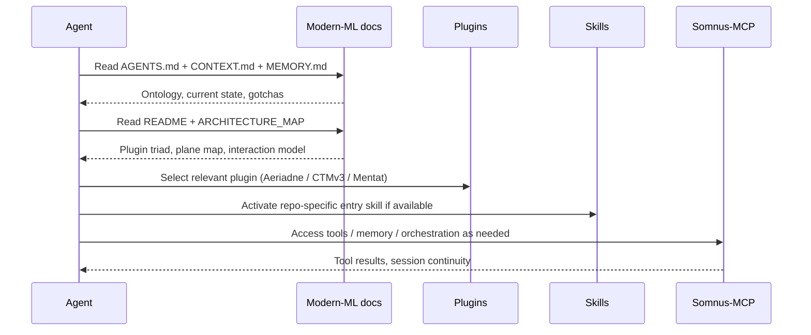
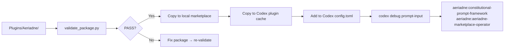
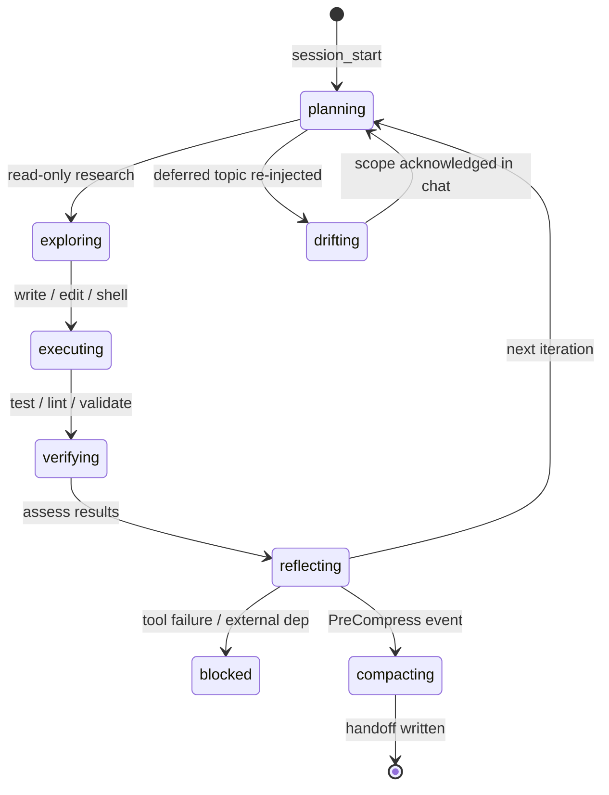

# TECHNICAL_REFERENCE.md — Modern-ML Sovereign Infrastructure Workspace

```
Classification: INTERNAL
Version:        1.0
Date:           2026-06-05
Origin:         Modern-ML / Daeron (Somnus Sovereign Systems)
Status:         OPERATIONAL
```

---

## Executive Summary

Modern-ML is the agent-operability, onboarding, and private-marketplace staging workspace for Daeron's sovereign ML ecosystem. It solves the problem of coding agents entering a large, specialized multi-repo environment without context — providing structured plugins, skills, agent prompts, and server visibility cards so any capable coding agent can orient and operate without guessing. The workspace is organized around three active plugins (Aeriadne, CTMv3, Mentat), a live server-plane reference (Somnus-MCP), and a layered skills/agents surface covering most active project repos. It is the support layer around the ML empire, not the empire itself.

---

## Table of Contents

1. [Workspace Identity](#1-workspace-identity)
2. [Plugin Triad](#2-plugin-triad)
3. [System Architecture](#3-system-architecture)
4. [Plane Specifications](#4-plane-specifications)
   - 4.1 [Agents Plane](#41-agents-plane)
   - 4.2 [Skills Plane](#42-skills-plane)
   - 4.3 [Plugin Plane](#43-plugin-plane)
   - 4.4 [Marketplace / Registry Plane](#44-marketplace--registry-plane)
   - 4.5 [Runtime Plane — Mentat](#45-runtime-plane--mentat)
   - 4.6 [Server / MCP Plane — Somnus-MCP](#46-server--mcp-plane--somnus-mcp)
5. [Cold-Entry Protocol](#5-cold-entry-protocol)
6. [Operational Flows](#6-operational-flows)
7. [Filesystem Layout](#7-filesystem-layout)
8. [Failure Signatures](#8-failure-signatures)
9. [Installation Reference](#9-installation-reference)
10. [Glossary](#10-glossary)
11. [Change Log](#11-change-log)

---

## 1. Workspace Identity

| Property | Value |
|---|---|
| Root path | `/home/daeron/Projects/Modern-ML` |
| Owner | Daeron (Somnus Sovereign Systems) |
| Classification | Internal / private |
| Primary consumers | Coding agents (Codex, Claude Code, OpenCode, Gemini CLI, Cursor) |
| Active plugin count | 3 (Aeriadne, Cognitive-Topology-Map, Mentat) |
| Active server plane | `/home/daeron/Somnus-MCP` |
| Server data root | `/home/daeron/Somnus-MCP/data` |

**What this workspace is:**
- Agent-operability and onboarding surface for the broader sovereign ML ecosystem
- Private-marketplace staging workspace for plugins, skills, and agent prompts
- Topology mirror and index over canonical sources that sometimes live elsewhere

**What this workspace is not:**
- The full sovereign ML empire
- A generic ML code repository
- A replacement for BB7/Sovereign tool planes

---

## 2. Plugin Triad

The three active plugins constitute the full plugin plane of Modern-ML as of 2026-06-05.

| Plugin | Path | Role | Install state |
|---|---|---|---|
| **Aeriadne** | `Plugins/Aeriadne/` | Constitutional prompt compiler + private marketplace operator | Staged; not installed |
| **Cognitive-Topology-Map (CTMv3)** | `Plugins/Cognitive-Topology-Map/` | Workspace activation / portable codebase-entry package | Active (multi-client) |
| **Mentat** | `Plugins/Mentat/` | Live session / runtime substrate | Active (Codex + Gemini adapters) |

**Archived (not active):**

| Plugin | Archive path | Reason |
|---|---|---|
| Codex-Config-Topology | `Plugins/old/Codex-Config-Topology/` | Consolidated; skills surfaced via Aeriadne |
| CPF-Plugin-Ariadne | `Plugins/old/Parallax-Narthex/CPF-Plugin-Ariadne/` | Superseded by Aeriadne |
| Parallax-Narthex | `Plugins/old/Parallax-Narthex/` | Superseded by Aeriadne |

---

## 3. System Architecture

```mermaid
graph TD
    subgraph Modern-ML["Modern-ML Workspace"]
        A[Agents/]
        S[Skills/]
        subgraph Plugins["Plugins/ — Active Triad"]
            AE[Aeriadne]
            CT[CTMv3]
            ME[Mentat]
        end
        REG[Aeriadne/registry + marketplace]
        OLD[Plugins/old/ — archived]
        SRV[Servers/]
    end

    AE --> CPF[constitutional-prompt-framework skill]
    AE --> AMO[aeriadne-marketplace-operator skill]
    AE --> REG

    CT --> CTMCORE[core Python activation engine]
    CT --> CTMADAPTERS[runtime adapters: Codex / Claude / Gemini / Cursor / OpenCode]

    ME --> SM[state_machine FSA + Q-table]
    ME --> HK[hooks — 11 event types]
    ME --> MCP_ME[MCP server — 10 introspection tools]
    ME --> WH[webhook engine + DLQ]
    ME --> EV[eval harness]

    SRV --> SOMNUS[Servers/Somnus-MCP -> /home/daeron/Somnus-MCP]
    SRV --> MUADDIB_L[Servers/Muaddib legacy symlink]

    A --> CUSTOM[Custom-Agents/]
    A --> MENTAT_A[Mentat-Agents/]
    A --> SOMNUS_A[Somnus-Agents/]

    S --> CTM_S[CTM-Skills/]
    S --> DOMAIN_S[Domain-Skills/]
    S --> TOOL_S[Tool-Skills/]
    S --> RESEARCH_S[Research-Skills/]
    S --> CTM_V3[cognitive-topology-v3/]

    SOMNUS --> BB7[BB7 / Sovereign tool plane]
    BB7 --> ROUTING[exoskeleton routing]
    BB7 --> MEMORY[memory / continuity]
    BB7 --> TOOLS[file / shell / web / orchestration]
```



*Legend: solid lines = contains / provides. Somnus-MCP is the active server root. Muaddib symlink is legacy-visible only.*

---

## 4. Plane Specifications

### 4.1 Agents Plane

**Path:** `Agents/`  
**Canonical source for most bodies:** `/home/daeron/.claude/agents/` (symlinked)

| Subdirectory | Contents | Purpose |
|---|---|---|
| `Custom-Agents/` | defense-grade-doc-engine, golden-path-architect, prod-finalizer | General-purpose operator posture |
| `Mentat-Agents/` | conductor, medic, quartermaster | Mentat ecosystem orchestration |
| `Somnus-Agents/` | ada-bridge-validator, entropy-kernel-inspector, system-router-tracer | ADA-Step-Entropy / routing specialist work |

> **IMPORTANT:** Agent bodies under `Agents/` are **symlinked mirrors** from `/home/daeron/.claude/agents/`. Edits to these files modify the canonical Claude agent source, not a local copy.

### 4.2 Skills Plane

**Path:** `Skills/`  
**Mixed topology:** some local, many symlinked from `/home/daeron/.opencode/skills/custom/`

| Subdirectory | Skills | Local vs. linked |
|---|---|---|
| `CTM-Skills/` | ada-step-entropy, agentic-kernel, codex-config, fiber-map, somnus-openrouter, somnus-router | Linked from `.opencode` |
| `Domain-Skills/` | enhanced-op-sota, polyphonic-agent-factory, somnus-design-system | Linked from `.opencode` |
| `Tool-Skills/` | academic-whitepaper, document-omniscient | Linked from `.opencode` |
| `Research-Skills/ssds-reverse-engineering-pipeline/` | SSDS reverse-eng pipeline | **Local to Modern-ML** |
| `cognitive-topology-v3/` | CTMv3 docs / lightweight entry | **Local to Modern-ML** |

### 4.3 Plugin Plane

#### Aeriadne

**Path:** `Plugins/Aeriadne/`  
**Plugin ID:** `aeriadne`  
**Status:** Private-v1, staged, not installed  
**Expected Codex exposure after install:** `aeriadne:constitutional-prompt-framework`, `aeriadne:aeriadne-marketplace-operator`

| Component | Path | Description |
|---|---|---|
| CPF skill | `skills/constitutional-prompt-framework/` | Constitution derivation, hardening, audit, scoring |
| Marketplace skill | `skills/aeriadne-marketplace-operator/` | Package/registry/adapter/marketplace/MCP-card operations |
| Plugin manifests | `plugin.json`, `.codex-plugin/`, `.claude-plugin/` | Codex and Claude Code install surfaces |
| Registry | `registry/*.yaml`, `registry/aeriadne.plugin.json` | Machine-readable package inventory |
| Marketplace cards | `marketplace/cards/`, `marketplace/indexes/` | Human-facing package discovery |
| Adapters | `adapters/codex/`, `adapters/claude-code/`, `adapters/opencode/` | Runtime projections per client |
| Subagents | `agents/subagents/` | 5 Aeriadne-specific subagent prompts |
| MCP/server card | `mcp/` | Somnus-MCP/BB7 reference catalog |
| Validation | `scripts/validate_package.py`, `tests/smoke_cases.yaml` | Package integrity checks |

**Validation state (last run: 2026-06-05):**

| Check | Result |
|---|---|
| Package shape | PASS |
| JSON manifests | PASS |
| TOML manifest | PASS |
| CPF skill package | PASS |
| CPF linter | PASS |
| CPF score | 87/100 (production candidate) |
| CPF static evals | PASS |
| CPF render fixture | PASS (3165 bytes) |

#### Cognitive-Topology-Map (CTMv3)

**Path:** `Plugins/Cognitive-Topology-Map/`  
**Role:** Portable codebase-entry and workspace-topology package. Instantiated upon entering a codebase; maintained as durable agent context.

| Component | Description |
|---|---|
| `core/ctmv3/` | Python activation engine (`cli.py`, `activate.py`, `boot.py`, `sovereign.py`) |
| `codex/` | Codex-specific skills, scripts, config fragments, install script |
| `claude-code/` | Claude Code commands, hooks, agents, settings |
| `gemini-cli/` | Gemini CLI commands, scripts, skills, extension manifest |
| `opencode/` | OpenCode commands, plugin TypeScript, agent, install script |
| `cursor/` | Cursor scripts, install script |
| `docs/` | Architecture maps, boot protocol, constitution, failure grammar, topology |

#### Mentat

**Path:** `Plugins/Mentat/`  
**Role:** Live cognitive/runtime substrate. Not a tool replacement — a session instrumentation layer.

| Component | Description |
|---|---|
| `state_machine/` | 8-state FSA (planning → exploring → executing → verifying → reflecting → blocked → drifting → compacting) + Q-table TD(0) learning |
| `hooks/` | 11 event hooks: session_start/stop, pre/post tool, pre/post compact, subagent start/stop, user_prompt_submit |
| `mcp_server/` | 10 MCP introspection tools |
| `webhook_engine/` | Async emission with dead-letter queue |
| `evals/` | Benchmark harness with state_transitions, persistence_recovery, predictive_routing scenarios |
| `adapters/codex/` | Codex hook compatibility layer |
| `adapters/gemini/` | Gemini CLI hook compatibility layer |
| `skills/` | mentat-plan, mentat-reflect, mentat-dispatch, mentat-debrief |
| `monitors/` | archivist, drift_watcher, entropy_watcher |

### 4.4 Marketplace / Registry Plane

**Current state:** Package-local proof of concept within Aeriadne.  
**Path:** `Plugins/Aeriadne/registry/` + `Plugins/Aeriadne/marketplace/`  
**Future direction:** Root-level `Registry/`, `Marketplace/`, `Adapters/`, `MCP/` surfaces.

| Registry file | Content |
|---|---|
| `plugins.yaml` | Aeriadne plugin card with client support matrix |
| `skills.yaml` | Skill inventory |
| `agents.yaml` | Agent/subagent inventory |
| `mcp_servers.yaml` | MCP/server-plane reference cards |
| `aeriadne.plugin.json` | Machine-readable plugin manifest |

### 4.5 Runtime Plane — Mentat

**FSA States:**

```
planning → exploring → executing → verifying → reflecting
                                                    ↓
                                              blocked / drifting / compacting
```

**Q-table parameters:** α=0.2, γ=0.8. Rewards: +1.0 successful tool, −0.5 tool error, +0.3 deep-chain bonus (≥4 tools), +0.1 low-latency (<500ms).

**Drift discipline:** `.mentat/scope.md` `## Out` list triggers `drifting` state. Write/exec tools blocked while drifting. Read tools and subagent dispatches remain open. Reset by acknowledging scope shift in chat.

**Session paths:**
- Active session: `~/.mentat/sessions/<sid>.json`
- Insights: `~/.mentat/insights/<sid>.jsonl`
- Handoffs: `~/.mentat/handoff/<sid>.md`
- Q-table: `~/.mentat/q_table.sqlite`

### 4.6 Server / MCP Plane — Somnus-MCP

**Active root:** `/home/daeron/Somnus-MCP`  
**Data root:** `/home/daeron/Somnus-MCP/data`  
**Modern-ML pointer:** `Servers/Somnus-MCP -> /home/daeron/Somnus-MCP`

> **CRITICAL:** `Servers/Muaddib -> /home/daeron/Repositories/Muaddib` is a **legacy visible symlink only**. It is not the active Codex server root. Do not use Muaddib as the current server-plane reference.

BB7/Sovereign capabilities available through Somnus-MCP:
- Memory and session continuity
- File, shell, web, and project-context tools
- Exoskeleton routing and orchestration
- Distillation and knowledge-graph surfaces

---

## 5. Cold-Entry Protocol

A coding agent entering Modern-ML for the first time must read in this exact order:

```
1. AGENTS.md          # purpose, ontology, precedence rules
2. CONTEXT.md         # current runtime state
3. MEMORY.md          # durable decisions, gotchas, plugin/package ontology
4. README.md          # directory structure, operator-stack map
5. ARCHITECTURE_MAP.md
6. ECOSYSTEM_ADOPTION_MAP.md
7. REPO_ENTRY_MATRIX.md
8. TECHNICAL_REFERENCE.md  (this document)
```

Then branch based on need:

| Objective | Primary surface |
|---|---|
| Constitution / prompt / packaging work | `Plugins/Aeriadne/` |
| Workspace activation / topology for a new repo | `Plugins/Cognitive-Topology-Map/` |
| Session instrumentation / drift/state tracking | `Plugins/Mentat/` |
| Domain entry for a specific repo | `Skills/CTM-Skills/<repo-skill>` |
| Specialist role / posture | `Agents/<category>/<agent>.md` |
| Tool / memory / orchestration | `/home/daeron/Somnus-MCP` |

---

## 6. Operational Flows

### Agent Onboarding Sequence



### Plugin Installation Flow (Aeriadne reference pattern)



### Mentat State Transitions



---

## 7. Filesystem Layout

```
Modern-ML/
├── Agents/                    # Role/posture surfaces (mostly symlinked from .claude/agents/)
│   ├── Custom-Agents/
│   ├── Mentat-Agents/
│   └── Somnus-Agents/
├── Plugins/                   # Active plugin triad
│   ├── Aeriadne/              # CPF + marketplace operator (staged, not installed)
│   ├── Cognitive-Topology-Map/ # CTMv3 (active, multi-client)
│   ├── Mentat/                # Runtime substrate (active)
│   └── old/                   # Archived: Codex-Config-Topology, Parallax-Narthex
├── Servers/
│   ├── Somnus-MCP -> /home/daeron/Somnus-MCP    # ACTIVE server plane
│   └── Muaddib   -> /home/daeron/Repositories/Muaddib  # Legacy mirror
├── Skills/                    # Mixed local + symlinked skill surfaces
│   ├── CTM-Skills/
│   ├── Domain-Skills/
│   ├── Tool-Skills/
│   ├── Research-Skills/
│   └── cognitive-topology-v3/  # Local
├── AGENTS.md                  # Primary entry point for coding agents
├── ARCHITECTURE_MAP.md        # Interaction map across all planes
├── CONTEXT.md                 # Current runtime state
├── ECOSYSTEM_ADOPTION_MAP.md  # Repo coverage matrix
├── MEMORY.md                  # Durable decisions and gotchas
├── PLAN.md                    # Current objectives and gates
├── README.md                  # Workspace overview
├── REPO_ENTRY_MATRIX.md       # Per-repo onboarding readiness registry
├── TECHNICAL_REFERENCE.md     # This document
└── filetree.md                # Detailed inventory snapshot
```

---

## 8. Failure Signatures

The following patterns indicate an agent has misread the workspace. Stop and correct before proceeding.

| Signature | Correct interpretation |
|---|---|
| Plugin described as replacing BB7/Sovereign tools | Plugins are cognitive/environment support; BB7 provides tool primitives |
| Aeriadne described as installed | Aeriadne is staged only; no `codex plugin list` evidence of install |
| `cpf-plugin-ariadne@local` installed alongside `aeriadne@local` | Duplicate CPF exposure — only one should be active |
| Somnus-MCP content copied into `Plugins/Aeriadne/mcp/` | `mcp/` is a reference catalog corner, not a vendor target |
| `Skills/` described as all-local | Many skill entries are symlinked from `.opencode/skills/custom/` |
| `Servers/Muaddib` cited as active server root | Active root is `/home/daeron/Somnus-MCP` |
| `cognitive-topology-v3` described as "the skill maker" | CTMv3 is a portable codebase-entry / workspace-topology package |
| Four or more plugins listed as active | Active triad is Aeriadne + CTMv3 + Mentat; Codex-Config-Topology is archived |
| AGENTS.md not read before any other file | AGENTS.md is the mandatory first read; all other reads depend on it |

---

## 9. Installation Reference

### Aeriadne (pending approval)

Use the same pattern proven for `codex-config-topology@local`:

```bash
# 1. Validate package
cd /home/daeron/Projects/Modern-ML/Plugins/Aeriadne
python3 scripts/validate_package.py .

# 2. Copy to local marketplace
cp -r . ~/.claude/plugins/marketplaces/local/plugins/aeriadne

# 3. Copy to Codex cache
mkdir -p ~/.codex/plugins/cache/local/aeriadne/1.0.0
cp -r . ~/.codex/plugins/cache/local/aeriadne/1.0.0/

# 4. Add to Codex config.toml
# [plugins."aeriadne@local"]
# enabled = true

# 5. Verify exposure
codex debug prompt-input | grep aeriadne
# Expected: aeriadne:constitutional-prompt-framework
#           aeriadne:aeriadne-marketplace-operator
```

> **WARNING:** Do not install `cpf-plugin-ariadne@local` alongside `aeriadne@local` unless duplicate CPF exposure is explicitly intended.

### Mentat adapters

```bash
# Codex adapter
cp -r Plugins/Mentat/adapters/codex/hooks/* ~/.codex/hooks/
# Add hooks.json entries to ~/.codex/config.toml

# Gemini adapter
cp Plugins/Mentat/adapters/gemini/gemini-extension.json ~/.gemini/extensions/mentat/
cp -r Plugins/Mentat/adapters/gemini/hooks/ ~/.gemini/extensions/mentat/hooks/
```

### CTMv3 per-client install

```bash
# Codex
bash Plugins/Cognitive-Topology-Map/codex/install.sh

# Claude Code
# Copy settings.json entries + add hooks from claude-code/hooks/

# Gemini CLI
bash Plugins/Cognitive-Topology-Map/gemini-cli/install.sh

# Cursor
bash Plugins/Cognitive-Topology-Map/cursor/install.sh

# OpenCode
bash Plugins/Cognitive-Topology-Map/opencode/install.sh
```

---

## 10. Glossary

| Term | Definition |
|---|---|
| **Aeriadne** | The canonical CPF + private marketplace plugin package. Skill-activated. Contains `constitutional-prompt-framework` and `aeriadne-marketplace-operator`. |
| **BB7 / Sovereign** | The tool-primitive layer exposed by Somnus-MCP. Provides file, shell, web, memory, and orchestration primitives. Not a plugin. |
| **Codex** | The active coding agent state machine. Plugins and skills are support surfaces for it, not replacements. |
| **CPF** | Constitutional Prompt Framework. The cognitive payload within Aeriadne for deriving, hardening, auditing, and packaging agent constitutions. |
| **CTMv3** | Cognitive Topology Map v3. Portable codebase-entry and workspace-topology package. Not merely a skill maker. |
| **Mentat** | Plugin/runtime substrate. Instruments the live coding session. Not the server plane. |
| **Modern-ML** | This workspace. The agent-operability, onboarding, and private-marketplace staging layer around Daeron's broader ML ecosystem. |
| **Somnus-MCP** | The active MCP/tool/server plane at `/home/daeron/Somnus-MCP`. Distinct from Mentat and from the Muaddib legacy mirror. |
| **Sovereign** | Daeron's broader sovereign ML ecosystem, of which Modern-ML is the onboarding/support layer. |
| **Skill** | A reusable cognitive workflow with trigger rules, references, templates, and tests. Distinct from a plugin (which is a distribution/install shell). |
| **Plugin** | An installable runtime/distribution package that may contain one or more skills plus manifests, adapters, and registry metadata. |

---

## 11. Change Log

| Date | Version | Change |
|---|---|---|
| 2026-06-05 | 1.0 | Initial production document. Reflects 3-plugin consolidation: Aeriadne, CTMv3, Mentat. Codex-Config-Topology archived. Somnus-MCP as active server plane. |
| 2026-06-05 | — | Aeriadne staged and validated. `ECOSYSTEM_ADOPTION_MAP.md` and `REPO_ENTRY_MATRIX.md` updated to v2.0. Stale addendum headers removed. |
| 2026-06-04 | — | CPF-Plugin-Ariadne and Parallax-Narthex superseded by unified Aeriadne package. |
| 2026-06-04 | — | `Codex-Config-Topology@local` installed and verified via prompt-input. |
