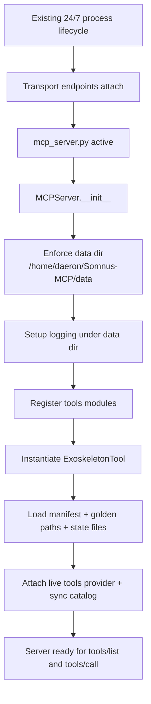
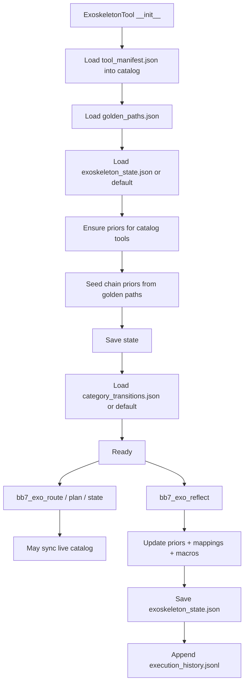
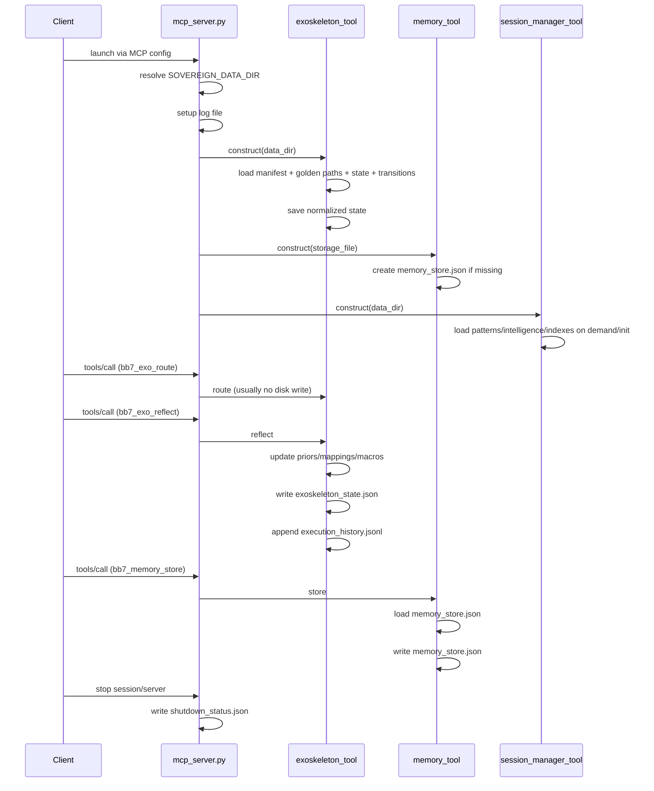

# Somnus-MCP Neural Substrate Specification

This document specifies the **24/7 Somnus-MCP neural-symbolic cognition server**. MCP JSON-RPC2, stdio, SSE, HTTPS, and webhook paths are transport surfaces only; they are not the architecture. The architecture is the always-on BB7/Lisan/Muad'Dib cognition plane operating over one shared distributed data root.

Gateway doctrine: `mcp_server.py` is the gateway into the 4-7 Muad'Dib + `tools/` cognition layers. It is not the intelligence itself. Its correct job is transport, registry, raw JSON/result-boundary preservation, lifecycle telemetry, one-plane binding, and final human-facing display projection. Neural weights, self-play, routing, reflection, and higher-order synthesis belong in `muadib/` and `tools/`.

Display projection doctrine (2026-06-04): verbose dict/list tool results are
summarized into Markdown only at the final MCP `content` seam. Raw result
payloads must already have fed trajectory buffers, tool usage logs, event-spine
summaries, ambient memory exchange, sovereign metadata, auto-reflect, Q-table
observation paths, and distillation/RFT capture before projection. Projection
metadata explicitly marks `projection_for_display_only`,
`raw_payload_in_content=false`, `raw_preserved_before_projection=true`,
`not_for_qtable=true`, `not_for_observations=true`,
`not_for_distillation=true`, and `not_for_rft=true`. Operators can set
`SOVEREIGN_DISPLAY_PROJECTION=raw` to return canonical raw JSON display text.

## Runtime Doctrine (2026-05-27)

- **One cognition/data plane, one venv**: all clients and agents use the same Muad'Dib + `tools/` substrate, `/home/daeron/Somnus-MCP/data`, and `/home/daeron/Somnus-MCP/mcp.venv`. Persistent transports should share one gateway process; stdio clients may spawn per-client gateway children, but they must not fork persistence or neural state.
- **No passive tool-rack framing**: `bb7_*` endpoints are public compiled capability surfaces. They may call multiple internal `cc8_`/private routines and substrate modules before returning.
- **Memory/session are substrate, not utilities**: `tools/memory_tool.py`, `tools/memory_interconnect.py`, and `tools/session_manager_tool.py` provide persistent cognition, context resurrection, concept graphs, auto-memory formation, and cross-session intelligence.
- **Routing/planning is neural-symbolic**: `tools/exoskeleton_tool.py`, `tools/lisan_al_gaib.py`, and `muadib/*` supply spectral intent decomposition, MCTS, Thompson bandits, SessionMomentum V3, Q-table signal, and advanced feature bridging.
- **Validation rule**: use `mcp.venv/bin/python` for source/schema checks. Do not start, stop, restart, or instantiate a parallel `MCPServer()` just to validate this repo. Live truth comes from the existing BB7/SovereignMCP plane.
- **Display rule**: do not treat cleaned display summaries as training truth. They are client-facing projections over raw payloads that have already been captured by the substrate.

## Architecture Layers

| Layer | Runtime role | Current surfaces |
|---|---|---|
| Transport layer | Carries requests/responses into the live process | MCP JSON-RPC2/stdio, Streamable HTTP/SSE, HTTPS wrapper, webhook engine |
| BB7 compiled capability surface | Public call contract exposed to clients | `bb7_*` endpoints in the live registry and `tool_manifest.json` |
| Cognitive continuity substrate | Makes agents non-stateless through durable memory and session state | `memory_tool.py`, `memory_interconnect.py`, `session_manager_tool.py`, ambient memory exchange |
| Routing/planning substrate | Chooses paths and compiles smarter responses | exoskeleton, Lisan, GoldenPathOracle, Muad'Dib, SessionMomentum, Thompson/MCTS |
| Persistence substrate | Shared distributed cognition data plane | `/home/daeron/Somnus-MCP/data` plus repo-root executable configs (`golden_paths.json`, `tool_manifest.json`) |

### Access Gateway Surfaces

- `https_wrapper.py` is an authenticated HTTPS gateway into the same Muad'Dib + `tools/` cognition plane. It must not become an output cleaner, second tool registry, or owner of neural/Q-table state.
- `webhook_engine.py` is event egress from the existing gateway/state-machine path. Webhook delivery signs and retries payloads; it does not mutate cognition ownership.
- `hook_executor.py` / `HOOK_BRIDGE.md` provide lifecycle/event ingress from Claude Code hooks into the state machine. Hooks are conductor signals, not a second server and not Mentat/Muad'Dib ownership.
- `docs/https_wrapper_endpoints.md` is an endpoint snapshot/documentation surface. It may contain dated tool-count payloads; runtime truth still comes from live `bb7_tool_health_report` plus `runtime_identity`.

## State Machine Router (`mcp_server.py`)

`mcp_server.py` is the active orchestration and transport boundary for the 24/7 cognition server. It resolves the canonical data directory, enforces one shared data root, dynamically discovers BB7 surfaces, maintains async bridging, records observations, and keeps the exoskeleton catalog synchronized with the live registry. It should not be treated as a disposable local harness.

### Key Responsibilities

- **Distributed cognition root**: enforces `/home/daeron/Somnus-MCP/data` via `SOVEREIGN_DATA_DIR`/`MCP_DATA_DIR` normalization.
- **Dynamic BB7 surface discovery**: discovers `tools/*.py`, instantiates the canonical `get_tools()` class, and registers endpoint definitions.
- **Async bridge**: background loop for coroutine-capable surfaces without per-call event-loop churn.
- **Continuity exchange**: automatically persists tool-call results into memory/session/interconnect structures with BM25 indexing, concept extraction, and session linkage.
- **Catalog sync**: feeds the exoskeleton live registry truth so routing priors follow the actual BB7 surface.
- **Neural-symbolic lifecycle**: warms Lisan/Muad'Dib/exoskeleton subsystems and records observations for ongoing learning.
- **Display projection**: `_format_tool_result(...)` projects verbose dict/list payloads into concise Markdown after raw capture; preformatted MCP `content` payloads are honored unchanged and raw JSON display is restored with `SOVEREIGN_DISPLAY_PROJECTION=raw`.

### Ambient Memory Exchange (2026-04-10)

The MCP server now implements automatic per-tool memory persistence:

- **Trigger**: Every tool call result is automatically scheduled for memory storage and injection alongside tool being called.
- **Process**: 
  1. Tool execution completes
  2. Result is analyzed for concepts via memory_interconnect
  3. Entry stored in memory_store.json with session linkage
  4. BM25 index updated for future retrieval
- **Memory Key Format**: `mcp_exchange::ses_{session_id}::{timestamp}::{tool_name}`
- **Benefits**: 
  - 24/7 autonomous operation without explicit memory calls
  - Every tool interaction is searchable via `bb7_memory_intelligent_search`
  - Session continuity preserved without developer intervention
  - Enables "zero-handshake" context resurrection via `bb7_lisan_recall`

### Codex History Ingestion (Global User Plane)

The state machine automatically pulls rollout and conversation history from the operator's global shell environment:

- **Source Path**: `/home/daeron/.codex/history.jsonl` (resolving to `/home/daeron/.codex/history.jsonl` on Linux, rather than workspace-internal directories).
- **Behavior**: Streams JSON-RPC conversation delta records and feeds them into the memory and session manager layers for ambient context.
- **State Tracking**: Stores offset and path info in `data/codex_ingest_state.json` to prevent reprocessing.

### Health & Monitoring

- `ping_server`: Basic server liveness check. Current-source payloads also include `runtime_identity` so the caller can identify the exact process/session answering the call.
- `bb7_tool_health_report`: Reports on failed loads, failed calls, slow tools, loaded modules, deterministic `registered_tools`, and current-source `runtime_identity` (`pid`, `ppid`, `session_id`, `transport`, canonical `data_dir`, source file mtime/digest, tool manifest mtime/digest). Use the identity block plus `registered_tools` for source/live parity gates; `unused_tools` is only backward-compatible session-behavior evidence because a tool leaves that projection after it is called. A healthy old process is still old-source until its identity-bearing health report and registry projection pass the relevant verifier.

---
### Runtime Module Integration Truth (2026-05-27; updated 2026-06-04)

- `tools/file_tool.py` is the advanced FileTool surface with compatibility aliases retained.
- `tools/meta_intelligence_engine.py` is a registry-bound orchestration facade. It composes the live BB7 tool plane through `attach_tool_plane(tools, tool_modules)` and does **not** instantiate sibling tools. Exposed source surfaces: `bb7_code_consciousness`, `bb7_context_weaver`, `bb7_creative_problem_solver`, and `bb7_muadib_mentat_bridge`.
- `bb7_tool_refresh_module` is a guarded built-in refresh surface for allowlisted registry-bound facades. It currently refreshes `meta_intelligence_engine` in-place, reattaches registry-bound facades, resyncs exoskeleton catalog, and avoids rerunning full `register_tools()` boot side effects such as autonomous-cycle startup.
- `TRASH/MAYBE-TOOLS/intelligent_automation_tool.py` is not registered separately because `tools/auto_tool_module.py` already owns the intelligent automation/optimization surface with richer schemas.
- `TRASH/MAYBE-TOOLS/ai_system_integration.py` is a blocked platform-specific candidate, not a current runtime module. It imports Windows-only modules (`winreg`, `win32*`, `wmi`) and contains eager system-management surfaces that are unsafe to drop into Linux auto-discovery.
- `golden_paths.json` contains only executable workflow definitions; extracted audit/history metadata lives in `golden_paths_meta.json`.


# Lisan Al-Gaib Orchestrator (`tools/lisan_al_gaib.py`): If the walk of the **golden path** is many possible futures, with only one chance to success

The literal, proactive orchestrator of the 24/7 autonomous tool server. It provides spectral intent decomposition, Thompson sampling with contextual bandits, Monte Carlo tree search planning, topological momentum manifold, narrative synthesis cortex, and autonomous meta-learning. The orchestrator actively evaluates context rather than passively waiting for tool calls.

## Architecture

- **Callable endpoints**: Functions starting with the `bb7_` prefix represents the actual called json format tool upon which any JSON-RPC2/likewise can call (This is to ensure the ability for the cross ecosystem integration. The "reverse-distillation" is not a core or neccessary system nor should it interfere with the operations of the State-Machine/SYmbolic rule reasoning network akin to SOAR/DART.) This is not an mcp server that is called-->execute-->output, this is not a single system and should **NEVER** be looked at as such. The Dune analogies although symbolic and may seem like simulation, are neccessary functions. The react "loop" (it is more akin to  a half donut). To walk the golden path is **every** user input-->only path to success. The golden path is, just as dune, the **single** path to success that the lisan al ghaib can only "see." Every tool input/output is also neccessary for the golden path as well as those represent the walking, to fail at any step of the way is to end the loop and not walk the golden path, just as Paul/Leto must have made every decision. We know where the system begins, my input we know where it ends, but we do not "know" how to get there only the Lisan Al Gaib can point the way. This is not brute force tools being called every `bb7_` tool called is a answer compilation of functions defined via (usually unless lisan al ghaib, etc. This will be further expabded upon but defining the cc8_ protocol for the actual tool-server. Yes Lisan Al Ghaib **is** the actual system. If `bb7_`, then `cc8_` {which may i remind that until digital twin rained we need because it connects the routes. Will come in handy when doing dig twin as it's already a persistent listening ssh llm backbone, well we remove the old shit strip to the bare concept, I am adding at min my structured and code modality, which because this is "my" version of a modality its like a flow top-->bottom python engine. Whay we do is hook direct to the bacbone of digital twin, use deterministic/hardcoded when cc8_ triggers its always self playinf we force it through the modality. Nobody said and ive already demonstrated that you need to set train and let run wild. Set, THEN 'aa6_' tools r whats coming in bc when bb7 that compiles the answer sure its the tool but each tool it calls itself internal classed because they 'compile' the final output.However, the tool server cc8_ since the server auto connects this is the 'backb is the culmination of lisan al ghaib in its ductape form not the one thats gonna be self play with digital twin and then the system has a real router. We dont clean outputs bc the underlying system is json but over time it is going to learn to not route tools, but become better at orchestration ie walking my Golden Path. The server can be looked at itself as Lisan AL Gaib. `aa6_` will replace the normal `_` tools that are called upon `bb7_` execution. When a `bb7_` is called that following class is not the actual tool, but rather the generated/compiled synthesized output from the defined `_` capabilities.

```
if `bb7_` detected via singular 24/7 server, it is routed through `mcp_server.py` (which is wht we are not cleaning json until the output. This is not a mcp server. Again, this is a autonomous tool network mcp/stdio json-rpc2 simply serves for now as the connector that is mass adoptable to local operators.) Every `bb7_` not only calls the `aa6_` (named A B C designated hierarchy I am a bottom down developer. The tool classed are defined first in order, ie 'aa` which serves to generate a more intelligent and useful output at every step. The server is not just pro-active, it is seeding the RFT dataset that will `reverse-distill` via gaining the usage of system, alongside that the tool server is re-used in another project of daerons in which the `bb7_` serve as backup tools in an Agentic Kernel, that is a agnostic full canon system/Master Terminal Emulator/kernel. This backend kernel assumes **NO** Operating System, Assumes **NO-OPERATOR** as it is a full terminal emulator, combined with the compounding benefits of agnostic ability to route making the system itself more intellient. Once a full digital-twin has been q learned (on every single tool call input/output/search etc fully cloning the routing layer) then the generated Reinforcement Fine Tuning Dataset will be used to seed a base model that will be inside of the agents environment, My Virtual Machines which are fully Peristent Operating systems I call "AIPC's." We already route these tools directly thru/out terminal as it is the single input, it hooks to base os which in the ai's case is Ubuntu Server in my virtual machine GO fleet system. By correcly loading the trained Lisan Al Ghaib, we continue more hooks/extending the self play further reverse upscale distillation until the Lisan Al Gaib becomes intelligent orchestration of **signal** itself.
```

## **Maintaining An understanding of the system: Defining the tool protocols for a baseline hardened understanding.**.

- The system is only an mcp server as far as that is the layer that our data is routed through. The lisan al ghaib is the real orchestrator of the system that is over time once the server is working at its actual state, will be itself "reverse-distilled" which is not raw capabilities of the underlying driving the system or code ability, but to serve

- **Proactive systems**: Functions starting with `_` are what actually makeup the output of a `bb7_` tools output. These earlier in file classes serve as a "library" that makeup a `bb7_` output. The Server is not just contuing to walk through the golden path, it is actively enhancing the answers every step of the way. The

### Spectral Intent Decomposition

- `_SpectralIntentDecomposer`: Character n-gram TF-IDF with positional decay for intent matching

### Thompson Sampling Bandit

- `_ThompsonContextualBandit`: Bayesian posterior sampling with context conditioning. **Instantiated and active (2026-04-24)** — drives `_reliability_sampled()` in `_score_tools` via stochastic Beta draw. Receives a `neural_q_bonus` from the Digital Twin 512-dim embedding space, conditioning the Beta draw on learned tool-quality signal. Note: the deterministic `_reliability()` path is preserved separately for chain confidence scoring and failure analysis; only scoring uses the stochastic draw.

### MCTS Planner

- `_MCTSPlanner`: Monte Carlo tree search for tool chain discovery. **Instantiated and active (2026-04-24)** — drives `bb7_exo_plan` when lisan subsystems are loaded. Runs 100 simulations per plan request with 15% adversarial failure injection per node. Selects Pareto-optimal branch by tree reward. Plans returned include `mcts: true`, `tree_reward: float`, `adversarial_survived: bool`, `fallback: List[str]`, and `plan_id` prefixed `mcts_`. The `_value_fn` inside the search uses `bb7_dt_encode_catalog` to compute embedding-based branch scores from the 512-dim manifold.

### Topological Momentum

- `_TopologicalMomentumManifold`: Session momentum with Wasserstein change-point detection

### Golden Path Oracle

- `GoldenPathOracle`: Prescient navigation layer for proven workflows

### Session Momentum

- `SessionMomentum`: Tracks tool usage for momentum-aware routing. **Instantiated and active (2026-04-24)** — `self._session_momentum` is constructed at exoskeleton init alongside `category_graph` and logger. On startup, `_refresh_spectral_catalog` runs immediately (not deferred) so the `_cached_neural_attention` dict is populated before any tool calls. At each `_refresh_spectral_catalog` call, per-category L1-norm attention weights are computed from Digital Twin embeddings and injected via `SessionMomentum._manifold.inject_neural_attention()`. The result is a 7-signal V3 manifold where signal 5 is neural attention and signal 6 blends `SessionMomentum.compute_momentum_bonus()` into `_compute_momentum_bonus`.

### Meta-Learning

- `_MetaLearningEngine`: Autonomous weight tuning and golden path discovery

### Narrative Engine

- `NarrativeEngine`: Transforms quantitative routing into reasoning narratives

### Distillation Subsystem

- `DistillationSubsystem`: Non-blocking telemetry/RFT witness layer

## Tool Categories

### Exoskeleton Tools (`exoskeleton_tool.py`)

Control-plane layer providing stateful, Bayesian tool routing, plan execution checkpointing, and multi-AI coordination. All routing decisions improve over time via Beta-distribution priors updated on each `bb7_exo_reflect` call.

#### `bb7_exo_bootstrap`

Initializes capability context for a turn. Returns current tool index counts, category distribution, manifest status, and active tool priors/diagnostics.
**Internal Composition**: Synthesizes the runtime environment state by orchestrating calls to `_refresh_catalog_from_manifest_if_changed`, `_maybe_sync_live_tools`, and `_tool_prior_diagnostics` to ensure the session operates on fresh tool priors.

- **Parameters**:
  - `include_recent_outcomes` (boolean, optional): Include recent plan outcomes in payload (default: `true`).
  - `include_healthcheck` (boolean, optional): Include live tool health check (default: `true`).

#### `bb7_exo_list_tool_categories`

List all tool categories with sample tool names and neighboring categories.

#### `bb7_exo_category_specific_tools`

List all tools in a specific category, sorted by reliability, with required params.

- **Parameters**:
  - `category` (string, required): Category name (e.g., `memory`, `file`, `shell`).
  - `limit` (integer, optional): Max tools to return (default: 20).

#### `bb7_exo_route`

Retrieve ranked candidate tools for an intent using TF-IDF semantic scoring, category graph neighbors, and Beta-distribution reliability priors.
**Internal Composition**: Compiles results from `_SpectralIntentDecomposer` for semantic intent matching and `_ThompsonContextualBandit` for Bayesian posterior sampling to provide context-conditioned tool routing.

- **Parameters**:
  - `intent` (string, required): The task or goal to find tools for.
  - `max_candidates` (integer, optional): Number of candidates to return (default: 12).
  - `include_neighbors` (boolean, optional): Include category-graph neighbors (default: `true`).
  - `neighbor_distance` (integer, optional): Graph hop distance for neighbors, 0-3 (default: 1).

#### `bb7_exo_plan`

Generate candidate multi-step execution chains. 
**Internal Composition**: Delegates to `_MCTSPlanner` for Monte Carlo tree search when lisan subsystems are active. Runs 100 simulations with adversarial failure injection, using `bb7_dt_encode_catalog` for neural value function estimation, and selects Pareto-optimal branches. Falls back to beam search (`_make_plans`) when lisan subsystems are unavailable. Returns ranked plans with confidence scores, token estimates, failure points, and fallback chains.

- **Parameters**:
  - `intent` (string, required): The task or goal to plan for.
  - `context` (string, optional): Additional context to incorporate into scoring.
  - `beam_width` (integer, optional): Number of candidate plans to generate, 1-6 (default: 3).
  - `max_chain_length` (integer, optional): Maximum steps per plan, 2-8 (default: 4).

#### `bb7_exo_reflect`

Update Beta priors after execution and append a row to the execution history JSONL. 
**Internal Composition**: Acts as a state synthesizer that calls `_apply_reflect_mutations` to update `_ThompsonContextualBandit` priors, updates the `_TopologicalMomentumManifold` via `_update_session_momentum`, and injects neural attention weights from the Digital Twin into the momentum graph.

- **Parameters**:
  - `plan_id` (string, required): Plan identifier from `bb7_exo_plan`.
  - `tools_used` (array or string, required): List (or comma-separated string) of tools executed.
  - `success` (boolean, required): Whether the execution succeeded.
  - `error` (string, optional): Error message if execution failed.
  - `intent` (string, optional): Original intent, used to update intent-to-tool mappings.
  - `recovery_strategy` (string, optional): What recovery was applied, if any.

#### `bb7_exo_state`

Return raw exoskeleton state: top tool priors, top chain priors, discovered macros, and known recovery strategies.

- **Parameters**:
  - `limit` (integer, optional): Max rows per section (default: 15).

#### `bb7_exo_get_recent_activity`

Get recent activity from all AI instances for multi-AI coordination.

- **Parameters**:
  - `limit` (integer, optional): Max entries per section (default: 10).

#### `bb7_exo_briefing`

Generate a natural-language markdown briefing for the current intent.

- **Parameters**:
  - `intent` (string, required): The user-facing goal or task description.
  - `max_recommendations` (integer, optional): Max tools to surface (default: 5).

#### `bb7_exo_preemptive_recovery`

Analyse a planned workflow for failure risks before execution.

- **Parameters**:
  - `intent` (string, required): The task intent to plan for.
  - `risk_tolerance` (string, optional): `conservative`, `moderate`, or `aggressive` (default: `moderate`).

#### `bb7_exo_route_focused`

Token-efficient routing: return only the top-N tools with a one-liner each.

- **Parameters**:
  - `intent` (string, required): The task intent.
  - `top_n` (integer, optional): Number of tools to surface, 1-15 (default: 5).

#### `bb7_exo_execute_step`

Record a single step execution in a checkpointed plan.

- **Parameters**:
  - `plan_id` (string, required): Plan identifier from `bb7_exo_plan`.
  - `step_index` (integer, required): 0-based index of the step in the chain.
  - `tool_name` (string, optional): Tool that was executed.
  - `result_summary` (string, optional): Brief description of the step outcome.
  - `success` (boolean, optional): Whether the step succeeded (default: `true`).
  - `dry_run` (boolean, optional): Preview the mutation without writing to disk (default: `false`).

#### `bb7_exo_resume_plan`

Resume a checkpointed plan from where it left off.

- **Parameters**:
  - `plan_id` (string, optional): Plan identifier to resume.

#### `bb7_exo_kpi_report`

Generate a KPI report for one or all active plans.

- **Parameters**:
  - `plan_id` (string, optional): Specific plan to report on.

#### `bb7_lisan_recall` (2026-04-10 ADDED)

Context Resurrection: single-call session recovery for long-horizon tasks. 
**Internal Composition**: Compiles context by orchestrating calls to `bb7_memory_surface_context` for BM25 memory retrieval, reading `active_plans.json` and `cross_ai_activity.jsonl`, generating topological momentum context via `_get_momentum_context()`, and surfacing decisions via `CognitiveJournalSubsystem`.

- **Parameters**:
  - `context` (string, required): Current task description or session context text.
  - `max_memories` (number, optional): Max memories to surface (default: 5).
  - `include_plans` (boolean, optional): Include active plan checkpoints (default: true).
  - `include_activity` (boolean, optional): Include cross-AI activity (default: true).
  - `include_decisions` (boolean, optional): Include prior decisions from cognitive journal (default: true).

#### `bb7_lisan_distill` (2026-04-10 ADDED)

Explicit distillation: log a complete LLM trajectory for RFT training data. 
**Internal Composition**: Delegates entirely to `DistillationSubsystem.log_full_trajectory` and `DistillationSubsystem._evaluate_heuristics` to store and analyze agent session telemetry.

- **Parameters**:
  - `trajectory` (array, required): List of message dicts (role/content/tool_calls).
  - `source_plane` (string, optional): Origin identifier (default: bb7_agent_harness).
  - `session_id` (string, optional): Session identifier (auto-detected if omitted).
  - `total_tokens` (number, optional): Total tokens consumed.
  - `latency_seconds` (number, optional): Wall-clock seconds.
  - `tool_error_count` (number, optional): Number of tool errors encountered.

#### `bb7_lisan_intend` (2026-04-10 ADDED)

Expose spectral intent analysis as a direct tool. 
**Internal Composition**: Compiles analysis directly from `_SpectralIntentDecomposer.spectral_similarity()` and `_SpectralIntentDecomposer.entropy_gate()`, along with topological momentum bonuses, synthesizing internal reasoning into an externally accessible representation.

- **Parameters**:
  - `user_message` (string, required): The user's natural language message or task description.
  - `verbosity` (string, optional): Output verbosity — minimal | normal | detailed (default: normal).

### Web Tools (`enhanced_web_tool.py`)

The primary web module for fetching, searching, and analyzing web content. Note: It replaces legacy `web_tool.py` endpoints with enhanced, consolidated methods.

#### `bb7_fetch_url`

Fetch and analyze web content from any URL with smart text extraction.
**Internal Composition**: Orchestrates `_fetch_web_content`, `_analyze_web_content`, `_extract_readable_content`, and `_get_content_insights`.

- **Parameters**:
  - `url` (string, required): The URL to fetch.
  - `extract_text` (boolean, optional): Whether to extract readable text (default: True).
  - `follow_redirects` (boolean, optional): Default True.
  - `include_metadata` (boolean, optional): Default True.
  - `save_content` (boolean, optional): Cache content to disk.

#### `bb7_search_web`

Search the web using multiple search engines with intelligent result aggregation.
**Internal Composition**: Compiles results via `_perform_web_search`, `_analyze_search_results`, and `_generate_related_queries`.

- **Parameters**:
  - `query` (string, required): The search query.
  - `search_engine` (string, optional): Engine to use (e.g. duckduckgo).
  - `max_results` (number, optional): Max results (default: 10).
  - `include_snippets` (boolean, optional): Include text snippets.

#### `bb7_analyze_webpage`

Perform comprehensive analysis of webpage structure, content quality, and SEO factors.
**Internal Composition**: Synthesizes analysis by calling `_fetch_web_content`, `_analyze_html_structure`, `_analyze_seo_factors`, `_analyze_technical_aspects`, and `_analyze_accessibility`.

- **Parameters**:
  - `url` (string, required): The URL to analyze.
  - `include_links` (boolean, optional): Default True.
  - `include_images` (boolean, optional): Default True.
  - `include_scripts` (boolean, optional): Default False.
  - `analyze_seo` (boolean, optional): Default True.

#### `bb7_download_file`

Download files from web URLs with intelligent handling and progress tracking.
**Internal Composition**: Orchestrates `_get_file_info`, `_download_file_content`, and `_analyze_downloaded_file`.

- **Parameters**:
  - `url` (string, required): The URL to download from.
  - `filename` (string, optional): The name to save the file as.
  - `destination` (string, optional): Directory to save to (default: downloads).
  - `max_size` (number, optional): Max allowed size in bytes.
  - `overwrite` (boolean, optional): Overwrite existing.

### Advanced File Capability Surface (`file_tool.py`)

`tools/file_tool.py` now exposes the promoted advanced `FileTool` surface with compatibility shims for continuity callers. This is a BB7 capability surface over filesystem state, not a separate server instance. Read operations preserve raw-content behavior by default so existing callers that parse file contents remain stable; decorated analysis is opt-in via `show_analysis=true` or `format="analysis"`.

#### Current file endpoints

| Endpoint | Status | Contract |
|---|---|---|
| `bb7_read_file` | existing, enhanced | Raw text by default; optional analysis/decorated mode; `path` required. |
| `bb7_write_file` | existing, enhanced | Writes content with parent creation, encoding, optional backup, executable bit. |
| `bb7_append_file` | compatibility preserved | Appends content without replacing historical callers. |
| `bb7_list_directory` | existing, enhanced | Metadata-rich directory listing with sorting/detail controls. |
| `bb7_search_files` | existing, hardened | Bounded recursive search; accepts legacy `pattern` and new `name_pattern`; content reads are capped; skips symlink loops and heavy runtime dirs. |
| `bb7_get_file_info` | compatibility alias | Alias to `bb7_file_info`. |
| `bb7_file_cache_stats` | compatibility shim | Legacy cache surface now reports cache removal plus operation-history stats. |
| `bb7_copy_file` | new | Copy files/directories with overwrite and metadata controls. |
| `bb7_move_file` | new | Move/rename files and directories. |
| `bb7_delete_file` | new | Deletes with backup by default; directory deletion and no-backup destructive deletion require `force=true`. |
| `bb7_file_info` | new canonical | Comprehensive path metadata with Linux-safe stat handling. |
| `bb7_operation_history` | new | File-operation history and workflow-pattern telemetry. |

#### Destructive-operation rule

`bb7_delete_file` defaults to reversible behavior. A directory delete, or any delete with `create_backup=false`, must include `force=true`. This preserves advanced capability while preventing accidental irreversible state loss from legacy callers.

#### `bb7_read_file`

Read file content as raw text with automatic encoding detection.
**Internal Composition**: Maps to `FileTool.bb7_read_file()`.

- **Parameters**:
  - `path` or `file_path` (string, required): Path of the file to read.
  - `max_size` (number, optional): Maximum size in bytes to read (default: 10,485,760).
  - `force_text` (boolean, optional): Read file as text even if binary characters are detected.
  - `show_analysis` (boolean, optional): Return structural file analysis metadata instead of raw content.
  - `format` (string, optional): Output format, either `raw` or `analysis`.

#### `bb7_write_file`

Write or create a file with parent folder creation and backup options.
**Internal Composition**: Maps to `FileTool.bb7_write_file()`.

- **Parameters**:
  - `path` or `file_path` (string, required): Path of the file to write.
  - `content` (string, required): Content to write.
  - `encoding` (string, optional): File encoding (default: `utf-8`).
  - `create_backup` (boolean, optional): Create a timestamped backup if the file already exists (default: `true`).
  - `make_executable` (boolean, optional): Set executable permissions on the file.

#### `bb7_append_file`

Append text content to a file.
**Internal Composition**: Maps to `FileTool.bb7_append_file()`.

- **Parameters**:
  - `path` or `file_path` (string, required): Path of the file to append to.
  - `content` (string, required): Content to append.
  - `encoding` (string, optional): File encoding (default: `utf-8`).
  - `create_backup` (boolean, optional): Create backup before appending (default: `false`).

#### `bb7_copy_file`

Copy a file or directory to a destination path.
**Internal Composition**: Maps to `FileTool.bb7_copy_file()`.

- **Parameters**:
  - `source` (string, required): Source path of the file or directory.
  - `destination` (string, required): Destination path.
  - `overwrite` (boolean, optional): Overwrite the destination if it exists (default: `false`).
  - `preserve_metadata` (boolean, optional): Preserve stat metadata (default: `true`).

#### `bb7_move_file`

Move or rename a file or directory.
**Internal Composition**: Maps to `FileTool.bb7_move_file()`.

- **Parameters**:
  - `source` (string, required): Source path.
  - `destination` (string, required): Destination path.

#### `bb7_delete_file`

Remove a file or directory. Directory deletions or disabling backups requires force.
**Internal Composition**: Maps to `FileTool.bb7_delete_file()`.

- **Parameters**:
  - `path` (string, required): Path of the file or directory to delete.
  - `force` (boolean, optional): Force delete directories or disable file backup safeguards (default: `false`).
  - `create_backup` (boolean, optional): Backup target to the temp directory before deleting (default: `true`).

#### `bb7_list_directory`

List directory contents with metadata-rich metrics.
**Internal Composition**: Maps to `FileTool.bb7_list_directory()`.

- **Parameters**:
  - `path` (string, optional): Path of the directory (default: `.`).
  - `show_hidden` (boolean, optional): Include files starting with a dot (default: `true`).
  - `sort_by` (string, optional): Sort entries by `name`, `size`, `modified`, or `type` (default: `name`).
  - `max_items` (integer, optional): Maximum list count (default: 200).
  - `show_details` (boolean, optional): Show size, modified timestamp, type, and permissions details (default: `true`).

#### `bb7_search_files`

Recursively search files under a directory by name or content.
**Internal Composition**: Maps to `FileTool.bb7_search_files()`.

- **Parameters**:
  - `directory` (string, optional): Root directory to search (default: `.`).
  - `name_pattern` or `pattern` (string, optional): Glob pattern for filenames (default: `*`).
  - `content_pattern` (string, optional): Text pattern to search for within file contents.
  - `max_results` (integer, optional): Bounded limit of results (default: 100).
  - `include_hidden` (boolean, optional): Include hidden directories/files (default: `false`).
  - `max_depth` (integer, optional): Maximum directory recursion depth (default: 10).
  - `file_size_min` (integer, optional): Minimum file size in bytes (default: 0).
  - `file_size_max` (integer, optional): Maximum file size in bytes.
  - `timeout_seconds` (number, optional): Query timeout threshold (default: 15.0).
  - `content_read_limit` (integer, optional): Content limit to search (default: 1,048,576).
  - `skip_dirs` (array of strings, optional): Subdirectories to skip.

#### `bb7_file_info`

Retrieve comprehensive system status, file metrics, and metadata.
**Internal Composition**: Maps to `FileTool.bb7_file_info()`.

- **Parameters**:
  - `path` (string, required): Path of the target file or directory.

#### `bb7_get_file_info`

Compatibility alias for detailed file metadata.
**Internal Composition**: Routes directly to `bb7_file_info`.

- **Parameters**:
  - `path` (string, required): Path of the target file or directory.

#### `bb7_file_cache_stats`

Compatibility shim reporting operation counts and confirming cache removal.
**Internal Composition**: Maps to `FileTool.bb7_file_cache_stats()`.

- **Parameters**: None.

#### `bb7_operation_history`

View recent history of filesystem operations in this session.
**Internal Composition**: Maps to `FileTool.bb7_operation_history()`.

- **Parameters**:
  - `limit` (integer, optional): Maximum history records to return (default: 20).
  - `operation_type` (string, optional): Filter by operation type (e.g., `read`, `write`, `copy`).

### Shell Tools (`shell_tool.py`)

Tools for secure command execution, system monitoring, and process management.

#### `bb7_run_command`

Execute shell commands safely with output analysis and security controls.
**Internal Composition**: Direct execution wrapping `subprocess.run` with built-in security via `_check_command_security()` and telemetry tracing via `_log_execution()`.

- **Parameters**:
  - `command` (string, required): The shell command to execute.
  - `working_directory` (string, optional): The directory to run the command in.
  - `timeout` (integer, optional): Command timeout in seconds.
  - `capture_output` (boolean, optional): Whether to capture command output.
  - `environment` (object, optional): Additional environment variables.

#### `bb7_get_system_info`

Get comprehensive system information (hardware, OS, processes, disk, memory, network).
**Internal Composition**: Reads `psutil` APIs to return structured system configuration.

- **Parameters**:
  - `include_processes` (boolean, optional): Include running processes information.
  - `include_network` (boolean, optional): Include network interface information.
  - `include_disk_usage` (boolean, optional): Include disk usage information.

#### `bb7_list_processes`

List and analyze running processes with filtering and resource usage analysis.
**Internal Composition**: Reads `psutil.process_iter()` to list current processes with sorting/filtering.

- **Parameters**:
  - `filter` (string, optional): Filter processes by name pattern.
  - `sort_by` (string, optional): Sort processes by `cpu`, `memory`, `name`, `pid`, or `age`.
  - `limit` (integer, optional): Maximum number of processes to show.
  - `show_system_processes` (boolean, optional): Include system processes in results.

#### `bb7_get_command_history`

View command execution history with performance analysis and success rates.
**Internal Composition**: Reads from the local in-memory/disk log `self.history_file`.

- **Parameters**:
  - `limit` (integer, optional): Maximum number of commands to show.
  - `filter` (string, optional): Filter commands by pattern.
  - `show_successful_only` (boolean, optional): Show only successful commands.

### Memory Continuity Substrate (`memory_tool.py`)

Public BB7 surfaces over persistent working and long-term memory. This module is not an ordinary utility rack; it is the continuity substrate that lets clients recover context across turns and sessions through LRU working memory, persistent storage, BM25 search, and Ebbinghaus decay metadata.

#### `bb7_memory_store`

Store a key-value pair with enhanced metadata and intelligence.
**Internal Composition**: Updates/reads the persistent memory substrate via `EnhancedMemoryTool.store()` with automatic BM25 indexing and Ebbinghaus decay initialisation.

- **Parameters**:
  - `key` (string, required): The key to store the value under.
  - `value` (string, required): The value to store.
  - `category` (string, optional): The category of the memory (e.g., `insights`, `decisions`, `technical`).
  - `importance` (number, optional): Importance score from 0.0 to 1.0.
  - `tags` (array, optional): A list of tags for the memory.

#### `bb7_memory_retrieve`

Retrieve a value with optional related memories and metadata.
**Internal Composition**: Updates/reads the persistent memory substrate via `EnhancedMemoryTool.retrieve()`, updating Ebbinghaus stability to reinforce retention.

- **Parameters**:
  - `key` (string, required): The key of the memory to retrieve.
  - `include_related` (boolean, optional): Whether to include related memories in the response.

#### `bb7_memory_delete`

Delete a key from persistent memory.
**Internal Composition**: Maps to `EnhancedMemoryTool.delete()`.

- **Parameters**:
  - `key` (string, required): The key of the memory to delete.

#### `bb7_memory_list`

List memory keys with advanced filtering and sorting.
**Internal Composition**: Maps to `EnhancedMemoryTool.list_keys()`.

- **Parameters**:
  - `prefix` (string, optional): Filter keys by prefix.
  - `category` (string, optional): Filter keys by category.
  - `min_importance` (number, optional): Minimum importance score filter.
  - `sort_by` (string, optional): Sort by `timestamp`, `importance`, `access`, or `alphabetical`.

#### `bb7_memory_search`

Search memories using intelligent semantic matching.
**Internal Composition**: Updates/reads the persistent memory substrate via `EnhancedMemoryTool.intelligent_search()` using BM25 and Ebbinghaus decay reranking.

- **Parameters**:
  - `query` (string, required): The search query.
  - `max_results` (number, optional): Maximum number of results to return.

#### `bb7_memory_stats`

Get comprehensive statistics about memory usage (keys, size, distribution).
**Internal Composition**: Updates/reads the persistent memory substrate via `EnhancedMemoryTool.get_stats()`.

#### `bb7_memory_insights`

Get comprehensive insights about the memory system (network density, top concepts).
**Internal Composition**: Updates/reads the persistent memory substrate via `EnhancedMemoryTool.get_memory_insights()`.

#### `bb7_memory_consolidate`

Consolidate and optimize memory storage by archiving old/low-importance entries.
**Internal Composition**: Updates/reads the persistent memory substrate via `EnhancedMemoryTool.consolidate_memories()`.

- **Parameters**:
  - `days_old` (number, optional): Age threshold in days.

#### `bb7_memory_categories`

Get the list of available memory categories and their descriptions.
**Internal Composition**: Maps to `EnhancedMemoryTool.CATEGORIES`.

#### `bb7_memory_surface_context`

Proactively surface the most relevant memories for a given context blob using BM25 + Ebbinghaus decay weighting. Call at session start to recover relevant prior knowledge.
**Internal Composition**: Updates/reads the persistent memory substrate via `EnhancedMemoryTool.surface_context()`.

- **Parameters**:
  - `context_text` (string, required): Current context or task description to match against.
  - `max_results` (number, optional): Max memories to surface (default: 5).

#### `bb7_memory_bulk_store`

Atomically store multiple memory entries in a single disk write.
**Internal Composition**: Updates/reads the persistent memory substrate via `EnhancedMemoryTool.bulk_store()`.

- **Parameters**:
  - `entries_json` (string, required): JSON array of `{key, value, category, importance, tags}` objects.

#### `bb7_memory_get_related`

Fetch semantically related memories for a given key using BM25.
**Internal Composition**: Updates/reads the persistent memory substrate via `EnhancedMemoryTool.get_related()`.

- **Parameters**:
  - `key` (string, required): Memory key to find relations for.
  - `max_results` (number, optional): Max related memories to return (default: 5).

#### `bb7_memory_timeline`

Chronological view of memories created or updated recently, showing Ebbinghaus retention score for each entry.
**Internal Composition**: Updates/reads the persistent memory substrate via `EnhancedMemoryTool.memory_timeline()`.

- **Parameters**:
  - `days` (number, optional): Look-back window in days (default: 7).
  - `limit` (number, optional): Max entries to show (default: 20).

#### `bb7_memory_export`

Export all memories as Markdown or JSON.
**Internal Composition**: Updates/reads the persistent memory substrate via `EnhancedMemoryTool.export_memories()`.

- **Parameters**:
  - `format` (string, optional): Export format — `markdown` or `json` (default: `markdown`).

### Memory Interconnect Substrate (`memory_interconnect.py`)

Tools for creating intelligent links between memory systems, semantic matching, and context-aware retrieval.

#### `bb7_memory_analyze_entry`

Analyze a memory entry to detect concepts, calculate importance, and find related memories.
**Internal Composition**: Orchestrates `MemoryInterconnectSubsystem.analyze_memory_entry` to index the entry using BM25, extract concepts, and map relationships to existing memories.

- **Parameters**:
  - `key` (string, required): The key of the memory entry.
  - `value` (string, required): The value of the memory entry.
  - `source` (string, optional): The source of the memory entry (defaults to `memory`).

#### `bb7_memory_intelligent_search`

Search across all memory systems using semantic similarity and concept matching.
**Internal Composition**: Delegates to `MemoryInterconnectSubsystem.intelligent_search` for BM25-ranked semantic search, returning formatted, highly accurate results compared to keyword search.

- **Parameters**:
  - `query` (string, required): The search query.
  - `max_results` (number, optional): The maximum number of results to return.

#### `bb7_memory_get_insights`

Generate high-level insights about the memory network.
**Internal Composition**: Synthesizes a formatted report about the memory network's density, top concepts, and important memories via `MemoryInterconnectSubsystem.get_memory_insights`.

#### `bb7_memory_concept_network`

Get the network of memories and related concepts connected to a specific term.
**Internal Composition**: Compiles a map from `MemoryInterconnectSubsystem.get_concept_network()`.

- **Parameters**:
  - `concept` (string, required): The concept to analyze.

#### `bb7_memory_extract_concepts`

Extract key technical terms, phrases, and concepts from text.
**Internal Composition**: Delegates to `MemoryInterconnectSubsystem.extract_concepts` utilizing BM25 tokens and heuristic NLP extraction.

- **Parameters**:
  - `text` (string, required): The text to extract concepts from.

#### `bb7_memory_cluster` (2026-04-10 ADDED)

Group indexed memories into BM25 semantic clusters.
**Internal Composition**: Orchestrates `MemoryInterconnectSubsystem.cluster_memories()`.

- **Parameters**:
  - `n_clusters` (number, optional): Target number of clusters (default: 5).

#### `bb7_memory_find_gaps` (2026-04-10 ADDED)

Find concepts referenced in multiple memories but lacking a dedicated entry.
**Internal Composition**: Compiles a report via `MemoryInterconnectSubsystem.find_knowledge_gaps()`.

- **Parameters**:
  - `min_frequency` (number, optional): Minimum reference count to flag as a gap (default: 3).

#### `bb7_memory_graph` (2026-04-10 ADDED)

Export memory relationship graph in Graphviz DOT format for visualisation.
**Internal Composition**: Exports directly via `MemoryInterconnectSubsystem.get_memory_graph()`.

- **Parameters**:
  - `min_similarity` (number, optional): Minimum BM25 similarity to draw an edge (default: 0.3).

#### `bb7_memory_consolidate_index` (2026-04-10 ADDED)

Archive low-importance old memories and prune all indices. Fixes orphaned concept refs.
**Internal Composition**: Orchestrates `MemoryInterconnectSubsystem.consolidate_memories()` to prune BM25 caches and re-link orphans.

- **Parameters**:
  - `age_threshold_days` (number, optional): Age threshold in days for archival (default: 30).
  - `explicit_ids` (array, optional): Optional list of specific memory IDs to archive.

#### `bb7_memory_delete` (2026-04-10 ADDED)

Delete a memory entry by key.

- **Parameters**:
  - `key` (string, required): Key to delete.

#### `bb7_memory_list` (2026-04-10 ADDED)

List memory keys with filtering and sorting.

- **Parameters**:
  - `prefix` (string, optional): Filter keys by prefix.
  - `category` (string, optional): Filter keys by category.
  - `min_importance` (number, optional): Minimum importance score filter.
  - `sort_by` (string, optional): Sort by timestamp, importance, access, alphabetical, or decay.

### Intelligent Optimization Tools (`auto_tool_module.py`)

AI-driven tools for workspace optimization, pattern recognition, and productivity enhancement.

#### `bb7_analyze_workflow_patterns`

Analyze workflow patterns with AI-driven insights and optimization opportunities.
**Internal Composition**: Compiles insights using `_collect_workflow_patterns`, `_analyze_productivity_patterns`, `_analyze_efficiency_patterns`, and `_identify_optimization_opportunities` to synthesize a full report.

- **Parameters**:
  - `analysis_depth` (string, optional): Depth of analysis (e.g., `comprehensive`).
  - `time_range_days` (number, optional): Time range in days to analyze.

#### `bb7_performance_optimization`

Advanced performance optimization with real-time monitoring and intelligent tuning.
**Internal Composition**: Orchestrates `_collect_performance_baseline`, `_identify_performance_bottlenecks`, and `_predict_performance_improvements`.

- **Parameters**:
  - `optimization_type` (string, optional): Type of optimization.
  - `target_metrics` (array, optional): Specific metrics to target.

#### `bb7_intelligent_automation`

Identify automation opportunities and suggest workflows based on adaptive learning.
**Internal Composition**: Synthesizes workflow automation suggestions based on the internal `patterns.db` frequency analysis.

- **Parameters**:
  - `automation_scope` (string, optional): Scope of automation (e.g., `workspace`).
  - `learning_mode` (boolean, optional): Whether to enable adaptive learning.

#### `bb7_cognitive_optimization`

Optimize for focus, creativity, and decision-making based on cognitive patterns.

- **Parameters**:
  - `focus_area` (string, optional): Specific cognitive area to optimize.
  - `personalization_level` (string, optional): Level of personalization (e.g., `adaptive`).

#### `bb7_optimization_results`

Get comprehensive results and next steps from optimization experiments.

- **Parameters**:
  - `experiment_id` (string, optional): Specific experiment ID.
  - `include_recommendations` (boolean, optional): Whether to include actionable next steps.

#### `bb7_adaptive_learning`

Evolve system behavior based on user preferences and learning patterns.

- **Parameters**:
  - `learning_scope` (string, optional): Scope of learning.
  - `adaptation_speed` (string, optional): Speed of adaptation (e.g., `moderate`).

#### `bb7_workspace_context_loader`

Load workspace context and recent state for session continuity.
**Internal Composition**: Scans `memory_store.json` and active session files to aggregate project markers, active goals, and latest memory keys.

- **Parameters**:
  - `include_recent_memories` (boolean, optional): Include recent memory keys (default: `true`).
  - `include_active_sessions` (boolean, optional): Include active sessions (default: `true`).
  - `workspace_path` (string, optional): Target workspace path.

#### `bb7_show_available_capabilities`

Show MCP tool categories and available tools from the auto tool module category map.

- **Parameters**:
  - `category` (string, optional): Show specific tools for a category.

#### `bb7_auto_session_resume`

Analyze existing sessions and suggest the best resume/start action.
**Internal Composition**: Sorts through active/paused session states to synthesize a recommendation on which session context to restore.

- **Parameters**:
  - `workspace_path` (string, optional): Filter by workspace.
  - `user_intent` (string, optional): Target intent.

#### `bb7_intelligent_tool_guide`

Analyze user intent and suggest an optimal tool sequence.
**Internal Composition**: Utilizes keyword mapping over `tool_categories` to suggest execution flows involving `bb7_workspace_context_loader`, category tools, and `bb7_memory_store`.

- **Parameters**:
  - `user_query` (string, required): Raw intent from the user.
  - `context` (string, optional): Additional context string.

### Code Analysis & Execution Tools (`enhanced_code_analysis_tool.py`)

Advanced tools for static code analysis, control/data flow analysis, type inference, and secure sandboxed Python execution.

#### `bb7_analyze_code_complete`

Complete code analysis with AST parsing, metrics, security scanning, and flow analysis.
**Internal Composition**: Orchestrates `AdvancedCodeAnalyzer.analyze_file()` with all subsystems enabled (CFA, DFA, types, security). Implements hard size gating to deflect large files to `bb7_shell_execute` to prevent OOM errors.

- **Parameters**:
  - `file_path` (string, required): Path to the Python file to analyze.
  - `include_all` (boolean, optional): Include all advanced analysis features (CFA, DFA, types).

#### `bb7_python_execute_secure`

Secure Python code execution with RestrictedPython sandboxing and resource limits.
**Internal Composition**: Synthesizes the execution flow by delegating code, input injection, and dry-run static analysis checks to the `SecurePythonInterpreter.execute_code()` subsystem.

- **Parameters**:
  - `code` (string, required): Python code to execute.
  - `input_data` (string, optional): JSON string of input data for the code.
  - `stateless` (boolean, optional): Whether to run in stateless mode (default: `True`).
  - `dry_run` (boolean, optional): Perform a security scan without execution.

#### `bb7_security_audit`

Security-focused code analysis to identify vulnerabilities like SQL injection or hardcoded secrets.
**Internal Composition**: Calls `AdvancedCodeAnalyzer.analyze_file()` directly with only `include_security=True` to run the targeted AST security pass, bypassing heavier CFA/DFA passes. Includes size deflections.

- **Parameters**:
  - `file_path` (string, required): Path to the Python file to audit.

#### `bb7_get_execution_audit`

Retrieve the audit log of recent Python executions and security events.
**Internal Composition**: Directly fetches telemetry and execution state histories from `SecurePythonInterpreter.get_audit_log()`.

- **Parameters**:
  - `limit` (number, optional): Maximum number of audit entries to return.

### Project Context Tools (`project_context_tool.py`)

Tools for intelligent project analysis, structure summary, and context retrieval optimized for LLM understanding.

#### `bb7_analyze_project_structure`

Analyze and summarize project structure, detecting project types and technologies.
**Internal Composition**: Delegates to `ProjectContextTool.analyze_project_structure()`.

- **Parameters**:
  - `max_depth` (number, optional): Maximum directory depth to analyze.
  - `include_hidden` (boolean, optional): Whether to include hidden files/directories.

#### `bb7_get_project_dependencies`

Extract and summarize project dependencies (Python, Node.js, etc.) in an LLM-friendly format.
**Internal Composition**: Maps to `ProjectContextTool.get_project_dependencies()`.

#### `bb7_get_recent_changes`

Get recent Git changes (commits and modified files) to provide development context.
**Internal Composition**: Delegates to `ProjectContextTool.get_recent_changes()`.

- **Parameters**:
  - `days` (number, optional): Number of days to look back for changes.

#### `bb7_get_code_metrics`

Generate code metrics and statistics (total lines, language breakdown, largest files).
**Internal Composition**: Maps to `ProjectContextTool.get_code_metrics()`.

#### `bb7_workspace_context_loader` (2026-04-10 ADDED)

Automatically loads relevant project context, active sessions, recent memories, and current workspace state. **Critical for session continuity** — always run first at session start.

- **Parameters**:
  - `workspace_path` (string, optional): Explicit workspace path to analyze.
  - `include_active_sessions` (boolean, optional): Include active development sessions (default: true).
  - `include_recent_memories` (boolean, optional): Load recent memory entries related to current workspace (default: true).

#### `bb7_show_available_capabilities` (2026-04-10 ADDED)

Display categories and available MCP tools.

- **Parameters**:
  - `category` (string, optional): Optional category filter (memory, web, execution, etc.).

#### `bb7_intelligent_tool_guide` (2026-04-10 ADDED)

Map user intent to a recommended set of tools and workflow steps.

- **Parameters**:
  - `user_query` (string, required): User request to analyze.
  - `context` (string, optional): Additional context for routing.

### Visual Automation Tools (`visual_tool.py`)

Tools for cross-platform visual automation, screen capture, UI interaction, and window management.

#### `bb7_take_screenshot`

Capture screenshots with optional region selection, analysis, and multiple output formats.
**Internal Composition**: Wraps `pyautogui` and `PIL` imaging, writing directly to `_history_dir`.

- **Parameters**:
  - `region` (string, optional): Screen region (e.g., `x,y,w,h` or `fullscreen`).
  - `save_path` (string, optional): Custom save path.
  - `include_analysis` (boolean, optional): Include visual analysis (colors, brightness).
  - `format` (string, optional): Output format (`png`, `jpg`, `base64`).

#### `bb7_find_on_screen`

Locate visual elements (text, color, or UI description) using pattern matching.
**Internal Composition**: Wraps `pyautogui.locateOnScreen()` for template matching.

- **Parameters**:
  - `target` (string, required): What to find.
  - `confidence` (number, optional): Match confidence threshold (0.0 to 1.0).
  - `search_region` (string, optional): Region to search in.

#### `bb7_click_element`

Perform mouse clicks on specific coordinates or identified visual elements.
**Internal Composition**: Wraps `pyautogui.click()`.

- **Parameters**:
  - `element` (string, required): Coordinates `x,y` or element description.
  - `click_type` (string, optional): Type of click (`left`, `right`, `double`, `middle`).
  - `offset` (string, optional): Click offset from center.

#### `bb7_screen_monitor`

Monitor the screen for changes over a duration with specified sensitivity.
**Internal Composition**: Evaluates screenshot deltas over time using `PIL.ImageChops`.

- **Parameters**:
  - `duration` (integer, optional): Duration in seconds.
  - `sensitivity` (number, optional): Change detection threshold.
  - `capture_changes` (boolean, optional): Capture screenshots when changes are detected.

#### `bb7_window_info`

Get information about active windows, layout, and positioning.
**Internal Composition**: Wraps OS-specific UI handlers (e.g., `pygetwindow`).

- **Parameters**:
  - `include_all` (boolean, optional): Include all visible windows.
  - `analyze_layout` (boolean, optional): Analyze window layout.

### VS Code Terminal Integration Tools (`vscode_terminal_tool.py`)

Tools for seamless integration with VS Code's terminal environment, session tracking, and environment awareness.

#### `bb7_terminal_status`

Get comprehensive terminal status (shell type, VS Code context, dev environment, recent metrics).

- **Parameters**:
  - `include_environment` (boolean, optional): Include filtered environment variables.
  - `include_integrations` (boolean, optional): Detect available tool integrations (Git, Docker, PMs).
  - `include_performance` (boolean, optional): Include recent performance metrics.

#### `bb7_terminal_run_command`

Execute commands in VS Code terminal context with directory tracking and intelligent output analysis.

- **Parameters**:
  - `command` (string, required): The command to execute.
  - `change_directory` (boolean, optional): Whether to track and update current directory (default: `True`).
  - `timeout` (integer, optional): Execution timeout in seconds.
  - `capture_environment` (boolean, optional): Detect environment changes after execution.

#### `bb7_terminal_environment`

Analyze terminal environment, PATH health, tool availability, and configuration optimization.

- **Parameters**:
  - `include_paths` (boolean, optional): Detailed PATH analysis.
  - `include_tools` (boolean, optional): Check availability of all dev tools.
  - `include_suggestions` (boolean, optional): Provide optimization recommendations.

#### `bb7_terminal_history`

Review and analyze session command history with pattern detection and usage analytics.

- **Parameters**:
  - `limit` (integer, optional): Maximum number of entries.
  - `filter` (string, optional): Filter by command pattern.
  - `include_analytics` (boolean, optional): Include usage and success analytics.

#### `bb7_terminal_cd`

Navigate directories with intelligent context tracking and project detection.

- **Parameters**:
  - `path` (string, required): Target directory path.
  - `analyze_context` (boolean, optional): Analyze contents and project info of target dir.

#### `bb7_terminal_which`

Locate executables with intelligent path analysis and version detection.

- **Parameters**:
  - `command` (string, required): Command to locate.
  - `show_alternatives` (boolean, optional): Show other instances in PATH.
  - `include_version` (boolean, optional): Detect tool version.

### Session Continuity Substrate (`session_manager_tool.py`)

Tools for cognitive session management, automatic memory formation, and productivity tracking.

#### `bb7_start_session`

Start a new enhanced cognitive session with goal tracking and intelligent recommendations.
**Internal Composition**: Updates/reads the persistent session continuity layer via `SessionManagerTool.start_session()`.

- **Parameters**:
  - `goal` (string, required): The goal of the session.
  - `context` (string, optional): Additional context for the session.
  - `tags` (array, optional): A list of tags for the session.

#### `bb7_log_event`

Log significant events during a session (breakthroughs, achievements, obstacles) with auto-memory capture.
**Internal Composition**: Updates/reads the persistent session continuity layer via `SessionManagerTool.log_event()`.

- **Parameters**:
  - `event_type` (string, required): Type of event (e.g., `breakthrough`, `obstacle`).
  - `description` (string, required): Description of the event.
  - `details` (object, optional): Additional structured details.

#### `bb7_capture_insight`

Capture key insights and connect them to concepts and other memories.
**Internal Composition**: Updates/reads the persistent session continuity layer via `SessionManagerTool.capture_insight()`.

- **Parameters**:
  - `insight` (string, required): The insight to capture.
  - `concept` (string, required): The concept the insight is related to.
  - `relationships` (array, optional): List of related concepts.

#### `bb7_record_workflow`

Record a procedural workflow or pattern discovered during the session.
**Internal Composition**: Updates/reads the persistent session continuity layer via `SessionManagerTool.record_workflow()`.

- **Parameters**:
  - `workflow_name` (string, required): Name of the workflow.
  - `steps` (array, required): List of steps in the workflow.
  - `context` (string, optional): Additional context.

#### `bb7_update_focus`

Update current attention focus, energy level, and momentum state.
**Internal Composition**: Updates/reads the persistent session continuity layer via `SessionManagerTool.update_focus()`.

- **Parameters**:
  - `focus_areas` (array, required): List of areas currently being focused on.
  - `energy_level` (string, optional): Current energy level (e.g., `high`, `low`).
  - `momentum` (string, optional): Current momentum state.

#### `bb7_pause_session`

Pause the current active session, capturing environment state for later resumption.
**Internal Composition**: Updates/reads the persistent session continuity layer via `SessionManagerTool.pause_session()`.

- **Parameters**:
  - `reason` (string, optional): Reason for pausing.

#### `bb7_resume_session`

Resume a previously paused session by its ID.
**Internal Composition**: Updates/reads the persistent session continuity layer via `SessionManagerTool.resume_session()`.

- **Parameters**:
  - `session_id` (string, required): The ID of the session to resume.

#### `bb7_list_sessions`

List all sessions with filtering by status and limit.
**Internal Composition**: Updates/reads the persistent session continuity layer via `SessionManagerTool.list_sessions()`.

- **Parameters**:
  - `status` (string, optional): Filter by status (e.g., `active`, `paused`).
  - `limit` (number, optional): Maximum number of sessions to return.

#### `bb7_get_session_summary`

Get a comprehensive summary of a specific session's history, insights, and workflows.
**Internal Composition**: Updates/reads the persistent session continuity layer via `SessionManagerTool.get_session_summary()`.

- **Parameters**:
  - `session_id` (string, required): The ID of the session.

#### `bb7_get_session_insights`

Get intelligent analysis and metrics for a specific session (auto-memories, concept network).
**Internal Composition**: Updates/reads the persistent session continuity layer via `SessionManagerTool.get_session_insights()`.

- **Parameters**:
  - `session_id` (string, optional): The ID of the session (defaults to current).

#### `bb7_cross_session_analysis`

Analyze patterns, success factors, and evolving concepts across multiple recent sessions.
**Internal Composition**: Updates/reads the persistent session continuity layer via `SessionManagerTool.cross_session_analysis()`.

- **Parameters**:
  - `days_back` (number, optional): Number of days to look back.

#### `bb7_link_memory_to_session`

Manually link a persistent memory key to the current session context.
**Internal Composition**: Updates/reads the persistent session continuity layer via `SessionManagerTool.link_memory_to_session()`.

- **Parameters**:
  - `memory_key` (string, required): The key of the memory to link.

#### `bb7_auto_memory_stats`

Get statistics on how many memories have been automatically captured during the current session.
**Internal Composition**: Updates/reads the persistent session continuity layer via `SessionManagerTool.auto_memory_stats()`.

#### `bb7_auto_session_resume` (2026-04-10 NEW)

Recommend whether to resume existing sessions or start a new one.
**Internal Composition**: Updates/reads the persistent session continuity layer via `SessionManagerTool.auto_session_resume()`.

- **Parameters**:
  - `user_intent` (string, optional): Optional user intent to improve recommendation quality.
  - `workspace_path` (string, optional): Optional explicit workspace path to analyze.

#### `bb7_session_recommendations` (2026-04-10 NEW)

Generate intelligent recommendations based on past sessions.
**Internal Composition**: Updates/reads the persistent session continuity layer via `SessionManagerTool.session_recommendations()`.

- **Parameters**:
  - `goal` (string, required): The goal of the new session.

#### `bb7_learned_patterns` (2026-04-10 NEW)

Get the learned patterns from sessions.
**Internal Composition**: Updates/reads the persistent session continuity layer via `SessionManagerTool.learned_patterns()`.

#### `bb7_session_intelligence` (2026-04-10 NEW)

Get the session intelligence data.
**Internal Composition**: Updates/reads the persistent session continuity layer via `SessionManagerTool.session_intelligence()`.

#### `bb7_record_workflow` (2026-04-10 NEW)

Record a procedural workflow or pattern.

- **Parameters**:
  - `workflow_name` (string, required): Name of the workflow.
  - `steps` (array, required): List of steps.
  - `context` (string, optional): Additional context.

#### `bb7_get_session_summary` (2026-04-10 NEW)

Get a detailed summary of a specific session.

- **Parameters**:
  - `session_id` (string, required): The ID of the session.

#### `bb7_update_focus` (2026-04-10 ADDED)

Update current attention focus and energy state.

- **Parameters**:
  - `focus_areas` (array, required): List of areas to focus on.
  - `energy_level` (string, optional): The current energy level.
  - `momentum` (string, optional): The current momentum.

#### `bb7_record_workflow` (2026-04-10 ADDED)

Record a procedural workflow or pattern.

- **Parameters**:
  - `workflow_name` (string, required): Name of the workflow.
  - `steps` (array, required): List of steps.
  - `context` (string, optional): Additional context.

#### `bb7_get_session_summary` (2026-04-10 ADDED)

Get a detailed summary of a specific session.

- **Parameters**:
  - `session_id` (string, required): The ID of the session.

### Thought Journal Tools (`thought_journal_tool.py`)

Legacy tools for chronological tracking of thoughts, decisions, and outcomes. Note: External journal-first operation is deprecated in favor of `lisan` and memory/session persistence.

#### `bb7_journal_record_thought`

Record a thought, insight, or observation to the journal.
**Internal Composition**: Maps to `ThoughtJournalTool.record_thought()`.

- **Parameters**:
  - `content` (string, required): The thought or reasoning content.
  - `type` (string, optional): One of `thought`, `insight`, `hypothesis`, `observation`, `question` (default: `thought`).
  - `context` (string, optional): Situational context that prompted this thought.
  - `confidence` (number, optional): Confidence level 0.0–1.0 (default: 0.7).
  - `tags` (array of strings, optional): Optional classification tags.
  - `linked_memories` (array of strings, optional): Keys from `memory_tool` to link.
  - `linked_files` (array of strings, optional): File paths relevant to this thought.

#### `bb7_journal_capture_decision`

Record a decision with alternatives considered and rationale.
**Internal Composition**: Maps to `ThoughtJournalTool.capture_decision()`.

- **Parameters**:
  - `decision` (string, required): What was decided.
  - `rationale` (string, required): Why this decision was made.
  - `alternatives` (string or array, optional): Alternatives considered.
  - `constraints` (string or array, optional): Constraints that shaped this decision.
  - `risk_assessment` (string, optional): What could go wrong with this decision.
  - `success_criteria` (string, optional): How to know if this decision was correct.
  - `linked_memories` (array of strings, optional): Memory keys relevant to this decision.
  - `linked_files` (array of strings, optional): File paths relevant to this decision.

#### `bb7_journal_add_outcome`

Add a result/outcome to a previously recorded decision or thought.
**Internal Composition**: Maps to `ThoughtJournalTool.add_outcome()`.

- **Parameters**:
  - `entry_id` (string, required): Journal entry ID (8-char hex).
  - `outcome` (string, required): Description of what actually happened.
  - `validated` (boolean, optional): True if confirmed correct, False if wrong, None if unknown.

#### `bb7_journal_search`

Search journal entries by content or tags.
**Internal Composition**: Maps to `ThoughtJournalTool.search_journal()`.

- **Parameters**:
  - `query` (string, required): BM25 full-text search query.
  - `max_results` (integer, optional): Maximum results to return (default: 5).
  - `entry_type` (string, optional): Filter by type (e.g. `thought`, `decision`, etc.).

#### `bb7_journal_get_decision_trail`

Get a chronological trail of decisions to understand how a project evolved.
**Internal Composition**: Maps to `ThoughtJournalTool.get_decision_trail()`.

- **Parameters**:
  - `topic` (string, required): Topic or keyword to trace decisions for.
  - `days` (integer, optional): Look-back window in days (default: 90).

#### `bb7_journal_surface_relevant`

Find journal entries relevant to the current context using semantic search.
**Internal Composition**: Maps to `ThoughtJournalTool.surface_relevant_entries()`.

- **Parameters**:
  - `context_text` (string, required): Context query.
  - `max_results` (integer, optional): Maximum results to return (default: 5).

#### `bb7_journal_detect_conflicts`

Analyze recent entries to find potential contradictions or conflicts.
**Internal Composition**: Maps to `ThoughtJournalTool.detect_conflicts()`.

- **Parameters**:
  - `topic` (string, optional): Focus conflict detection on a specific topic.

#### `bb7_journal_generate_retrospective`

Generate a retrospective summary for a given time period or topic.
**Internal Composition**: Maps to `ThoughtJournalTool.generate_retrospective()`.

- **Parameters**:
  - `days` (integer, optional): Bounded time window in days (default: 30).

#### `bb7_journal_get_reasoning_chain`

Extract a chain of reasoning across multiple journal entries for a given topic.
**Internal Composition**: Maps to `ThoughtJournalTool.get_reasoning_chain()`.

- **Parameters**:
  - `decision_id` (string, required): ID of the decision entry to trace supporting thoughts for.

#### `bb7_journal_stats`

Get statistics about the thought journal.
**Internal Composition**: Maps to `ThoughtJournalTool.get_stats()`.

- **Parameters**: None.

#### `bb7_journal_linked_entries`

Get entries that are explicitly or implicitly linked to the given memory key.
**Internal Composition**: Maps to `ThoughtJournalTool.get_linked_entries()`.

- **Parameters**:
  - `memory_key` (string, required): The memory store key to reverse lookup.
  - `include_content` (boolean, optional): Include entry content previews (default: `true`).

## Exoskeleton Runtime, Golden Paths, and Persistence Contract (2026-02-12)

This section extends the spec with an end-to-end runtime explanation of how the always-on cognition server maintains exoskeleton state and what is persisted in the shared data plane.

### Why This Exists

The exoskeleton layer is the control-plane that makes tool usage stateful across chats and sessions. It is not just a router. It maintains priors, execution outcomes, and learned transitions so tool selection improves over time.

### Startup Flow (High-Level)

In production doctrine there is one already-running Somnus-MCP process. Clients connect through configured transport surfaces; they do not create private cognition instances. On process lifecycle, `mcp_server.py` initializes and loads BB7 surfaces as shown below.



### mcp_server.py Data Root Contract

`mcp_server.py` establishes a canonical persistence root:

- Reads `SOVEREIGN_DATA_DIR`.
- Enforces `/home/daeron/Somnus-MCP/data` for this Linux runtime.
- Passes this `data_dir` into tool constructors when they support it.

This is the anchor that prevents per-project `./data` fragmentation when the server is running normally.

### Exoskeleton Files and Their Roles

Under `/home/daeron/Somnus-MCP/data/exoskeleton`:

1. `exoskeleton_state.json`

- Stores long-lived priors and model state:
- Tool priors (`alpha`, `beta`, successes/failures).
- Chain priors.
- Intent-to-tool mappings.
- Recovery strategies.
- Recent outcomes summary.
- Discovered macros.

1. `execution_history.jsonl`

- Append-only reflection history.
- One row per reflect event.
- Used as telemetry and historical evidence.

1. `category_transitions.json`

- Learned category transition probabilities.
- Supports momentum-aware routing over time.

### Golden Paths (`golden_paths.json`) Explained

`golden_paths.json` is executable routing configuration only. It is a curated bootstrap for chain intelligence, not user chat history and not an audit notebook. Top-level metadata belongs in `golden_paths_meta.json`; Lisan and exoskeleton both filter metadata or malformed entries before seeding priors or building spectral indexes.

It provides:

- Pre-seeded workflow chains.
- Prior values for those chains.
- Faster convergence on good tool sequences before enough live observations accumulate.

In plain terms: it gives exoskeleton a strong starting policy so it is not stuck in cold-start behavior.

### Exoskeleton Load/Save Lifecycle



### Important Clarification: Does Exoskeleton Save Every Call?

No. It does not write on every `bb7_exo_*` call.

It writes on state-mutation boundaries, especially:

- Initialization save.
- Catalog/priors mutation points.
- Reflection (`bb7_exo_reflect`) where both state and JSONL history are persisted.

This is intentional to avoid unnecessary write amplification while still preserving rolling state.

### Persistence Matrix (Global vs Risky)

| Component | Expected Root | Current Behavior | Notes |
|---|---|---|---|
| `mcp_server.py` data root | `/home/daeron/Somnus-MCP/data` | Enforced canonical root | Distributed cognition anchor |
| `exoskeleton_tool.py` | `.../data/exoskeleton/*` | Global by default/env | Correct |
| `session_manager_tool.py` | `.../data/sessions/*` | Global by default/env | Correct |
| `memory_tool.py` store | `.../data/memory_store.json` | Global path | Works; currently hardcoded default string |
| `memory_interconnect.py` indices | `.../data/*` | Depends on injected constructor arg | If instantiated standalone with default, it may use relative `data` |

### Why You Felt Drift Before

Your concern is valid: if any tool gets instantiated outside the server's centralized constructor path, modules with relative defaults can create local `./data` files in whichever repo/cwd launched them.

So your architectural rule is correct:

- One global persistence root.
- No per-codebase `data/` for shared memory/exoskeleton/session intelligence.

### Operational Rule of Thumb

If you want strongest continuity:

1. Always launch MCP through the same managed config entry.
2. Ensure `SOVEREIGN_DATA_DIR` resolves to `/home/daeron/Somnus-MCP/data`; do not create per-project BB7 data silos.
3. Keep exoskeleton reflect cycle active so priors/history continuously evolve.

### Message-Level Golden Path Recommendation

Do not run bootstrap/category calls as ritual. Use the live BB7 plane intentionally: load or recall context when needed, route/plan when the next move is unclear, execute the selected capability surface, then call `bb7_exo_reflect` after substantive work so the neural-symbolic substrate learns. This preserves rolling, stateful capability evolution without turning the cognition server into a checklist harness.

## Detailed Persistence Inventory and Timing Matrix (2026-02-12)

This section is a deep-dive inventory of where each core module reads/writes state, and *when* those operations happen.

### Canonical Global Root Rule

- Canonical root: `SOVEREIGN_DATA_DIR`.
- Default/enforced root in this Linux runtime: `/home/daeron/Somnus-MCP/data`.
- `mcp_server.py` resolves this once at startup and passes it into tools that accept `data_dir` and/or `storage_file`.

### Server-Level Persistence (`mcp_server.py`)

| Artifact | Path | Load Timing | Save Timing | Trigger |
|---|---|---|---|---|
| server log | `data/mcp_server.log` | startup (logger init) | continuous append | server lifecycle + tool calls |
| shutdown snapshot | `data/shutdown_status.json` | none | shutdown | graceful `server.shutdown()` |

Notes:

- This is process-level state/telemetry, not tool memory.
- If client is killed hard, shutdown snapshot may not be written.

### Exoskeleton Persistence (`tools/exoskeleton_tool.py`)

| Artifact | Path | Load Timing | Save Timing | Trigger |
|---|---|---|---|---|
| exoskeleton state | `data/exoskeleton/exoskeleton_state.json` | init | init + mutation points + reflect | constructor + priors/catalog updates + `bb7_exo_reflect` |
| reflect history | `data/exoskeleton/execution_history.jsonl` | none | append per reflect | `bb7_exo_reflect` |
| category transitions | `data/exoskeleton/category_transitions.json` | init | on transition updates | momentum/category learning paths |
| tool manifest source | `tool_manifest.json` (repo root) | init/bootstrap refresh checks | read-only here | catalog build/refresh |
| golden path source | `golden_paths.json` (repo root) | init | read-only here | chain-prior seeding |

Critical behavior:

- Exoskeleton is **read-on-init and write-on-mutation**, not write-on-every-call.
- The strongest persistence events are reflect updates (`bb7_exo_reflect`):
- tool priors,
- chain priors,
- intent mappings,
- recovery hints,
- outcome row append to JSONL.

### Memory Persistence (`tools/memory_tool.py` + `tools/memory_interconnect.py`)

#### `memory_tool.py`

| Artifact | Path | Load Timing | Save Timing | Trigger |
|---|---|---|---|---|
| memory store | `data/memory_store.json` | per operation (`_load_data`) | per mutation (`_save_data`) | store/delete/retrieve(access counters)/consolidate |
| memory archives | `data/archives/memory_archive_*.json` | none | on consolidation | `bb7_memory_consolidate` |

Important nuance:

- `EnhancedMemoryTool` is injected with `storage_file` from the canonical data root during normal server boot.
- Compatibility defaults must not be treated as runtime truth; `/home/daeron/Somnus-MCP/data` is the shared cognition root.

#### `memory_interconnect.py`

| Artifact | Path | Load Timing | Save Timing | Trigger |
|---|---|---|---|---|
| relationships index | `<data_dir>/memory_relationships.json` | init | after analysis/consolidation | `bb7_memory_analyze_entry`, `bb7_memory_consolidate` |
| concept index | `<data_dir>/concept_index.json` | init | with same index save batch | concept updates |
| importance index | `<data_dir>/importance_scores.json` | init | with same index save batch | scoring updates |
| interconnect archive | `<data_dir>/memory_archive_<ts>.json` | none | on consolidation | `bb7_memory_consolidate` |

Risk note:

- Constructor default is `data_dir="data"`.
- If instantiated outside server injection flow, this can become cwd-relative.

### Session Persistence (`tools/session_manager_tool.py`)

| Artifact | Path | Load Timing | Save Timing | Trigger |
|---|---|---|---|---|
| session files | `data/sessions/<session_id>.json` | on resume/load-current | on session mutations | start/log/focus/pause/resume/workflow/etc. |
| session index | `data/sessions/session_index.json` | on index ops | on index ops | session lifecycle operations |
| learned patterns | `data/sessions/learned_patterns.json` | init | pattern save points | pattern analysis/updates |
| session intelligence | `data/sessions/session_intelligence.json` | init | intelligence save points | intelligence updates |
| memory linkage index | `data/sessions/memory_index.json` | on link op | on link op | `bb7_link_memory_to_session` |

### Optimization/Automation Persistence (`tools/auto_tool_module.py`)

| Artifact | Path | Load Timing | Save Timing | Trigger |
|---|---|---|---|---|
| pattern DB | `data/optimization/patterns.db` | init/open-on-query | insert/update during analyses | workflow/pattern/insight operations |
| performance DB | `data/optimization/performance.db` | init/open-on-query | experiment/metric writes | optimization experiments |
| recommendations file | `data/optimization/recommendations.json` | optional/read paths | recommendation save paths | optimization recommendation flows |

### Web/Visual/Terminal/File/Project/Shell Modules

#### `web_tool.py`

| Artifact | Path | Load Timing | Save Timing | Trigger |
|---|---|---|---|---|
| web cache dir | `data/web_cache/` | init (dir ensure) | optional (future cache writes) | currently mostly runtime network ops |

Notes:

- Current web implementation primarily performs network I/O and optional downloads to user-specified targets.
- It does not currently maintain a large structured persistent state file by default.

#### `visual_tool.py`

| Artifact | Path | Load Timing | Save Timing | Trigger |
|---|---|---|---|---|
| visual artifact dir | `data/visual/` | init (dir ensure) | on screenshot/monitor captures | `bb7_take_screenshot`, `bb7_screen_monitor` |

Notes:

- In-memory capture history exists per process and is not persisted across process restarts unless screenshots are saved.

#### `vscode_terminal_tool.py`

| Artifact | Path | Load Timing | Save Timing | Trigger |
|---|---|---|---|---|
| none by default | n/a | n/a | n/a | state mostly in-memory per process |

Notes:

- Command history here is process-memory (`self.terminal_history`) unless explicitly written by another tool.

#### `shell_tool.py`

| Artifact | Path | Load Timing | Save Timing | Trigger |
|---|---|---|---|---|
| none by default | n/a | n/a | n/a | command history is in-memory only |

#### `project_context_tool.py`

| Artifact | Path | Load Timing | Save Timing | Trigger |
|---|---|---|---|---|
| none by default | n/a | n/a | n/a | read/analyze-only tool |

#### `file_tool.py`

| Artifact | Path | Load Timing | Save Timing | Trigger |
|---|---|---|---|---|
| user-target files | caller-specified path | on reads | on writes/appends | explicit file ops |

### End-to-End Timing Model



### What Should Be Loaded Automatically vs Tool-Call Driven

- Auto-loaded at server startup:
- canonical data root,
- exoskeleton foundational artifacts,
- tool registrations,
- server logging.

- Mutated/saved during operational calls:
- exoskeleton priors/history on reflect,
- memory/session/index artifacts on their operations,
- optimization DB records on analysis/experiment operations.

This split is intentional: foundational context loads early; expensive/volatile state writes occur on meaningful events.

### Hard Rule for Cross-Chat Continuity

If you want maximum statefulness:

1. Keep one canonical `SOVEREIGN_DATA_DIR`.
2. Launch MCP through the same config entry (avoid ad-hoc standalone tool instantiation paths).
3. Keep exoskeleton reflect active in each substantial loop so priors/history advance continuously.

---

## Neural-Symbolic Substrate Wiring (2026-04-24)

This section documents the completed wiring of the Muad'Dib neural substrate into the Lisan al-Gaib routing layer. All 8 routing gaps identified during the April 2026 audit have been closed. The server init log now reads:

```
ExoskeletonTool ready: 110 indexed tools, 34 golden paths, 0 active plans, neural_twin=active, subsystems=[mcts,thompson,session_momentum_v3]
```

### Muad'Dib Neural Substrate (`muadib/`)

The `muadib/` package provides a 512-dimensional embedding manifold M that all tool scores flow through. It connects the symbolic rule-reasoning layer (exoskeleton / lisan) to a learned, continuous representation of tool semantics.

#### `muadib/muaddib.py` — `DigitalTwinTool`

The Digital Twin's primary tool class. Hosts `bb7_dt_encode_catalog`, the catalog-scale encoding API added 2026-04-24.

**`bb7_dt_encode_catalog(tool_names: List[str], tool_categories: Optional[Dict[str, str]]) -> Dict`**

Encodes a list of tool names into 512-dim embeddings. Handles chunked encoding transparently: catalogs larger than `max_seq_len=64` are split across multiple forward passes and merged. Return schema:

```json
{
  "ok": true,
  "embeddings": { "<tool_name>": [<float>, ...] },
  "d_model": 512,
  "encoded_count": <int>,
  "chunks": <int>
}
```

Contrast with the lower-level `bb7_dt_encode`, which accepts `List[Dict]` and does not handle chunking. `bb7_dt_encode_catalog` is the correct API for exoskeleton catalog operations.

#### `muadib/neural_config.py`

Provides `NeuralNetConfig`, `SubstrateConfig`, and `NeuralSubstrateTokenizer` — the configuration layer for the digital twin's neural backbone.

As of 2026-06-04 it also provides the bounded self-play neural primitive:

- `SelfPlayConfig` — compact policy/value-head configuration for continuous Muad'Dib self-play.
- `MuadDibSelfPlayHead` — isolated policy/value module trained on candidate self-play trajectories over tool IDs.

Checkpoint doctrine:

- JSON is metadata/ledger/pointer state only. It is not neural weight storage.
- Actual tensor weights are `.safetensors` when the `safetensors` package is available.
- Existing `checkpoint_vN.pt` tokenizer files are load-only migration fallback. New tokenizer saves prefer `checkpoint_vN.safetensors`.
- Self-play trains a candidate copy, writes `data/digital_twin/self_play/self_play_head_vN.safetensors` atomically, and archives by default. Promotion to active/champion is explicit opt-in after the checkpoint is complete.
- Safetensors locks the serialization/integrity boundary, not semantic immutability. Continuous self-play can keep producing candidate weights; active/champion weights are pinned only when promotion is disabled or the active promotion lock is set.
- Synthetic self-play does not update the real DigitalTwin Q-table by default; callers must set `update_qtable=true` explicitly for synthetic-data experiments.
- The existing `mcp_server.py` autonomous exo cycle invokes bounded self-play through `exo.bb7_dt_self_play(...)`. This is lifecycle training only; it does not modify the JSON-RPC result adapter or display/content-block formatting boundary.
- Autonomous cadence defaults: `MUADIB_SELF_PLAY_ENABLED=1`, `MUADIB_SELF_PLAY_INTERVAL_CYCLES=32`, `MUADIB_SELF_PLAY_EPISODES=4`, `MUADIB_SELF_PLAY_MAX_STEPS=3`, `MUADIB_SELF_PLAY_PROMOTE=0`, `MUADIB_SELF_PLAY_LOCK_ACTIVE=0`, `MUADIB_SELF_PLAY_UPDATE_QTABLE=0`. Continuous self-play therefore archives candidate safetensors by default; active/champion weights advance only when promotion is explicitly enabled and the promotion lock is not set.
- Isolated validation command: `mcp.venv/bin/python scripts/validate_muadib_self_play_weights.py --json`. This uses `DigitalTwinTool(data_dir=temp)` only, writes temporary `.safetensors` candidates, verifies archive-only and locked-promotion semantics, cleans the temp data dir, and does not instantiate `MCPServer` or mutate the canonical data plane.
- Display projection validator: `mcp.venv/bin/python scripts/validate_display_projection.py --json`. This performs static source-order checks and `object.__new__(MCPServer)` formatter smoke tests only. It proves raw telemetry/memory/Q/RFT paths occur before projection, verifies the raw JSON escape hatch, and writes `docs/validation/2026-06-04-display-projection.md/json`.
- Full source/live validation suite: `mcp.venv/bin/python scripts/run_muadib_one_plane_validation.py --json`. Add `--live-health-json <path> --require-live` after the MCP client/gateway reloads to turn the same suite into the strict completion gate. The runner composes existing validators, refreshes the generated completion audit through `scripts/write_muadib_completion_audit.py`, and never instantiates `MCPServer`, restarts/signals live processes, or mutates output adapters.
- Completion audit generator: `mcp.venv/bin/python scripts/write_muadib_completion_audit.py --json`. It reads validation JSON artifacts, writes `docs/validation/2026-06-04-muadib-completion-audit.md/json`, and can move from `pending_live_reload` to complete only when the supplied suite artifact has `completion_ready=true` and `live_status=PASS`.

#### `bb7_dt_self_play`

Run bounded Muad'Dib self-play through the exoskeleton's live DigitalTwin instance.

**Internal Composition**: Uses the live exoskeleton tool catalog, trains a candidate `MuadDibSelfPlayHead`, writes safetensors weights, updates self-play metadata, and optionally promotes the complete candidate as the active self-play head.

- **Parameters**:
  - `episodes` (integer, optional): bounded self-play episode count (default `32`, max `512`).
  - `max_steps` (integer, optional): tools per simulated episode (default `4`, bounded by self-play config).
  - `learning_rate` (number, optional): AdamW learning-rate override.
  - `promote` (boolean, optional): request promotion of the fully written candidate checkpoint (default `false` / archive-only). Ignored when the active promotion lock is set.
  - `update_qtable` (boolean, optional): also record synthetic observations into the real Q-table (default `false`).
  - `session_id` (string, optional): session identifier for optional synthetic observations.

#### `bb7_dt_self_play_lock`

Lock or unlock active/champion self-play promotion without stopping candidate training.

**Internal Composition**: Mutates only `data/digital_twin/self_play/checkpoint_meta.json` promotion-lock metadata. Continuous cadence may still write candidate `.safetensors` checkpoints, but locked active checkpoints are protected from pruning and cannot be swapped into the live in-memory head until unlocked or overridden by `MUADIB_SELF_PLAY_LOCK_ACTIVE`.

- **Parameters**:
  - `locked` (boolean, optional): `true` to pin active/champion weights; `false` to allow promotion again.
  - `reason` (string, optional): operator-readable reason persisted into checkpoint metadata.
  - `operator` (string, optional): actor/source label for the lock mutation.

#### `bb7_dt_checkpoint_status`

Inspect tokenizer/self-play checkpoint state without loading or mutating weights.

Returns safetensors availability, active tokenizer checkpoint metadata, legacy `.pt` migration files, active self-play checkpoint metadata, promotion-lock state, and self-play safetensors file list.

#### `muadib/tool_modality.py`

Provides `MemorySystem`, `EnhancedRSLMemorySystem`, and `ReasoningMode`. The `except ImportError` fallback block now contains stubs for all three classes, preventing the `NameError on import` that blocked neural substrate initialization.

### Three Injection Points into the Routing Layer

The 512-dim manifold M injects neural signal into the symbolic routing layer at three points:

| Injection Point | Mechanism | Effect |
|---|---|---|
| Spectral decomposer | 30% neural blend in `_refresh_spectral_catalog` | Tool TF-IDF scores blended with embedding-derived relevance |
| `_cached_neural_attention` | L1-norm attention weights per category, computed from embeddings | Per-category attention weights stored at startup, re-computed on catalog mutations |
| `SessionMomentum._manifold` | `inject_neural_attention()` called with `_cached_neural_attention` | V3 momentum manifold (7 signals) uses neural attention as signal 5 |

### `_reliability_sampled` vs `_reliability` Split

Two parallel reliability paths exist to serve different consumers:

- **`_reliability_sampled(tool_name, context_category)`** — stochastic path. Draws from Thompson Beta distribution conditioned on `neural_q_bonus` (embedding-derived quality signal from the Digital Twin). Used exclusively in `_score_tools` for plan generation and routing decisions.
- **`_reliability(tool_name)`** — deterministic path. Returns Beta distribution mean. Used in chain confidence scoring, failure analysis, and KPI reporting where reproducibility is required.

This split ensures that scoring benefits from exploration/exploitation trade-offs while downstream analytics remain stable and auditable.

### Exoskeleton Startup Sequence (Post-Wiring)

The exoskeleton now performs the following additional steps at init:

1. Import `_MCTSPlanner`, `_ThompsonContextualBandit`, `SessionMomentum` from `lisan_al_gaib`.
2. Construct `self._mcts_planner`, `self._thompson_bandit`, `self._session_momentum`.
3. Call `_refresh_spectral_catalog()` immediately (post-init) so `_cached_neural_attention` is populated before the first tool call.
4. `_refresh_spectral_catalog` calls `bb7_dt_encode_catalog` with all catalog tool names, computes per-category L1-norm attention weights from the returned 512-dim embeddings, and injects them into `SessionMomentum._manifold`.

### Persistence

No new persistence files. Neural attention weights (`_cached_neural_attention`) are in-memory only and are recomputed on startup and on each catalog mutation. The `bb7_dt_encode_catalog` results are not written to disk; they are ephemeral per server process.

---

## Meta Intelligence Facade (`meta_intelligence_engine.py`)

A registry-bound orchestration facade. It composes the live BB7 tool plane and orchestrates static analysis, directory layout, memory nodes, Lisan al-Gaib recall, and read-only one-plane status snapshots. It must not instantiate sibling tools, start a second server, or mutate Muad'Dib weights/Q-table state.

#### `bb7_code_consciousness`

Architectural context synthesis combining AST code analysis, project structures, and memory nodes to infer design intent.
**Internal Composition**: Invokes `bb7_analyze_code_complete`, `bb7_analyze_project_structure`, `bb7_memory_intelligent_search`, and `bb7_lisan_recall`.

- **Parameters**:
  - `file_path` or `path` (string, optional): Target file path to analyze (default: `.`).
  - `query` (string, optional): Intent query to contextualize design role.
  - `max_depth` (integer, optional): Bounded directory traversal depth (default: 3).
  - `max_memories` (integer, optional): Maximum semantic memories to retrieve (default: 5).
  - `include_hidden` (boolean, optional): Include hidden files in project analysis (default: `false`).
  - `operation` (string, optional): Target operation (default: `understand_intent`).

#### `bb7_context_weaver`

Holistic context weaver synthesizing active session data, git logs, and memory search nodes.
**Internal Composition**: Invokes `bb7_workspace_context_loader`, `bb7_lisan_recall`, `bb7_auto_session_resume`, `bb7_memory_get_insights`, and `bb7_get_recent_changes`.

- **Parameters**:
  - `context` or `task` (string, optional): Context query/task description.
  - `workspace_path` (string, optional): Filter by target workspace path.
  - `max_memories` (integer, optional): Bounded memory lookup limit (default: 7).
  - `days` (integer, optional): Time range filter in days for git changes (default: 7).
  - `operation` (string, optional): Target operation (default: `synthesize_context`).

#### `bb7_creative_problem_solver`

Decomposes complex goals using Lisan spectral intents and cognitive memories.
**Internal Composition**: Invokes `bb7_lisan_intend` and `bb7_memory_intelligent_search`.

- **Parameters**:
  - `problem` or `challenge` or `prompt` (string, required): Problem description.
  - `operation` (string, optional): Target operation (default: `decompose_challenge`).

#### `bb7_muadib_mentat_bridge`

Read-only one-plane bridge snapshot across Muad'Dib checkpoint state, exoskeleton health, and Mentat conductor artifacts.
**Internal Composition**: Invokes live registry surfaces when available (`bb7_dt_checkpoint_status`, `bb7_dt_advanced_features`, `bb7_exo_state`, `bb7_tool_health_report`) and reads bounded Mentat sidecar files under `~/.mentat` plus workspace `.mentat/scope.md`. It does **not** instantiate sibling tools, mutate weights, update Q-table state, start/stop server lifecycle, or alter MCP output adapter/display formatting.
**Gateway Contract**: The returned contract marks `mcp_server.py` as gateway/dispatcher into Muad'Dib + `tools/`, not the intelligence owner (`mcp_server_is_intelligence=false`, `gateway_process_is_cognition_plane=false`, `one_cognition_data_plane=true`). When the answering gateway is current-source, `gateway.runtime_identity` is derived from `bb7_tool_health_report.runtime_identity`.

- **Parameters**:
  - `operation` (string, optional): Target operation (default: `snapshot`).
  - `workspace_path` (string, optional): Workspace whose local `.mentat/scope.md` should be read.
  - `mentat_root` (string, optional): Mentat data root override (default: `$MENTAT_HOME` or `~/.mentat`).
  - `mentat_session_id` (string, optional): Mentat session id to inspect, or `latest` (default: `default`).
  - `max_insights` (integer, optional): Tail count for Mentat insights JSONL (default: 8, max: 50).
  - `max_handoff_chars` (integer, optional): Bounded handoff excerpt length (default: 5000).
  - `include_handoff`, `include_insights`, `include_scope`, `include_live_calls` (boolean, optional): Snapshot sections to include.
  - `exo_limit` (integer, optional): Exoskeleton state row limit (default: 5).
  - `candidates` (array or comma-separated string, optional): Tool candidates for Muad'Dib advanced feature scoring.

#### `bb7_tool_refresh_module`

Guarded in-place refresh for allowlisted registry-bound facade modules.
**Internal Composition**: Reloads and rebuilds `meta_intelligence_engine` inside the existing `MCPServer` instance, atomically replaces that module's tool entries, reattaches registry-bound facades, reattaches exoskeleton/OpenRouter agent registry consumers, and resyncs the exoskeleton catalog. It does not start a second server, does not rerun full `register_tools()` boot lifecycle loops, does not mutate Muad'Dib weights/Q-table state directly, and does not touch MCP output adapter/display formatting.

- **Parameters**:
  - `module_name` (string, optional): Allowlisted module to refresh (default and current allowlist: `meta_intelligence_engine`).
  - `force_reload` (boolean, optional): Reload the Python module before rebuilding the facade instance (default: `true`).

---

## OpenRouter Planner Tools (`openrouter_planner_tool.py`)

LLM-backed planner tools powered by OpenRouter. Require `OPENROUTER_API_KEY` to be set. All run data is persisted under `data/planner/`.

#### `bb7_planner_health`

Return planner integration health: configuration status, data directory paths, model in use, and run telemetry (total/successful/failed runs).
**Internal Composition**: Synthesizes configuration via `_openrouter_config()` and reads telemetry from `self._state`.

#### `bb7_planner_template`

Generate a structured plan template for an intent without calling the LLM. Useful for dry-run planning or prompt engineering.
**Internal Composition**: Delegates to `_default_plan_template()` to generate a reusable system prompt.

- **Parameters**:
  - `intent` (string, required): The goal to plan for.
  - `context` (string, optional): Additional context.
  - `max_steps` (integer, optional): Maximum steps in the plan (default: 8).

#### `bb7_planner_plan`

Generate a full LLM-reasoned structured plan via OpenRouter with model fallback. Returns human-readable steps with `why`, acceptance criteria, and risk notes. All runs are persisted to `planner_runs.jsonl`.
**Internal Composition**: Orchestrates an async OpenRouter payload via `_get_or_client()` wrapped with `_log_planner_distillation()` for RFT telemetry.

- **Parameters**:
  - `intent` (string, required): The goal to plan for.
  - `context` (string, optional): Background context.
  - `constraints` (string, optional): Hard constraints the plan must respect.
  - `max_steps` (integer, optional): Maximum steps (default: 8).
  - `model` (string, optional): Model override (defaults to `qwen/qwen3.5-plus-02-15` with fallback chain).
  - `temperature` (number, optional): Sampling temperature 0.0–1.0 (default: 0.2).
  - `retries` (integer, optional): Retry count on network/model errors (default: 2).
  - `timeout` (integer, optional): Request timeout in seconds (default: 45).
  - `dry_run` (boolean, optional): Return a template without calling the LLM (default: `false`).

---

## OpenRouter Agent Tools (`openrouter_agent_tool.py`)

Multi-agent distributed cognitive execution plane backed by OpenRouter. Agents execute real MCP tools in a shared data space and support cross-agent handoff. Require `OPENROUTER_API_KEY`. State persists under `data/agents/`.

Available agent types: `planner`, `debugger`, `analyzer`, `doc`.

#### `bb7_agent_health`

Return agent integration health: configuration status, available agents with their tool counts and max iterations, and lifetime run telemetry.
**Internal Composition**: Synthesizes configuration from `_openrouter_config()`, reading core memory structures and `self._state` telemetry.

#### `bb7_agent_list`

List all available agent types with their descriptions, tool lists, and max iteration limits.
**Internal Composition**: Maps directly to `OpenRouterAgentTool.AGENT_CONFIGS`.

#### `bb7_agent_capabilities`

Get the tool list, description, and max iterations for a specific agent type.
**Internal Composition**: Maps to specific dictionary entries inside `OpenRouterAgentTool.AGENT_CONFIGS`.

- **Parameters**:
  - `agent_type` (string, required): One of `planner`, `debugger`, `analyzer`, `doc`.

#### `bb7_agent_nodes`

List all active execution nodes currently registered in the cognitive plane.
**Internal Composition**: Interrogates the active execution cognitive plane by reading active state from `self.agents_dir / "nodes"`.

#### `bb7_agent_messages`

Read messages from the shared cognitive plane message bus.
**Internal Composition**: Reads lines directly from `self.agents_dir / "messages"` logs.

- **Parameters**:
  - `channel` (string, optional): Message channel name (default: `general`).
  - `since` (number, optional): Unix timestamp filter — only return messages after this time.

#### `bb7_agent_handoff`

Write a handoff record so that another agent picks up the current task with full context.
**Internal Composition**: Synthesizes handoff files written directly to `self.agents_dir / "handoffs"`.

- **Parameters**:
  - `to_agent` (string, required): Target agent type to hand off to.
  - `context` (string, required): Context to pass to the receiving agent.
  - `task` (string, required): Task for the target agent to execute.

#### `bb7_agent_call`

Queue a task for another agent (non-blocking, fire-and-forget).
**Internal Composition**: Fires an async queue event to be picked up by the cognitive plane.

- **Parameters**:
  - `agent_type` (string, required): Agent to call.
  - `task` (string, required): Task description.
  - `context` (string, optional): Optional context.

#### `bb7_agent_run`

Run an agent with **actual MCP tool execution** in the distributed cognitive plane. The agent iterates, calling real tools via `bb7_exo_route` + tool dispatch on each step, until the task is complete or `max_iterations` is reached.
**Internal Composition**: Heavy orchestration binding `_get_or_client()`, `_build_execution_prompt()`, `_parse_agent_response()`, `_execute_tool_call()`, and `_log_agent_distillation()` for a full closed-loop execution.

- **Parameters**:
  - `agent_type` (string, required): One of `planner`, `debugger`, `analyzer`, `doc`.
  - `task` (string, required): The task for the agent to execute.
  - `context` (string, optional): Additional context.
  - `model` (string, optional): Model override.
  - `temperature` (number, optional): Sampling temperature 0.0–1.0 (default: 0.3).
  - `max_iterations` (integer, optional): Override agent's default max iterations.
  - `execute_tools` (boolean, optional): Actually execute MCP tools (default: `true`).

#### `bb7_agent_status`

Get the list of currently active agent execution nodes and their IDs.
**Internal Composition**: Returns active execution states from `self._active_nodes`.

---

## Distillation Pipeline (Telemetry & RFT Data Flywheel)

The system implements a telemetry flywheel for Reinforcement Fine-Tuning (RFT), capturing cognitive trajectories for behavioral cloning and model distillation.

### Architecture Overview

The distillation engine runs as a non-blocking telemetry/RFT witness layer within `mcp_server.py`. It captures trajectories without blocking tool execution, using thread-safe append-only writes to JSONL files. It is retrospective observation, not the prospective routing authority; Lisan/Muad'Dib/exoskeleton remain the decision plane.

### Data Storage

- **Location**: `data/distillation_dataset/trajectories_YYYY-MM-DD.jsonl`
- **Format**: JSONL (JSON Lines) - one JSON object per line
- **Rotation**: Daily file rotation to prevent massive unreadable files

### Capture Modes

#### External RPC Stub (Cursor/Claude Desktop)

For calls from external clients where only RPC boundaries are visible:
```json
{
  "trajectory_id": "uuid",
  "timestamp": 1710313064.123,
  "session_id": "stateless",
  "source_plane": "external_rpc",
  "quality_matrix": {
    "status": "unreviewed",
    "score": null,
    "heuristics": ["contains_tool_error", "high_latency"],
    "human_labels": []
  },
  "trajectory": [
    {"role": "assistant", "tool_calls": [{"id": "...", "name": "bb7_fetch_url", "arguments": {...}}]},
    {"role": "tool", "content": "..."}
  ],
  "telemetry": {"latency_seconds": 12.4, "is_stub": true}
}
```

#### Internal Agent Loop (bb7_agent_run)

For autonomous agent execution where full cognitive trajectory is available:
```json
{
  "trajectory_id": "uuid",
  "timestamp": 1710313064.123,
  "session_id": "session-123",
  "source_plane": "bb7_agent_run",
  "environment_state": {"os": "linux", "active_tools_count": 108},
  "quality_matrix": {...},
  "trajectory": [
    {"role": "user", "content": "Debug the async failure..."},
    {"role": "assistant", "reasoning": "I need to read web_tool.py...", "tool_calls": [...]},
    {"role": "tool", "tool_call_id": "...", "content": "..."}
  ],
  "telemetry": {"total_tokens": 4050, "latency_seconds": 12.4, "tool_error_count": 1}
}
```

### Quality Matrix & Heuristics

Auto-tagging heuristics applied to each trajectory:
- `contains_tool_error`: Tool execution returned an error
- `deep_tool_chain`: 3+ tool calls in sequence (high-value training data)
- `high_latency`: Total execution time >30 seconds

### Forward Path

1. **Triage**: Trajectories marked `unreviewed` can be reviewed via future `bb7_distillation_review` tool
2. **Labeling**: Human scores 1-5 on trajectory quality
3. **Fine-tuning**: Scored trajectories feed into RFT dataset for behavioral cloning

### Tool Integration Points

- **In mcp_server.py**: Wrap tool execution in timing, fire-and-forget to distillation engine
- **In bb7_agent_run**: On task completion, dump full message array to distillation engine
- **Reflection**: Distillation is non-blocking - tool execution never blocks on logging

This enables the data flywheel: every successful agent execution improves future routing decisions through accumulated trajectory data.
