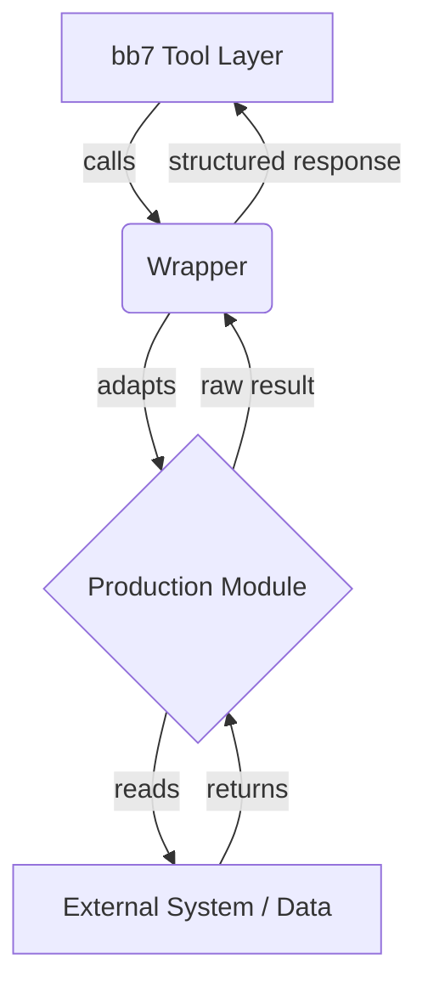
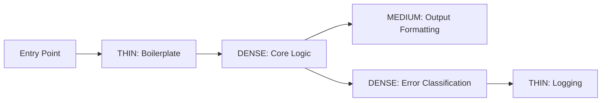
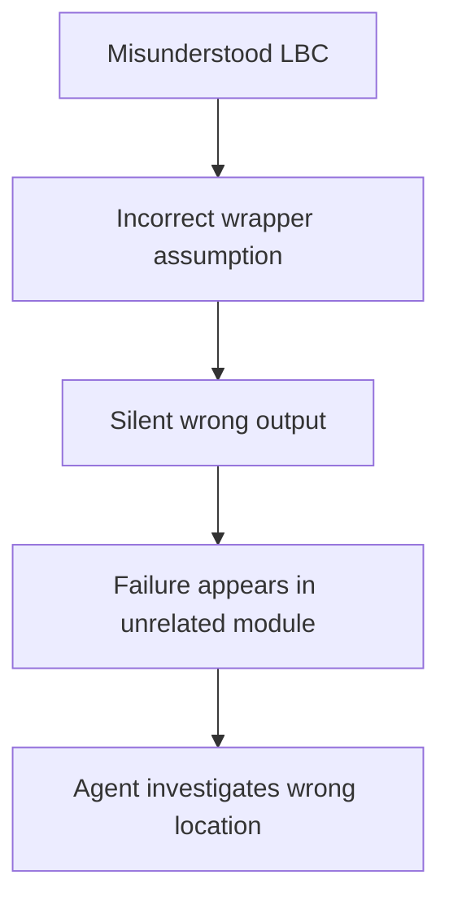

# TOPOLOGY.md — Cognitive Topology Map: Anatomy and Doctrine

**Loaded by**: SKILL.md when task is [NEW_SKILL], [ENCODE codebase], or [UPGRADE skill]  
**Purpose**: Defines what a CTM skill IS, how to construct one, and what "topology" means operationally

---

## What Topology Means Here (Not a Metaphor)

Topology in mathematics is the study of properties preserved under continuous deformation — which shapes are fundamentally the same, which are genuinely different. Applied to codebases and domains: topology is what remains invariant when you change implementation details. 

The load-bearing concepts of a codebase are topologically invariant — they survive refactors, language changes, and architectural rewrites because they are the *structure itself*, not its expression.

A CTM skill encodes the topology, not the implementation. This is why CTM skills survive major refactors while checklist skills don't.

---

## The 7 Nodes of a Domain Topology

Every non-trivial domain has these 7 nodes. Some are thin, some are dense. Identify them all before writing anything.

### Node 1: Load-Bearing Concepts (LBCs)

These are the concepts that, if misunderstood, cause cascading failures that look like unrelated bugs. They are structurally central, not merely important. 

**How to identify an LBC:**
- If you got this wrong, would failures appear in unexpected places?
- Does this concept have multiple valid instantiations, each with different implications?
- Do other engineers (or agents) reliably misunderstand this concept in the same direction?

**Format for each LBC:**
```markdown
### LBC: [Name]
Definition: [Precise, not generous]
Why load-bearing: [What cascades if this is wrong]
Common misunderstanding: [The specific wrong model most agents will construct]
Verification: [How to confirm you actually understand this, not just pattern-matched it]
```

### Node 2: Interface Contracts

Where does this domain receive inputs? What invariants must inputs satisfy? Where does it emit outputs? What guarantees does it make?

Interface contracts are not API signatures — they are behavioral contracts. "Takes a string" is not a contract. "Takes a canonicalized file path where the file is guaranteed to exist and is readable by the current process, returns a structured result or raises DomainSpecificError — never returns None silently" is a contract.

**In Daeron's stack specifically:**
- Wrappers are interface contracts between production modules and the bb7 tool layer
- The wrapper IS the contract, not the module
- Wrapper contract violation = integration failure, not module failure

### Node 3: Complexity Distribution Map

Where does genuine cognitive weight concentrate? This is not about code length. A 2000-line module with 1900 lines of boilerplate has complexity concentrated in 100 lines.

Mark complexity concentration points explicitly:
- `DENSE` — Slow down. Verify. Do not pattern-match here.
- `MEDIUM` — Normal attention.
- `THIN` — Trust the abstraction. Do not read the implementation unless failing.

### Node 4: Baked-In Decisions

Every codebase is a frozen archaeological record of decisions made under constraints that may no longer exist. The baked-in decisions are the ones that look like they could be different but silently cannot be — because changing them requires changes to 7 other things that aren't obvious from the code.

**In Daeron's recursive production system:**
- Module read-only status is a baked-in decision
- bb7 tool prefix convention is baked-in
- Snapshot naming convention is baked-in
- Wrapper < 200 lines is a baked-in constraint with a mathematical basis (I_eff)

### Node 5: Anti-Concepts

Things that look like they belong in this domain but don't. False attractors. These consume agent time catastrophically because the agent works hard, produces reasonable-looking output, and fails for an invisible reason.

For each anti-concept: name it, explain why it looks like it belongs, explain why it doesn't.

### Node 6: Temporal Structure

How does this domain change over time? What is immutable? What is the cadence of change? 

In Daeron's system:
- Production modules: essentially immutable (read-only by doctrine)
- Wrappers: change as integration needs evolve
- AGENTS.md: living document, changes as capabilities expand
- SKILL packages: version-locked to snapshot lineage

### Node 7: Failure Attractors

The points in the topology where agents (and humans) reliably fail, even when they know the domain. These are not knowledge gaps — they are cognitive failure modes that persist even with correct knowledge.

Examples from Daeron's system:
- Confusing the Assimilator (weight ingestion) with the dataset extractor (completely separate tool)
- Treating "virtual machine" as generic VM rather than Somnus persistent VM
- Implementing from scratch instead of wrapping (the integration > implementation principle)
- Adding logic to wrappers instead of modules

---

## Mermaid Diagram Requirements

Every topology with 4+ nodes requires a Mermaid diagram. Text-only topology is lossy for graph structures.

**Mandatory diagram types:**

For **codebase topology** (module dependencies):


For **complexity distribution** (where to slow down):


For **failure flow** (how failures propagate):


---

## Topology Construction Protocol

**Step 1**: List all candidate concepts. Don't filter yet. Brain-dump everything that seems relevant.

**Step 2**: Apply the LBC filter. Ask for each: "If I got this wrong, where would I see failures?" High cascade = LBC. Low cascade = supporting concept.

**Step 3**: Map the edges. What depends on what? Draw it. Don't write it — draw it. Then formalize.

**Step 4**: Mark density. Go through the codebase / domain and mark each component: DENSE, MEDIUM, or THIN. This is the complexity distribution map.

**Step 5**: Run the anti-concept pass. Ask: "What would a smart agent assume belongs here that doesn't?" Write these explicitly.

**Step 6**: Write it up. Use the format below.

---

## TOPOLOGY.md Template

```markdown
# TOPOLOGY — [Domain Name]

**Snapshot**: [Version / date this topology was extracted from]
**Language**: [Python / Go / Ada / mixed]
**Complexity**: [DENSE / MEDIUM / THIN overall]

---

## Load-Bearing Concepts

### LBC 1: [Name]
Definition: ...
Why load-bearing: ...
Common misunderstanding: ...
Verification: ...

[Repeat for each LBC]

---

## Interface Map

### Inputs
[What enters, with invariants]

### Outputs  
[What exits, with guarantees]

### Wrapper Contract (if applicable)
[The behavioral contract between the wrapper and the bb7 layer]

---

## Complexity Distribution

[Mermaid diagram]

Component-level breakdown:
| Component | Density | Notes |
|-----------|---------|-------|
| ... | DENSE | ... |

---

## Dependency Graph

[Mermaid diagram]

---

## Baked-In Decisions

1. [Decision]: [What it is, why it's baked in, what changes if you try to change it]
2. ...

---

## Anti-Concepts

| Looks Like It Belongs | Actually Doesn't | Why |
|-----------------------|-----------------|-----|
| ... | ... | ... |

---

## Temporal Structure

| Component | Mutability | Change Cadence |
|-----------|------------|----------------|
| ... | Immutable | Snapshot-locked |
| ... | Mutable | Per-integration |

---

## Failure Attractors

1. [Attractor]: [Why agents reliably fail here, even with correct knowledge]
2. ...
```

---

### Node 8: Config File Topology (CTMv3 Addition)

The root-level config files and `.xyz` directories are topology nodes, not metadata.
They encode architectural decisions that would take hours to reverse-engineer from source.

**How to identify the config spine:**
Every repo has a config spine — the set of root-level files that declare the project's
structure before any source file is read. Map it before reading source.

**What each config signal means for topology:**

| Config File | What It Reveals Topologically |
|------------|-------------------------------|
| `pyproject.toml` / `setup.py` | Dependency graph, entry points, quality gate config |
| `go.mod` | Import graph canonical prefix, Go version constraints |
| `Cargo.toml` | Binary entry points (each `[[bin]]` is a topology node) |
| `manifest.json` | Snapshot boundary — what is production-stable vs. unverified |
| `golden_paths.json` | bb7 system active; proven tool chains already exist |
| `AGENTS.md` | Prior agent encoding — read before re-encoding |
| `CLAUDE.md` | Claude Code session history and operational constraints |
| `.sovereign/session_state.json` | Warm start validity + last session action |
| `.github/copilot-instructions.md` | Agent posture already encoded (may be stale) |

**Config spine section in TOPOLOGY.md:**

```markdown
## Config File Spine

| File | Present | What It Encodes |
|------|---------|-----------------|
| pyproject.toml | yes/no | [dependencies, entry points, tool config] |
| manifest.json | yes/no | [snapshot version, hash, production file set] |
| AGENTS.md | yes/no | [agent posture, last encoding summary] |
| golden_paths.json | yes/no | [bb7 proven chains, prior session workflows] |
| .sovereign/ | yes/no | [warm start validity, last session timestamp] |
```

**Critical**: If `manifest.json` is present, every file NOT in its hash set is
post-snapshot. Treat post-snapshot files as unverified until archaeologized.

See DOT_TOPOLOGY.md for full `.xyz` directory encoding doctrine.

---

## Quality Gates for TOPOLOGY.md

Before considering TOPOLOGY.md complete, verify:

- [ ] Every LBC has a "common misunderstanding" field — the correct model alone is not enough
- [ ] Complexity distribution is marked, not assumed
- [ ] At least one Mermaid diagram exists for non-trivial graphs
- [ ] Anti-concepts are listed — every domain has at least one
- [ ] Baked-in decisions are distinguished from changeable design choices
- [ ] Interface contracts are behavioral, not just type signatures
- [ ] Config file spine section present — what exists at root, what each file encodes (CTMv3)
- [ ] ARCHITECTURE_MAP.md has been produced or updated after TOPOLOGY.md is complete (CTMv3)
