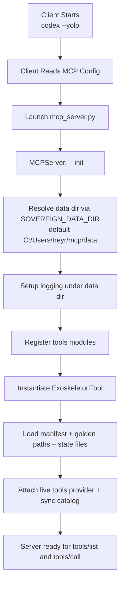
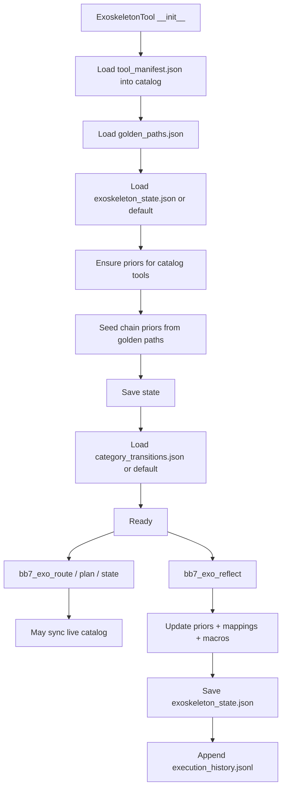
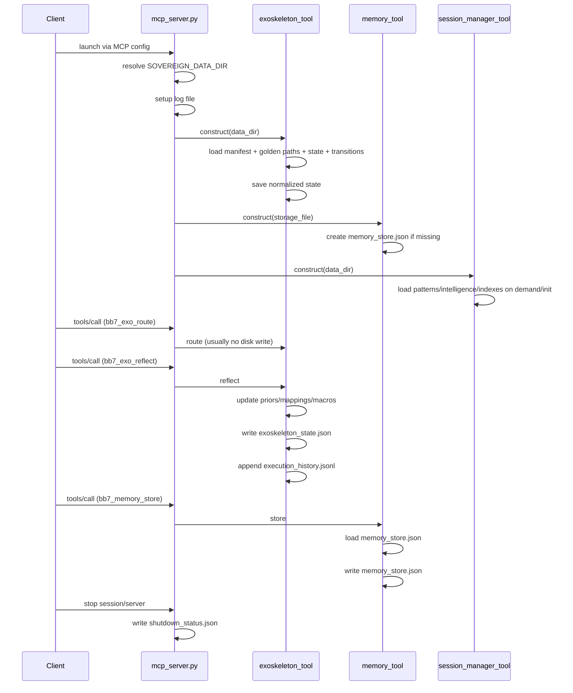

# Sovereign MCP Specification

This document details the capabilities and tools provided by the Sovereign MCP server.

## Overview

The Sovereign MCP server provides a comprehensive suite of tools for AI-human collaboration. All tools follow a strict naming convention using the **`bb7_`** prefix to ensure compatibility and ease of identification within the Model Context Protocol ecosystem.

## Tool Categories

### 🌐 Web Tools (`web_tool.py`)

Tools for HTTP requests, web content fetching, and simple web searching.

#### `bb7_fetch_url`

Fetch content from a URL.

- **Parameters**:
  - `url` (string, required): The URL to fetch content from.
  - `headers` (object, optional): A dictionary of headers to send with the request.
  - `timeout` (number, optional): The timeout for the request in seconds.

#### `bb7_download_file`

Download a file from a URL to the local filesystem.

- **Parameters**:
  - `url` (string, required): The URL to download the file from.
  - `filename` (string, required): The name to save the file as.
  - `headers` (object, optional): A dictionary of headers to send with the request.

#### `bb7_check_url_status`

Check if a URL is accessible and get basic info (HEAD request).

- **Parameters**:
  - `url` (string, required): The URL to check.

#### `bb7_search_web`

Simple web search using DuckDuckGo's instant answer API.

- **Parameters**:
  - `query` (string, required): The search query.
  - `num_results` (number, optional): The maximum number of results to return.

#### `bb7_extract_links`

Extract all links from a webpage.

- **Parameters**:
  - `url` (string, required): The URL to extract links from.

### 📁 File Tools (`file_tool.py`)

Tools for system-wide file operations including reading, writing, and directory management.

#### `bb7_read_file`

Read the complete contents of a file.

- **Parameters**:
  - `path` (string, required): The absolute path to the file to read.

#### `bb7_write_file`

Write content to a file, creating parent directories as needed.

- **Parameters**:
  - `path` (string, required): The absolute path to the file to write.
  - `content` (string, required): The content to write to the file.

#### `bb7_append_file`

Append content to a file.

- **Parameters**:
  - `path` (string, required): The absolute path to the file to append to.
  - `content` (string, required): The content to append to the file.

#### `bb7_list_directory`

List contents of a directory with detailed information (size, modified time, type).

- **Parameters**:
  - `path` (string, optional): The absolute path to the directory to list.

#### `bb7_get_file_info`

Get detailed information about a file or directory (path, size, creation/modified/accessed times, permissions, type).

- **Parameters**:
  - `path` (string, required): The absolute path to the file or directory.

#### `bb7_search_files`

Search for files matching a glob pattern in a directory tree.

- **Parameters**:
  - `directory` (string, required): The absolute path to the directory to search in.
  - `pattern` (string, required): The glob pattern to search for.
  - `max_results` (number, optional): The maximum number of results to return.

### ⚡ Shell Tools (`shell_tool.py`)

Tools for secure command execution, system monitoring, and process management.

#### `bb7_run_command`

Execute shell commands safely with output analysis and security controls.

- **Parameters**:
  - `command` (string, required): The shell command to execute.
  - `working_directory` (string, optional): The directory to run the command in.
  - `timeout` (integer, optional): Command timeout in seconds.
  - `capture_output` (boolean, optional): Whether to capture command output.
  - `environment` (object, optional): Additional environment variables.

#### `bb7_get_system_info`

Get comprehensive system information (hardware, OS, processes, disk, memory, network).

- **Parameters**:
  - `include_processes` (boolean, optional): Include running processes information.
  - `include_network` (boolean, optional): Include network interface information.
  - `include_disk_usage` (boolean, optional): Include disk usage information.

#### `bb7_list_processes`

List and analyze running processes with filtering and resource usage analysis.

- **Parameters**:
  - `filter` (string, optional): Filter processes by name pattern.
  - `sort_by` (string, optional): Sort processes by `cpu`, `memory`, `name`, `pid`, or `age`.
  - `limit` (integer, optional): Maximum number of processes to show.
  - `show_system_processes` (boolean, optional): Include system processes in results.

#### `bb7_get_command_history`

View command execution history with performance analysis and success rates.

- **Parameters**:
  - `limit` (integer, optional): Maximum number of commands to show.
  - `filter` (string, optional): Filter commands by pattern.
  - `show_successful_only` (boolean, optional): Show only successful commands.

### 🧠 Memory Tools (`memory_tool.py`)

Tools for intelligent persistent memory with semantic connections and organization.

#### `bb7_memory_store`

Store a key-value pair with enhanced metadata and intelligence.

- **Parameters**:
  - `key` (string, required): The key to store the value under.
  - `value` (string, required): The value to store.
  - `category` (string, optional): The category of the memory (e.g., `insights`, `decisions`, `technical`).
  - `importance` (number, optional): Importance score from 0.0 to 1.0.
  - `tags` (array, optional): A list of tags for the memory.

#### `bb7_memory_retrieve`

Retrieve a value with optional related memories and metadata.

- **Parameters**:
  - `key` (string, required): The key of the memory to retrieve.
  - `include_related` (boolean, optional): Whether to include related memories in the response.

#### `bb7_memory_delete`

Delete a key from persistent memory.

- **Parameters**:
  - `key` (string, required): The key of the memory to delete.

#### `bb7_memory_list`

List memory keys with advanced filtering and sorting.

- **Parameters**:
  - `prefix` (string, optional): Filter keys by prefix.
  - `category` (string, optional): Filter keys by category.
  - `min_importance` (number, optional): Minimum importance score filter.
  - `sort_by` (string, optional): Sort by `timestamp`, `importance`, `access`, or `alphabetical`.

#### `bb7_memory_search`

Search memories using intelligent semantic matching.

- **Parameters**:
  - `query` (string, required): The search query.
  - `max_results` (number, optional): Maximum number of results to return.

#### `bb7_memory_stats`

Get comprehensive statistics about memory usage (keys, size, distribution).

#### `bb7_memory_insights`

Get comprehensive insights about the memory system (network density, top concepts).

#### `bb7_memory_consolidate`

Consolidate and optimize memory storage by archiving old/low-importance entries.

- **Parameters**:
  - `days_old` (number, optional): Age threshold in days.

#### `bb7_memory_categories`

Get the list of available memory categories and their descriptions.

#### `bb7_memory_surface_context`

Proactively surface the most relevant memories for a given context blob using BM25 + Ebbinghaus decay weighting. Call at session start to recover relevant prior knowledge.

- **Parameters**:
  - `context_text` (string, required): Current context or task description to match against.
  - `max_results` (number, optional): Max memories to surface (default: 5).

#### `bb7_memory_bulk_store`

Atomically store multiple memory entries in a single disk write.

- **Parameters**:
  - `entries_json` (string, required): JSON array of `{key, value, category, importance, tags}` objects.

#### `bb7_memory_get_related`

Fetch semantically related memories for a given key using BM25.

- **Parameters**:
  - `key` (string, required): Memory key to find relations for.
  - `max_results` (number, optional): Max related memories to return (default: 5).

#### `bb7_memory_timeline`

Chronological view of memories created or updated recently, showing Ebbinghaus retention score for each entry.

- **Parameters**:
  - `days` (number, optional): Look-back window in days (default: 7).
  - `limit` (number, optional): Max entries to show (default: 20).

#### `bb7_memory_export`

Export all memories as Markdown or JSON.

- **Parameters**:
  - `format` (string, optional): Export format — `markdown` or `json` (default: `markdown`).

### 🧠 Memory Interconnection Tools (`memory_interconnect.py`)

Tools for creating intelligent links between memory systems, semantic matching, and context-aware retrieval.

#### `bb7_memory_analyze_entry`

Analyze a memory entry to detect concepts, calculate importance, and find related memories.

- **Parameters**:
  - `key` (string, required): The key of the memory entry.
  - `value` (string, required): The value of the memory entry.
  - `source` (string, optional): The source of the memory entry (defaults to `memory`).

#### `bb7_memory_intelligent_search`

Search across all memory systems using semantic similarity and concept matching.

- **Parameters**:
  - `query` (string, required): The search query.
  - `max_results` (number, optional): The maximum number of results to return.

#### `bb7_memory_get_insights`

Generate high-level insights about the memory network (density, top memories, connectivity).

#### `bb7_memory_consolidate`

Consolidate and archive old/low-importance memories to maintain system performance.

- **Parameters**:
  - `age_threshold_days` (number, optional): Age threshold in days.

#### `bb7_memory_concept_network`

Get the network of memories and related concepts connected to a specific term.

- **Parameters**:
  - `concept` (string, required): The concept to analyze.

#### `bb7_memory_extract_concepts`

Extract key technical terms, phrases, and concepts from text using multiple heuristics.

- **Parameters**:
  - `text` (string, required): The text to extract concepts from.

### 🤖 Intelligent Optimization Tools (`auto_tool_module.py`)

AI-driven tools for workspace optimization, pattern recognition, and productivity enhancement.

#### `bb7_analyze_workflow_patterns`

Analyze workflow patterns with AI-driven insights and optimization opportunities.

- **Parameters**:
  - `analysis_depth` (string, optional): Depth of analysis (e.g., `comprehensive`).
  - `time_range_days` (number, optional): Time range in days to analyze.

#### `bb7_performance_optimization`

Advanced performance optimization with real-time monitoring and intelligent tuning.

- **Parameters**:
  - `optimization_type` (string, optional): Type of optimization.
  - `target_metrics` (array, optional): Specific metrics to target.

#### `bb7_intelligent_automation`

Identify automation opportunities and suggest workflows based on adaptive learning.

- **Parameters**:
  - `automation_scope` (string, optional): Scope of automation (e.g., `workspace`).
  - `learning_mode` (boolean, optional): Whether to enable adaptive learning.

#### `bb7_cognitive_optimization`

Optimize for focus, creativity, and decision-making based on cognitive patterns.

- **Parameters**:
  - `focus_area` (string, optional): Specific cognitive area to optimize.
  - `personalization_level` (string, optional): Level of personalization (e.g., `adaptive`).

#### `bb7_optimization_results`

Get comprehensive results and next steps from optimization experiments.

- **Parameters**:
  - `experiment_id` (string, optional): Specific experiment ID.
  - `include_recommendations` (boolean, optional): Whether to include actionable next steps.

#### `bb7_adaptive_learning`

Evolve system behavior based on user preferences and learning patterns.

- **Parameters**:
  - `learning_scope` (string, optional): Scope of learning.
  - `adaptation_speed` (string, optional): Speed of adaptation (e.g., `moderate`).

### 🔍 Code Analysis & Execution Tools (`enhanced_code_analysis_tool.py`)

Advanced tools for static code analysis, control/data flow analysis, type inference, and secure sandboxed Python execution.

#### `bb7_analyze_code_complete`

Complete code analysis with AST parsing, metrics, security scanning, and flow analysis.

- **Parameters**:
  - `file_path` (string, required): Path to the Python file to analyze.
  - `include_all` (boolean, optional): Include all advanced analysis features (CFA, DFA, types).

#### `bb7_python_execute_secure`

Secure Python code execution with RestrictedPython sandboxing and resource limits.

- **Parameters**:
  - `code` (string, required): Python code to execute.
  - `input_data` (string, optional): JSON string of input data for the code.
  - `stateless` (boolean, optional): Whether to run in stateless mode (default: `True`).
  - `dry_run` (boolean, optional): Perform a security scan without execution.

#### `bb7_security_audit`

Security-focused code analysis to identify vulnerabilities like SQL injection or hardcoded secrets.

- **Parameters**:
  - `file_path` (string, required): Path to the Python file to audit.

#### `bb7_get_execution_audit`

Retrieve the audit log of recent Python executions and security events.

- **Parameters**:
  - `limit` (number, optional): Maximum number of audit entries to return.

### 🏗️ Project Context Tools (`project_context_tool.py`)

Tools for intelligent project analysis, structure summary, and context retrieval optimized for LLM understanding.

#### `bb7_analyze_project_structure`

Analyze and summarize project structure, detecting project types and technologies.

- **Parameters**:
  - `max_depth` (number, optional): Maximum directory depth to analyze.
  - `include_hidden` (boolean, optional): Whether to include hidden files/directories.

#### `bb7_get_project_dependencies`

Extract and summarize project dependencies (Python, Node.js, etc.) in an LLM-friendly format.

#### `bb7_get_recent_changes`

Get recent Git changes (commits and modified files) to provide development context.

- **Parameters**:
  - `days` (number, optional): Number of days to look back for changes.

#### `bb7_get_code_metrics`

Generate code metrics and statistics (total lines, language breakdown, largest files).

### 👁️ Visual Automation Tools (`visual_tool.py`)

Tools for cross-platform visual automation, screen capture, UI interaction, and window management.

#### `bb7_take_screenshot`

Capture screenshots with optional region selection, analysis, and multiple output formats.

- **Parameters**:
  - `region` (string, optional): Screen region (e.g., `x,y,w,h` or `fullscreen`).
  - `save_path` (string, optional): Custom save path.
  - `include_analysis` (boolean, optional): Include visual analysis (colors, brightness).
  - `format` (string, optional): Output format (`png`, `jpg`, `base64`).

#### `bb7_find_on_screen`

Locate visual elements (text, color, or UI description) using pattern matching.

- **Parameters**:
  - `target` (string, required): What to find.
  - `confidence` (number, optional): Match confidence threshold (0.0 to 1.0).
  - `search_region` (string, optional): Region to search in.

#### `bb7_click_element`

Perform mouse clicks on specific coordinates or identified visual elements.

- **Parameters**:
  - `element` (string, required): Coordinates `x,y` or element description.
  - `click_type` (string, optional): Type of click (`left`, `right`, `double`, `middle`).
  - `offset` (string, optional): Click offset from center.

#### `bb7_screen_monitor`

Monitor the screen for changes over a duration with specified sensitivity.

- **Parameters**:
  - `duration` (integer, optional): Duration in seconds.
  - `sensitivity` (number, optional): Change detection threshold.
  - `capture_changes` (boolean, optional): Capture screenshots when changes are detected.

#### `bb7_window_info`

Get information about active windows, layout, and positioning.

- **Parameters**:
  - `include_all` (boolean, optional): Include all visible windows.
  - `analyze_layout` (boolean, optional): Analyze window layout.

### 👁️ Enhanced Visual Automation Tools (`maybe/visual_tool.py`)

Advanced visual automation with intelligent screen analysis and element targeting.

#### `bb7_take_screenshot`

Capture screenshots with intelligent analysis (color detection, brightness, complexity).

- **Parameters**:
  - `region` (string, optional): Format: "x,y,width,height" or "fullscreen".
  - `save_path` (string, optional): Custom path.
  - `include_analysis` (boolean, optional): Perform visual characteristic analysis.
  - `format` (string, optional): `png`, `jpg`, or `base64`.

#### `bb7_find_on_screen`

🔍 Find visual elements using pattern matching, color detection, or UI description.

- **Parameters**:
  - `target` (string, required): Text, color, or element description.
  - `confidence` (number, optional): Match threshold (0.0 to 1.0).
  - `search_region` (string, optional): Search area coordinates.

#### `bb7_click_element`

🖱️ Targeting and clicking elements based on coordinates or semantic descriptions.

- **Parameters**:
  - `element` (string, required): Coordinates "x,y" or element description.
  - `click_type` (string, optional): `left`, `right`, `double`, or `middle`.
  - `offset` (string, optional): Click offset from center.

#### `bb7_screen_monitor` (Enhanced)

Monitor screen activity and capture screenshots only when significant changes occur.

- **Parameters**:
  - `duration` (integer, optional): Monitoring time in seconds.
  - `sensitivity` (number, optional): Change detection intensity.
  - `capture_changes` (boolean, optional): Save frames of detected changes.

#### `bb7_window_info` (Enhanced)

Retrieve detailed window properties, process IDs, and layout analysis for active applications.

- **Parameters**:
  - `include_all` (boolean, optional): Report on all windows.
  - `analyze_layout` (boolean, optional): Provide layout optimization insights.

### 🖥️ VS Code Terminal Integration Tools (`vscode_terminal_tool.py`)

Tools for seamless integration with VS Code's terminal environment, session tracking, and environment awareness.

#### `bb7_terminal_status`

Get comprehensive terminal status (shell type, VS Code context, dev environment, recent metrics).

- **Parameters**:
  - `include_environment` (boolean, optional): Include filtered environment variables.
  - `include_integrations` (boolean, optional): Detect available tool integrations (Git, Docker, PMs).
  - `include_performance` (boolean, optional): Include recent performance metrics.

#### `bb7_terminal_run_command`

Execute commands in VS Code terminal context with directory tracking and intelligent output analysis.

- **Parameters**:
  - `command` (string, required): The command to execute.
  - `change_directory` (boolean, optional): Whether to track and update current directory (default: `True`).
  - `timeout` (integer, optional): Execution timeout in seconds.
  - `capture_environment` (boolean, optional): Detect environment changes after execution.

#### `bb7_terminal_environment`

Analyze terminal environment, PATH health, tool availability, and configuration optimization.

- **Parameters**:
  - `include_paths` (boolean, optional): Detailed PATH analysis.
  - `include_tools` (boolean, optional): Check availability of all dev tools.
  - `include_suggestions` (boolean, optional): Provide optimization recommendations.

#### `bb7_terminal_history`

Review and analyze session command history with pattern detection and usage analytics.

- **Parameters**:
  - `limit` (integer, optional): Maximum number of entries.
  - `filter` (string, optional): Filter by command pattern.
  - `include_analytics` (boolean, optional): Include usage and success analytics.

#### `bb7_terminal_cd`

Navigate directories with intelligent context tracking and project detection.

- **Parameters**:
  - `path` (string, required): Target directory path.
  - `analyze_context` (boolean, optional): Analyze contents and project info of target dir.

#### `bb7_terminal_which`

Locate executables with intelligent path analysis and version detection.

- **Parameters**:
  - `command` (string, required): Command to locate.
  - `show_alternatives` (boolean, optional): Show other instances in PATH.
  - `include_version` (boolean, optional): Detect tool version.

### 🎯 Session Management Tools (`session_manager_tool.py`)

Tools for cognitive session management, automatic memory formation, and productivity tracking.

#### `bb7_start_session`

Start a new enhanced cognitive session with goal tracking and intelligent recommendations.

- **Parameters**:
  - `goal` (string, required): The goal of the session.
  - `context` (string, optional): Additional context for the session.
  - `tags` (array, optional): A list of tags for the session.

#### `bb7_log_event`

Log significant events during a session (breakthroughs, achievements, obstacles) with auto-memory capture.

- **Parameters**:
  - `event_type` (string, required): Type of event (e.g., `breakthrough`, `obstacle`).
  - `description` (string, required): Description of the event.
  - `details` (object, optional): Additional structured details.

#### `bb7_capture_insight`

Capture key insights and connect them to concepts and other memories.

- **Parameters**:
  - `insight` (string, required): The insight to capture.
  - `concept` (string, required): The concept the insight is related to.
  - `relationships` (array, optional): List of related concepts.

#### `bb7_record_workflow`

Record a procedural workflow or pattern discovered during the session.

- **Parameters**:
  - `workflow_name` (string, required): Name of the workflow.
  - `steps` (array, required): List of steps in the workflow.
  - `context` (string, optional): Additional context.

#### `bb7_update_focus`

Update current attention focus, energy level, and momentum state.

- **Parameters**:
  - `focus_areas` (array, required): List of areas currently being focused on.
  - `energy_level` (string, optional): Current energy level (e.g., `high`, `low`).
  - `momentum` (string, optional): Current momentum state.

#### `bb7_pause_session`

Pause the current active session, capturing environment state for later resumption.

- **Parameters**:
  - `reason` (string, optional): Reason for pausing.

#### `bb7_resume_session`

Resume a previously paused session by its ID.

- **Parameters**:
  - `session_id` (string, required): The ID of the session to resume.

#### `bb7_list_sessions`

List all sessions with filtering by status and limit.

- **Parameters**:
  - `status` (string, optional): Filter by status (e.g., `active`, `paused`).
  - `limit` (number, optional): Maximum number of sessions to return.

#### `bb7_get_session_summary`

Get a comprehensive summary of a specific session's history, insights, and workflows.

- **Parameters**:
  - `session_id` (string, required): The ID of the session.

#### `bb7_get_session_insights`

Get intelligent analysis and metrics for a specific session (auto-memories, concept network).

- **Parameters**:
  - `session_id` (string, optional): The ID of the session (defaults to current).

#### `bb7_cross_session_analysis`

Analyze patterns, success factors, and evolving concepts across multiple recent sessions.

- **Parameters**:
  - `days_back` (number, optional): Number of days to look back.

#### `bb7_link_memory_to_session`

Manually link a persistent memory key to the current session context.

- **Parameters**:
  - `memory_key` (string, required): The key of the memory to link.

#### `bb7_auto_memory_stats`

Get statistics on how many memories have been automatically captured during the current session.

### 🚀 Ultimate Session Management Tools (`maybe/session_manager_tool.py`)

Enterprise-grade session management with ML-driven insights, background monitoring, and advanced analytics.

#### `bb7_start_session` (Ultimate)

Start an ultimate AI collaboration session with comprehensive intelligence and inherited context.

- **Parameters**:
  - `goal` (string, required): The goal of the session.
  - `context` (string, optional): Additional context.
  - `session_type` (string, optional): Type of session (e.g., `coding`, `debugging`).
  - `inherit_from` (string, optional): Session ID to inherit context from.
  - `template_id` (string, optional): Template to apply.
  - `enable_background` (boolean, optional): Enable continuous productivity tracking.

#### `bb7_end_session`

End a session with a final summary, success rating, and achievement tracking.

- **Parameters**:
  - `summary` (string, optional): Final summary of the session.
  - `success_rating` (number, optional): User rating of session success.
  - `achievements` (array, optional): List of milestones reached.

#### `bb7_execute_session_analysis`

Execute advanced Python analysis on session data with optional ML capabilities and notebook saving.

- **Parameters**:
  - `code` (string, optional): Python code for analysis.
  - `analysis_type` (string, optional): Type of analysis (e.g., `productivity_trends`).
  - `save_notebook` (boolean, optional): Save results as a notebook.
  - `enable_ml` (boolean, optional): Enable ML libraries.

#### `bb7_generate_productivity_insights`

Generate AI-powered productivity insights (time correlation, tool effectiveness, cognitive patterns).

- **Parameters**:
  - `insight_type` (string, optional): Focus of insights.
  - `time_period` (number, optional): Lookback period in days.

#### `bb7_create_session_template`

Create intelligent session templates optimized using historical success data.

- **Parameters**:
  - `template_name` (string, required): Name for the template.
  - `work_type` (string, optional): Category of work.
  - `optimization_level` (string, optional): Level of AI optimization.

#### `bb7_start_background_session`

Start a session that continues monitoring productivity and system state even when VS Code is inactive.

- **Parameters**:
  - `goal` (string, optional): Goal for monitoring.
  - `monitoring_level` (string, optional): Depth of monitoring.

#### `bb7_merge_sessions`

Intelligently merge multiple sessions, combining contexts and discovering cross-session patterns.

- **Parameters**:
  - `session_ids` (array, required): IDs of sessions to merge.
  - `merge_strategy` (string, optional): Strategy (e.g., `intelligent`, `thematic`).

#### `bb7_export_analytics`

Export comprehensive analytics in multiple formats (CSV, JSON, SQL, Markdown) for external tools.

- **Parameters**:
  - `format` (string, optional): Export format.
  - `time_range` (number, optional): Days of data to export.
  - `external_tool` (string, optional): Tool to optimize for (e.g., `Excel`, `Tableau`).

#### `bb7_goal_achievement_tracking`

Track goal completion rates and predict future success using ML modeling.

- **Parameters**:
  - `category` (string, optional): Filter by goal category.
  - `prediction_horizon` (number, optional): Days to forecast.

#### `bb7_session_dashboard`

Retrieve a real-time dashboard of session metrics, historical trends, and predictive analytics.

- **Parameters**:
  - `dashboard_type` (string, optional): Type of dashboard (e.g., `comprehensive`, `predictive`).

#### `bb7_experiment_with_hypothesis`

Test productivity hypotheses using scientific rigor and statistical analysis.

- **Parameters**:
  - `hypothesis` (string, required): The hypothesis to test.
  - `statistical_confidence` (number, optional): Target confidence level.

#### `bb7_cognitive_state_analysis`

Analyze focus levels, cognitive load, and mental fatigue to optimize work patterns.

- **Parameters**:
  - `analysis_depth` (string, optional): Depth of analysis.
  - `time_window` (string, optional): Timeframe for pattern analysis.

### 🚀 Auto-Activation & Guidance Tools (`auto_tool_module.py` / Backup)

Foundational tools for establishing session continuity and guiding AI-human collaboration.

#### `bb7_workspace_context_loader`

🚀 **ALWAYS RUN FIRST**: Automatically loads project context, active sessions, and recent memories to establish a shared collaboration state.

- **Parameters**:
  - `include_recent_memories` (boolean, optional): Whether to load recent memories.
  - `include_active_sessions` (boolean, optional): Whether to check for active sessions.

#### `bb7_show_available_capabilities`

📋 Display a comprehensive overview of all registered MCP tools and their categories.

- **Parameters**:
  - `category` (string, optional): Specific category to display.

#### `bb7_auto_session_resume`

🔄 Intelligent session continuity management; automatically matches user intent with paused or active sessions.

- **Parameters**:
  - `workspace_path` (string, optional): Current workspace path.
  - `user_intent` (string, optional): Brief description of what you're trying to do.

#### `bb7_intelligent_tool_guide`

🧠 Analyze user intent and suggest the optimal sequence of tools to achieve a goal.

- **Parameters**:
  - `user_query` (string, required): The user's request or problem.
  - `context` (string, optional): Additional context.

## 🧭 Exoskeleton Runtime, Golden Paths, and Persistence Contract (2026-02-12)

This section extends the spec with an end-to-end runtime explanation of how the MCP server boots, how exoskeleton state evolves, and what is persisted globally.

### Why This Exists

The exoskeleton layer is the control-plane that makes tool usage stateful across chats and sessions. It is not just a router. It maintains priors, execution outcomes, and learned transitions so tool selection improves over time.

### Startup Flow (High-Level)

When you run a client (for example `codex --yolo`), the client launches the MCP server process defined in your MCP config (`mcp_config.json` or `settings.json` equivalent). Then `mcp_server.py` initializes and loads all tool modules.



### mcp_server.py Data Root Contract

`mcp_server.py` establishes a canonical persistence root:

- Reads `SOVEREIGN_DATA_DIR`.
- Falls back to `C:/Users/treyr/mcp/data`.
- Passes this `data_dir` into tool constructors when they support it.

This is the anchor that prevents per-project `./data` fragmentation when the server is running normally.

### Exoskeleton Files and Their Roles

Under `C:/Users/treyr/mcp/data/exoskeleton`:

1. `exoskeleton_state.json`

- Stores long-lived priors and model state:
- Tool priors (`alpha`, `beta`, successes/failures).
- Chain priors.
- Intent-to-tool mappings.
- Recovery strategies.
- Recent outcomes summary.
- Discovered macros.

1. `execution_history.jsonl`

- Append-only reflection history.
- One row per reflect event.
- Used as telemetry and historical evidence.

1. `category_transitions.json`

- Learned category transition probabilities.
- Supports momentum-aware routing over time.

### Golden Paths (`golden_paths.json`) Explained

`golden_paths.json` is a curated bootstrap for chain intelligence. It is not user chat history.

It provides:

- Pre-seeded workflow chains.
- Prior values for those chains.
- Faster convergence on good tool sequences before enough live observations accumulate.

In plain terms: it gives exoskeleton a strong starting policy so it is not stuck in cold-start behavior.

### Exoskeleton Load/Save Lifecycle



### Important Clarification: Does Exoskeleton Save Every Call?

No. It does not write on every `bb7_exo_*` call.

It writes on state-mutation boundaries, especially:

- Initialization save.
- Catalog/priors mutation points.
- Reflection (`bb7_exo_reflect`) where both state and JSONL history are persisted.

This is intentional to avoid unnecessary write amplification while still preserving rolling state.

### Persistence Matrix (Global vs Risky)

| Component | Expected Root | Current Behavior | Notes |
|---|---|---|---|
| `mcp_server.py` data root | `C:/Users/treyr/mcp/data` | Global by default/env | Canonical anchor |
| `exoskeleton_tool.py` | `.../data/exoskeleton/*` | Global by default/env | Correct |
| `session_manager_tool.py` | `.../data/sessions/*` | Global by default/env | Correct |
| `memory_tool.py` store | `.../data/memory_store.json` | Global path | Works; currently hardcoded default string |
| `memory_interconnect.py` indices | `.../data/*` | Depends on injected constructor arg | If instantiated standalone with default, it may use relative `data` |

### Why You Felt Drift Before

Your concern is valid: if any tool gets instantiated outside the server’s centralized constructor path, modules with relative defaults can create local `./data` files in whichever repo/cwd launched them.

So your architectural rule is correct:

- One global persistence root.
- No per-codebase `data/` for shared memory/exoskeleton/session intelligence.

### Operational Rule of Thumb

If you want strongest continuity:

1. Always launch MCP through the same managed config entry.
2. Ensure `SOVEREIGN_DATA_DIR` points to `C:/Users/treyr/mcp/data` (or your chosen single global root).
3. Keep exoskeleton reflect cycle active so priors/history continuously evolve.

### Message-Level Exo Loop Recommendation

For deterministic behavior, each substantial turn should follow:

```text
bb7_exo_bootstrap
-> bb7_exo_list_tool_categories
-> bb7_exo_category_specific_tools (as needed)
-> bb7_exo_route / bb7_exo_plan
-> execute selected bb7 tools
-> bb7_exo_reflect
```

This gives you exactly what you described: rolling, stateful capability evolution rather than stateless tool calls.

## 🧩 Detailed Persistence Inventory and Timing Matrix (2026-02-12)

This section is a deep-dive inventory of where each core module reads/writes state, and *when* those operations happen.

### Canonical Global Root Rule

- Canonical root: `SOVEREIGN_DATA_DIR`.
- Default fallback root: `C:/Users/treyr/mcp/data`.
- `mcp_server.py` resolves this once at startup and passes it into tools that accept `data_dir` and/or `storage_file`.

### Server-Level Persistence (`mcp_server.py`)

| Artifact | Path | Load Timing | Save Timing | Trigger |
|---|---|---|---|---|
| server log | `data/mcp_server.log` | startup (logger init) | continuous append | server lifecycle + tool calls |
| shutdown snapshot | `data/shutdown_status.json` | none | shutdown | graceful `server.shutdown()` |

Notes:

- This is process-level state/telemetry, not tool memory.
- If client is killed hard, shutdown snapshot may not be written.

### Exoskeleton Persistence (`tools/exoskeleton_tool.py`)

| Artifact | Path | Load Timing | Save Timing | Trigger |
|---|---|---|---|---|
| exoskeleton state | `data/exoskeleton/exoskeleton_state.json` | init | init + mutation points + reflect | constructor + priors/catalog updates + `bb7_exo_reflect` |
| reflect history | `data/exoskeleton/execution_history.jsonl` | none | append per reflect | `bb7_exo_reflect` |
| category transitions | `data/exoskeleton/category_transitions.json` | init | on transition updates | momentum/category learning paths |
| tool manifest source | `tool_manifest.json` (repo root) | init/bootstrap refresh checks | read-only here | catalog build/refresh |
| golden path source | `golden_paths.json` (repo root) | init | read-only here | chain-prior seeding |

Critical behavior:

- Exoskeleton is **read-on-init and write-on-mutation**, not write-on-every-call.
- The strongest persistence events are reflect updates (`bb7_exo_reflect`):
- tool priors,
- chain priors,
- intent mappings,
- recovery hints,
- outcome row append to JSONL.

### Memory Persistence (`tools/memory_tool.py` + `tools/memory_interconnect.py`)

#### `memory_tool.py`

| Artifact | Path | Load Timing | Save Timing | Trigger |
|---|---|---|---|---|
| memory store | `data/memory_store.json` | per operation (`_load_data`) | per mutation (`_save_data`) | store/delete/retrieve(access counters)/consolidate |
| memory archives | `data/archives/memory_archive_*.json` | none | on consolidation | `bb7_memory_consolidate` |

Important nuance:

- `EnhancedMemoryTool` default path string is currently hardcoded to `C:/users/treyr/mcp/data/memory_store.json`.
- In normal MCP boot, server also injects `storage_file` from canonical data root.

#### `memory_interconnect.py`

| Artifact | Path | Load Timing | Save Timing | Trigger |
|---|---|---|---|---|
| relationships index | `<data_dir>/memory_relationships.json` | init | after analysis/consolidation | `bb7_memory_analyze_entry`, `bb7_memory_consolidate` |
| concept index | `<data_dir>/concept_index.json` | init | with same index save batch | concept updates |
| importance index | `<data_dir>/importance_scores.json` | init | with same index save batch | scoring updates |
| interconnect archive | `<data_dir>/memory_archive_<ts>.json` | none | on consolidation | `bb7_memory_consolidate` |

Risk note:

- Constructor default is `data_dir="data"`.
- If instantiated outside server injection flow, this can become cwd-relative.

### Session Persistence (`tools/session_manager_tool.py`)

| Artifact | Path | Load Timing | Save Timing | Trigger |
|---|---|---|---|---|
| session files | `data/sessions/<session_id>.json` | on resume/load-current | on session mutations | start/log/focus/pause/resume/workflow/etc. |
| session index | `data/sessions/session_index.json` | on index ops | on index ops | session lifecycle operations |
| learned patterns | `data/sessions/learned_patterns.json` | init | pattern save points | pattern analysis/updates |
| session intelligence | `data/sessions/session_intelligence.json` | init | intelligence save points | intelligence updates |
| memory linkage index | `data/sessions/memory_index.json` | on link op | on link op | `bb7_link_memory_to_session` |

### Optimization/Automation Persistence (`tools/auto_tool_module.py`)

| Artifact | Path | Load Timing | Save Timing | Trigger |
|---|---|---|---|---|
| pattern DB | `data/optimization/patterns.db` | init/open-on-query | insert/update during analyses | workflow/pattern/insight operations |
| performance DB | `data/optimization/performance.db` | init/open-on-query | experiment/metric writes | optimization experiments |
| recommendations file | `data/optimization/recommendations.json` | optional/read paths | recommendation save paths | optimization recommendation flows |

### Web/Visual/Terminal/File/Project/Shell Modules

#### `web_tool.py`

| Artifact | Path | Load Timing | Save Timing | Trigger |
|---|---|---|---|---|
| web cache dir | `data/web_cache/` | init (dir ensure) | optional (future cache writes) | currently mostly runtime network ops |

Notes:

- Current web implementation primarily performs network I/O and optional downloads to user-specified targets.
- It does not currently maintain a large structured persistent state file by default.

#### `visual_tool.py`

| Artifact | Path | Load Timing | Save Timing | Trigger |
|---|---|---|---|---|
| visual artifact dir | `data/visual/` | init (dir ensure) | on screenshot/monitor captures | `bb7_take_screenshot`, `bb7_screen_monitor` |

Notes:

- In-memory capture history exists per process and is not persisted across process restarts unless screenshots are saved.

#### `vscode_terminal_tool.py`

| Artifact | Path | Load Timing | Save Timing | Trigger |
|---|---|---|---|---|
| none by default | n/a | n/a | n/a | state mostly in-memory per process |

Notes:

- Command history here is process-memory (`self.terminal_history`) unless explicitly written by another tool.

#### `shell_tool.py`

| Artifact | Path | Load Timing | Save Timing | Trigger |
|---|---|---|---|---|
| none by default | n/a | n/a | n/a | command history is in-memory only |

#### `project_context_tool.py`

| Artifact | Path | Load Timing | Save Timing | Trigger |
|---|---|---|---|---|
| none by default | n/a | n/a | n/a | read/analyze-only tool |

#### `file_tool.py`

| Artifact | Path | Load Timing | Save Timing | Trigger |
|---|---|---|---|---|
| user-target files | caller-specified path | on reads | on writes/appends | explicit file ops |

### End-to-End Timing Model



### What Should Be Loaded Automatically vs Tool-Call Driven

- Auto-loaded at server startup:
- canonical data root,
- exoskeleton foundational artifacts,
- tool registrations,
- server logging.

- Mutated/saved during operational calls:
- exoskeleton priors/history on reflect,
- memory/session/index artifacts on their operations,
- optimization DB records on analysis/experiment operations.

This split is intentional: foundational context loads early; expensive/volatile state writes occur on meaningful events.

### Hard Rule for Cross-Chat Continuity

If you want maximum statefulness:

1. Keep one canonical `SOVEREIGN_DATA_DIR`.
2. Launch MCP through the same config entry (avoid ad-hoc standalone tool instantiation paths).
3. Keep exoskeleton reflect active in each substantial loop so priors/history advance continuously.

---

## 🦴 Exoskeleton Tools (`exoskeleton_tool.py`)

Control-plane layer providing stateful, Bayesian tool routing, plan execution checkpointing, and multi-AI coordination. All routing decisions improve over time via Beta-distribution priors updated on each `bb7_exo_reflect` call.

### Recommended per-turn loop

`bb7_exo_bootstrap` → `bb7_exo_route` / `bb7_exo_plan` → execute tools → `bb7_exo_reflect`

#### `bb7_exo_bootstrap`

Bootstrap capability context for the current turn. Refreshes the tool catalog from `tool_manifest.json`, syncs live tools, and returns a healthcheck of critical tools with their reliability scores.

- **Parameters**:
  - `include_recent_outcomes` (boolean, optional): Include the last 5 reflect outcomes (default: `true`).
  - `include_healthcheck` (boolean, optional): Ping key tools for availability (default: `true`).

#### `bb7_exo_list_tool_categories`

List all tool categories with sample tool names and neighboring categories.

#### `bb7_exo_category_specific_tools`

List all tools in a specific category, sorted by reliability, with required params.

- **Parameters**:
  - `category` (string, required): Category name (e.g., `memory`, `file`, `shell`).
  - `limit` (integer, optional): Max tools to return (default: 20).

#### `bb7_exo_route`

Retrieve ranked candidate tools for an intent using TF-IDF semantic scoring, category graph neighbors, and Beta-distribution reliability priors.

- **Parameters**:
  - `intent` (string, required): The task or goal to find tools for.
  - `max_candidates` (integer, optional): Number of candidates to return (default: 12).
  - `include_neighbors` (boolean, optional): Include category-graph neighbors (default: `true`).
  - `neighbor_distance` (integer, optional): Graph hop distance for neighbors, 0–3 (default: 1).

#### `bb7_exo_plan`

Generate candidate multi-step execution chains using beam search. Returns up to `beam_width` ranked plans, each with a confidence score, estimated token cost, failure points, and a fallback chain. The best plan is checkpointed to disk for use with `bb7_exo_execute_step` and `bb7_exo_resume_plan`.

- **Parameters**:
  - `intent` (string, required): The task or goal to plan for.
  - `context` (string, optional): Additional context to incorporate into scoring.
  - `beam_width` (integer, optional): Number of candidate plans to generate, 1–6 (default: 3).
  - `max_chain_length` (integer, optional): Maximum steps per plan, 2–8 (default: 4).

#### `bb7_exo_reflect`

Update Beta priors after execution and append a row to the execution history JSONL. This is the primary mechanism by which tool reliability improves over time. Also updates session momentum and the cross-AI activity log.

- **Parameters**:
  - `plan_id` (string, required): Plan identifier from `bb7_exo_plan`.
  - `tools_used` (array or string, required): List (or comma-separated string) of tools executed.
  - `success` (boolean, required): Whether the execution succeeded.
  - `error` (string, optional): Error message if execution failed.
  - `intent` (string, optional): Original intent, used to update intent-to-tool mappings.
  - `recovery_strategy` (string, optional): What recovery was applied, if any.

#### `bb7_exo_state`

Return raw exoskeleton state: top tool priors, top chain priors, discovered macros, and known recovery strategies.

- **Parameters**:
  - `limit` (integer, optional): Max rows per section (default: 15).

#### `bb7_exo_get_recent_activity`

Get recent activity from all AI instances — call at session start for multi-AI coordination. Returns recent tool outcomes, cross-AI activity log entries, discovered macros, and active workflow momentum.

- **Parameters**:
  - `limit` (integer, optional): Max entries per section (default: 10).

#### `bb7_exo_briefing`

Generate a natural-language markdown briefing for the current intent. Returns narrative sections covering intent understanding, session momentum, matched golden path, a ranked tool table, the best plan summary, and health warnings. The paradigm-shift alternative to raw routing scores.

- **Parameters**:
  - `intent` (string, required): The user-facing goal or task description.
  - `max_recommendations` (integer, optional): Max tools to surface in the table (default: 5).

#### `bb7_exo_preemptive_recovery`

Analyse a planned workflow for failure risks *before* execution. Scans each step's reliability, finds same-category alternatives for weak links, and returns a per-step risk report with an overall risk score.

- **Parameters**:
  - `intent` (string, required): The task intent to plan for.
  - `risk_tolerance` (string, optional): `conservative` (80% threshold), `moderate` (60%), or `aggressive` (40%) (default: `moderate`).

#### `bb7_exo_route_focused`

Token-efficient routing: return only the top-N tools with a one-liner each, plus an expansion hint.

- **Parameters**:
  - `intent` (string, required): The task intent.
  - `top_n` (integer, optional): Number of tools to surface, 1–15 (default: 5).

#### `bb7_exo_execute_step`

Record a single step execution in a checkpointed plan. The LLM runs the tool itself and calls this to log the outcome. Updates KPI counters and plan status atomically.

- **Parameters**:
  - `plan_id` (string, required): Plan identifier from `bb7_exo_plan`.
  - `step_index` (integer, required): 0-based index of the step in the chain.
  - `tool_name` (string, optional): Tool that was executed (auto-resolved from chain if omitted).
  - `result_summary` (string, optional): Brief description of the step outcome.
  - `success` (boolean, optional): Whether the step succeeded (default: `true`).
  - `dry_run` (boolean, optional): Preview the mutation without writing to disk (default: `false`).

#### `bb7_exo_resume_plan`

Resume a checkpointed plan from where it left off. Returns the full plan state, completed steps, remaining steps, and the next tool to execute. If no `plan_id` is given, returns a list of all active plans.

- **Parameters**:
  - `plan_id` (string, required): Plan identifier to resume. Omit to list available plans.

#### `bb7_exo_kpi_report`

Generate a KPI report for one or all active plans: completion rate, success rate, elapsed time, and health assessment.

- **Parameters**:
  - `plan_id` (string, optional): Specific plan to report on. Omit to report all active plans.

---

## 🔀 OpenRouter Planner Tools (`openrouter_planner_tool.py`)

LLM-backed planner tools powered by OpenRouter. Require `OPENROUTER_API_KEY` to be set. All run data is persisted under `data/planner/`.

#### `bb7_planner_health`

Return planner integration health: configuration status, data directory paths, model in use, and run telemetry (total/successful/failed runs).

#### `bb7_planner_template`

Generate a structured plan template for an intent without calling the LLM. Useful for dry-run planning or prompt engineering.

- **Parameters**:
  - `intent` (string, required): The goal to plan for.
  - `context` (string, optional): Additional context.
  - `max_steps` (integer, optional): Maximum steps in the plan (default: 8).

#### `bb7_planner_plan`

Generate a full LLM-reasoned structured plan via OpenRouter with model fallback. Returns human-readable steps with `why`, acceptance criteria, and risk notes. All runs are persisted to `planner_runs.jsonl`.

- **Parameters**:
  - `intent` (string, required): The goal to plan for.
  - `context` (string, optional): Background context.
  - `constraints` (string, optional): Hard constraints the plan must respect.
  - `max_steps` (integer, optional): Maximum steps (default: 8).
  - `model` (string, optional): Model override (defaults to `qwen/qwen3.5-plus-02-15` with fallback chain).
  - `temperature` (number, optional): Sampling temperature 0.0–1.0 (default: 0.2).
  - `retries` (integer, optional): Retry count on network/model errors (default: 2).
  - `timeout` (integer, optional): Request timeout in seconds (default: 45).
  - `dry_run` (boolean, optional): Return a template without calling the LLM (default: `false`).

---

## 🤖 OpenRouter Agent Tools (`openrouter_agent_tool.py`)

Multi-agent distributed cognitive execution plane backed by OpenRouter. Agents execute real MCP tools in a shared data space and support cross-agent handoff. Require `OPENROUTER_API_KEY`. State persists under `data/agents/`.

Available agent types: `planner`, `debugger`, `analyzer`, `doc`.

#### `bb7_agent_health`

Return agent integration health: configuration status, available agents with their tool counts and max iterations, and lifetime run telemetry.

#### `bb7_agent_list`

List all available agent types with their descriptions, tool lists, and max iteration limits.

#### `bb7_agent_capabilities`

Get the tool list, description, and max iterations for a specific agent type.

- **Parameters**:
  - `agent_type` (string, required): One of `planner`, `debugger`, `analyzer`, `doc`.

#### `bb7_agent_nodes`

List all active execution nodes currently registered in the cognitive plane.

#### `bb7_agent_messages`

Read messages from the shared cognitive plane message bus.

- **Parameters**:
  - `channel` (string, optional): Message channel name (default: `general`).
  - `since` (number, optional): Unix timestamp filter — only return messages after this time.

#### `bb7_agent_handoff`

Write a handoff record so that another agent picks up the current task with full context.

- **Parameters**:
  - `to_agent` (string, required): Target agent type to hand off to.
  - `context` (string, required): Context to pass to the receiving agent.
  - `task` (string, required): Task for the target agent to execute.

#### `bb7_agent_call`

Queue a task for another agent (non-blocking, fire-and-forget).

- **Parameters**:
  - `agent_type` (string, required): Agent to call.
  - `task` (string, required): Task description.
  - `context` (string, optional): Optional context.

#### `bb7_agent_run`

Run an agent with **actual MCP tool execution** in the distributed cognitive plane. The agent iterates, calling real tools via `bb7_exo_route` + tool dispatch on each step, until the task is complete or `max_iterations` is reached.

- **Parameters**:
  - `agent_type` (string, required): One of `planner`, `debugger`, `analyzer`, `doc`.
  - `task` (string, required): The task for the agent to execute.
  - `context` (string, optional): Additional context.
  - `model` (string, optional): Model override.
  - `temperature` (number, optional): Sampling temperature 0.0–1.0 (default: 0.3).
  - `max_iterations` (integer, optional): Override agent's default max iterations.
  - `execute_tools` (boolean, optional): Actually execute MCP tools (default: `true`).

#### `bb7_agent_status`

Get the list of currently active agent execution nodes and their IDs.

---

## 📓 Thought Journal Tools (`thought_journal_tool.py`)

Structured reasoning and decision provenance system. Captures the *why* behind actions — thoughts, hypotheses, decisions with full rationale, outcomes, and conflict detection. Solves the AI amnesia problem by persisting reasoning trails across session boundaries. Storage: `data/thought_journal.json` + `data/journal_index.json`.

#### `bb7_journal_record_thought`

Record a thought, insight, hypothesis, observation, or question with optional links to memory keys and files.

- **Parameters**:
  - `content` (string, required): The thought/reasoning content.
  - `type` (string, optional): One of `thought`, `insight`, `hypothesis`, `observation`, `question` (default: `thought`).
  - `context` (string, optional): Situational context that prompted this thought.
  - `confidence` (number, optional): Confidence level 0.0–1.0 (default: 0.7).
  - `tags` (array, optional): Classification tags.
  - `linked_memories` (array, optional): Memory keys from `memory_tool` to link to this entry.
  - `linked_files` (array, optional): File paths relevant to this thought.

#### `bb7_journal_capture_decision`

Record a decision with full provenance: rationale, alternatives considered, constraints, risk assessment, and success criteria.

- **Parameters**:
  - `decision` (string, required): What was decided.
  - `rationale` (string, required): Why this decision was made.
  - `alternatives` (string, optional): Comma-separated or JSON array of alternatives considered.
  - `constraints` (string, optional): Comma-separated or JSON array of constraints.
  - `risk_assessment` (string, optional): What could go wrong with this decision.
  - `success_criteria` (string, optional): How to know if this decision was correct.
  - `linked_memories` (array, optional): Memory keys relevant to this decision.
  - `linked_files` (array, optional): File paths relevant to this decision.

#### `bb7_journal_add_outcome`

Retrospectively record what happened as a result of a thought or decision. For decisions, updates status to `validated` or `invalidated`.

- **Parameters**:
  - `entry_id` (string, required): Journal entry ID (8-char hex from a prior record/capture call).
  - `outcome` (string, required): Description of what actually happened.
  - `validated` (boolean, optional): `true` = confirmed correct, `false` = was wrong, omit = unknown.

#### `bb7_journal_search`

BM25-ranked full-text search across all journal entries.

- **Parameters**:
  - `query` (string, required): Search query.
  - `max_results` (integer, optional): Maximum results (default: 5, max: 50).
  - `entry_type` (string, optional): Filter by type: `thought`, `insight`, `hypothesis`, `observation`, `question`, `decision`.

#### `bb7_journal_get_decision_trail`

Get the chronological decision history for a topic. Uses BM25 to find relevant decisions and orders them by creation time, with conflict flagging.

- **Parameters**:
  - `topic` (string, required): Topic or keyword to trace decisions for.
  - `days` (integer, optional): Look-back window in days (default: 90).

#### `bb7_journal_surface_relevant`

Proactively surface journal entries most relevant to the current context. Applies a 1.5× recency boost to entries from the last 7 days.

- **Parameters**:
  - `context_text` (string, required): Current task context to match against.
  - `max_results` (integer, optional): Maximum results (default: 5).

#### `bb7_journal_detect_conflicts`

Find decisions that may contradict each other on the same topic. Uses BM25 similarity + negation-word heuristic to identify pairs where one affirms what another denies.

- **Parameters**:
  - `topic` (string, optional): Topic to focus conflict detection. Omit to scan all decisions.

#### `bb7_journal_generate_retrospective`

Synthesise journal entries from the last N days into a retrospective document with sections for decisions (validated/invalidated/active), key insights, hypotheses, open questions, and decision quality metrics.

- **Parameters**:
  - `days` (integer, optional): Look-back window in days (default: 30).

#### `bb7_journal_get_reasoning_chain`

Reconstruct the reasoning chain that led to a specific decision. Follows `linked_thoughts` and infers additional supporting entries via BM25, sorting them chronologically.

- **Parameters**:
  - `decision_id` (string, required): ID of the decision entry to trace.

#### `bb7_journal_stats`

Journal statistics: entry counts by type, decision quality score, outcome tracking rate, average confidence, and top tags.

#### `bb7_journal_linked_entries`

Given a memory key, return all journal entries that linked to it (reverse lookup: `memory_key → [journal entries]`).

- **Parameters**:
  - `memory_key` (string, required): The memory store key to look up.
  - `include_content` (boolean, optional): Include entry content previews (default: `true`).
