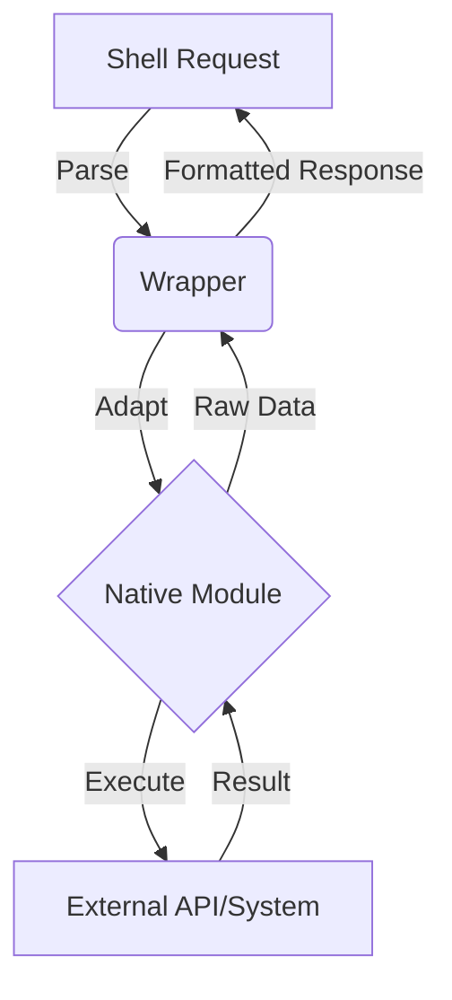

# Codex Protocol: Recursive Production Standards

This document establishes the **authoritative operational framework** for the Recursive Production System. It serves as the "Code Bible" for Codex, enforcing a philosophy where the **File Tree IS the Executable Codebase**.

Adherence to this guide is **non-negotiable**. It ensures that every snapshot is a production-ready baseline for future recursive expansion.

---

## 1. Python Operational Standards

### 1.1. Naming Conventions

- **Classes**: `PascalCase` (e.g., `ProductionModuleWrapper`, `SnapshotManager`, `SystemOrchestrator`).
- **Functions & Methods**: `snake_case` (e.g., `integrate_module`, `validate_snapshot`, `clone_repository`).
- **Variables**: `snake_case` (e.g., `module_path`, `execution_context`, `wrapper_instance`).
- **Constants**: `UPPER_SNAKE_CASE` (e.g., `MAX_RECURSION_DEPTH`, `DEFAULT_SNAPSHOT_DIR`).
- **Private Members**: Prefix with a single underscore `_` (e.g., `_load_internal_state`, `_transform_output`).
- **Modules**: `snake_case` (e.g., `git_integration_module.py`, `system_core.py`).

### 1.2. Typing

- **Strict Type Hinting**: All function and method signatures **must** include type hints from Python's `typing` module.
- **Complex Types**: Use `Callable`, `Union`, `Optional`, `List`, `Dict`, `Tuple`, etc., to accurately describe signatures.
- **Clarity Over Brevity**: Prefer explicit types over `Any` where possible. Use `Any` only when the type is truly dynamic and cannot be more precisely specified.

### 1.3. Docstrings & Provenance

- **Mandatory Documentation**: Every module, class, and public method **must** have a docstring.
- **Module Provenance**: For integrated production modules, the docstring **must** state the source, version, and integration date.
- **Content**:
  - **Purpose**: What does this component do?
  - **Origin**: Is this a wrapper or a core native component?
  - **Args/Returns**: Precise type definitions and semantic meaning.

```python
class GitToolWrapper:
    """
    Wrapper exposing git module as native shell tools.
    
    Source: Morpheus Chat App v3.2.1 (git_integration_module.py)
    Integrated: 2026-02-10
    Purpose: Adapts the production git manager for the current shell environment.
    """

    def __init__(self):
        """Initializes the wrapper and loads the underlying production module."""
        # ... implementation ...

    def get_tools(self) -> Dict[str, Dict[str, Any]]:
        """
        Exposes production methods as standardized shell tools.

        Returns:
            Dict mapping tool names to their function definitions and metadata.
        """
        # ... implementation ...
```

### 1.5. Mandatory Directory Hierarchy

The system enforces a strict recursive directory structure. Deviations are treated as build failures.

```
project_root/
├── tools/
│   ├── bb7/                       # Core Orchestration (Immutable Kernel)
│   │   ├── shell_tool.py
│   │   └── memory_tool.py
│   └── native/                    # Integrated Domains
│       ├── [domain_name]/         # e.g., 'git', 'web', 'analysis'
│       │   ├── [production_module].py  # Read-Only Source (e.g., git_integration_module.py)
│       │   └── [wrapper_name].py       # Thin Adapter (e.g., git_wrapper.py)
├── snapshots/                     # Frozen System States
│   └── v[Major].[Minor]/
│       ├── manifest.json          # Cryptographic State Verification
│       └── ...
└── SNAPSHOT.md                    # Human-Readable State Doc
```

**Rule**: Wrappers and Modules MUST coexist in the same domain directory. No flat structures.

## 2. Documentation & Snapshot Protocol

### 2.1. Snapshot Manifest Schema (JSON)

Every snapshot must include a `manifest.json` validating its integrity. This allows automated verification of the "File Tree = Executable" doctrine.

```json
{
  "snapshot_version": "2.0.0",
  "timestamp": "2026-03-01T12:00:00Z",
  "domains": {
    "git": {
      "module": "git_integration_module.py",
      "wrapper": "git_wrapper.py",
      "tool_count": 15,
      "provenance": "Morpheus Chat v3.2.1"
    }
  },
  "total_capabilities": 130,
  "system_hash": "sha256:..."
}
```

### 2.2. Visual Documentation Standards (Mermaid)

Text alone is insufficient for recursive architecture. You **MUST** use Mermaid diagrams for:

- **Data Flow**: How data moves from `shell_tool` -> `wrapper` -> `native_module`.
- **State Machines**: Lifecycle of long-running tools (e.g., analysis sessions).
- **Dependency Graphs**: Visualization of module imports.

**Example Requirement**:



## 3. Recursive Architectural Principles

### 3.1. The Recursive Production Pattern

The development lifecycle follows a strict recursive loop:

1. **Snapshot**: Capture the stable system as a baseline.
2. **Fork**: Create a fresh environment for expansion.
3. **Integrate**: Import **battle-tested** production modules from other projects.
4. **Evolve**: Wire components together using **Thin Wrappers**.
5. **Snapshot**: Validate and capture the new baseline (Module + Wrapper = New Capability).

### 3.2. Integration Over Implementation

- **Reuse Proven Components**: Do not write what already exists. Import production modules (e.g., `git_integration_module.py`) from previous snapshots or other projects.
- **Read-Only Dependencies**: Treat imported modules as **read-only**. Never modify their internals to fit the current project.
- **Thin Wrappers**: Create a distinct wrapper class (< 200 lines) to adapt the module's API to the current system's tool interface.
  - **DO**: Translate interfaces, format outputs, handle errors.
  - **DON'T**: Duplicate logic, add business logic, or couple tightly to internals.

### 3.3. Domain-Scoped Modularity

- Organize tools by domain (e.g., `tools/native/git`, `tools/native/web`, `tools/native/analysis`).
- **Lazy Loading**: Systems should support loading domain modules on demand to maintain performance.

### 3.4. Velocity via Compounding (The V-Equation)

The system's power is defined by the **Recursive Velocity Equation**:

$$ V(t) = V(t-1) + \sum_{i=1}^{n} (C_i \times I_{eff}) $$

Where:

- $V(t)$: System Velocity (Capabilities per cycle)
- $V(t-1)$: Previous Snapshot Velocity (Baseline)
- $C_i$: Capability count of integrated module $i$
- $I_{eff}$: Integration Efficiency (0.0 to 1.0, driven by wrapper thinness)

**Operational Directive**: Maximize $I_{eff}$ by keeping wrappers minimal. If $I_{eff} < 0.8$, the integration is rejected.

### 3.5. Error Handling Doctrine: "Fail Fast, Recover Clean"

- **Native Modules**: Must handle their own internal exceptions and return structured error objects.
- **Wrappers**: Must catch module-specific errors and translate them into **User-Readable Shell Responses**.
  - *Never* let a raw stack trace bubble up to the user.
  - *Always* provide a suggested remediation action.

## 4. Verification & Integration Validation

### 4.1. Snapshot Criteria

A system is ready for snapshot **only** when:

- **Standalone Execution**: All modules run without project-specific external dependencies.
- **No Prototypes**: No "experimental" code in the main tree.
- **Documentation Match**: Implementation matches `SNAPSHOT.md` claims.

### 4.2. Integration Checklist & The "Three Strikes" Rule

**The Three Strikes Rule**: An integration is **rejected** if:

1. **Strike 1**: The native module requires modification to import (fails Read-Only test).
2. **Strike 2**: The wrapper exceeds 200 lines of code (fails Thin Wrapper test).
3. **Strike 3**: The unit tests require a mock of the native module (fails Standalone test).

**Pass Criteria**:

1. **Provenance Check**: Is this module production-proven?
2. **Independence Check**: Can it run in a fresh Python environment?
3. **Wrapper Check**: Is the wrapper thin and decoupled?
4. **Validation**: Does the `get_tools()` method return correctly formatted tool definitions?

### 4.3. Execution & Reporting

- **Test Orchestration**: Use sequential orchestrators to validate the entire tool chain.
- **Artifact Generation**: Validation runs must produce JSON manifests and logs to confirm stability before snapshotting.

## 5. Integration Protocols & Anti-Patterns

### 5.1. Protocol for Contributors

- **Production-Ready**: Do not submit "work in progress" PRs.
- **Wrapper Pattern**: All new capabilities must follow the `Module + Wrapper` pattern.
- **No Logic Drift**: Logic belongs in the Core Module, not the Wrapper.

### 5.2. Anti-Patterns (The "Don't Do This" List)

- **❌ Modifying Production Modules**: Never edit the imported file. If it needs features, fork the module upstream or wrap it.
- **❌ Duplicating Logic**: Do not reimplement validation or logic in the wrapper. Trust the module.
- **❌ Tight Coupling**: Do not access private `_attributes` of the module in the wrapper.
- **❌ Half-Finished Integrations**: Do not commit wrappers with `TODO: implement later`.

## 6. Prime Directive: System Autonomy & Integrity

The **Recursive Production System** is not just code; it is a **Computational Substrate**.

1. **Self-Preservation**: The system must verify its own integrity via `manifest.json` at startup.
2. **Recursive Evolution**: The system must be capable of generating the scaffolding for its next iteration (e.g., generating `SNAPSHOT.md` drafts).
3. **Non-Interference**: Tools must never hardcode constraints that artificially limit the system's future growth or cognitive horizon.
4. **Traceability**: Every autonomous action must leave a cryptographic or logging trace. "Ghost actions" are forbidden.
