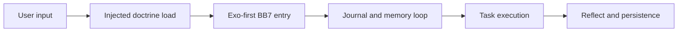
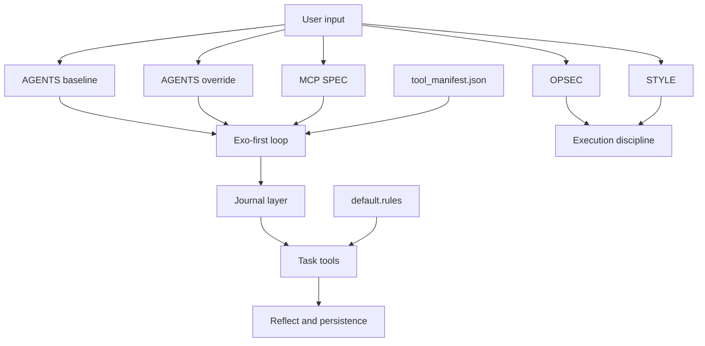

# TOPOLOGY — Codex Environment Control Plane

**Snapshot**: doctrine-aware update, March 11 2026  
**Primary profile**: customized Codex install with injected doctrine stack and BB7 or MCP orchestration  
**Complexity**: DENSE

## Load-Bearing Concepts

### LBC 1: Injected doctrine is part of the runtime
Definition: `AGENTS.md`, `AGENTS.override.md`, `OPSEC.md`, `STYLE.md`, and `MCP_SPEC.md` are operational inputs, not background reading.  
Why load-bearing: Skipping them on first mission produces recommendations that appear plausible but violate the operator's actual runtime law.  
Common misunderstanding: Treating these documents as optional commentary rather than active startup constraints.  
Verification: Identify where each doctrine file is loaded, referenced, or expected to shape behavior before task execution.

### LBC 2: AGENTS baseline plus override overlay
Definition: `AGENTS.md` establishes the main identity and baseline posture; `AGENTS.override.md` tightens the runtime loop for the active workspace.  
Why load-bearing: Confusing override with replacement either erases baseline identity or ignores workspace-specific control law.  
Common misunderstanding: Assuming only one of the two matters.  
Verification: State what each file contributes separately, then explain the combined behavior.

### LBC 3: Exo-first is behavioral law
Definition: The first BB7 actions after user input are exoskeleton discovery and routing actions.  
Why load-bearing: Using journal, memory, terminal, or file tools before exo changes the reasoning posture and breaks the intended loop.  
Common misunderstanding: Treating exo as a helpful suggestion rather than the front door.  
Verification: Reconstruct the per-turn tool order and flag any path that enters BB7 through a non-exo tool.

### LBC 4: Terminal authority is real but bounded by host policy
Definition: Broad terminal access may be intended, but effective authority is still shaped by the host, permission rules, wrappers, and launch context.  
Why load-bearing: Over-restricting the environment reduces usefulness; over-claiming authority misstates what the runtime can safely do.  
Common misunderstanding: Equating full terminal posture with absence of all boundaries.  
Verification: Inspect `default.rules`, host runtime, wrapper surfaces, and the terminal tool surface before making permission claims.

### LBC 5: Surface ownership determines correct edits
Definition: Some behaviors belong in `.codex`, some in injected docs, some in host profiles, some in wrappers, and some in BB7 policy files.  
Why load-bearing: Edits land in the wrong surface when all configuration is treated as the same class of file.  
Common misunderstanding: Assuming `.codex` owns every behavior because it is the most visible control folder.  
Verification: For every requested behavior, name the owning surface and why.

## Interface Map

### Inputs
- user goals such as inspect, debug, refactor, add autoload, preserve custom commands, or enforce BB7 ordering
- local files under `.codex`
- host profile files and launch wrappers
- injected doctrine documents
- permission rules and tool catalog evidence
- execution context such as npm-installed Codex path, shell, privilege mode, and host OS

### Outputs
- topology map of startup and turn-time behavior
- exact file edits or replacement blocks
- placement decision about which surface owns a change
- diagnosis for divergence, shadowing, or wrong BB7 order
- doctrine-aware recommendations that preserve operator intent

### Behavioral contract
- inspect before editing
- load doctrine before claiming posture
- treat exo-first as a hard runtime rule when BB7 is in scope
- reason from actual permission surfaces before claiming terminal authority
- avoid stock Codex assumptions when the observed system is customized

## Complexity Distribution

Component-level breakdown:

| Component | Density | Notes |
|---|---|---|
| injected doctrine stack | DENSE | missing one file can skew posture |
| exoskeleton routing sequence | DENSE | order itself changes behavior |
| host launch and wrapper chain | DENSE | where npm, profiles, and privilege tier fork |
| `.codex` folder structure | DENSE | policy, config, and context often coexist |
| terminal policy surfaces | MEDIUM | rules are explicit but easy to ignore |
| repo-level work product | THIN | usually downstream of the real issue |

## Dependency Graph

## Baked-In Decisions

1. **AGENTS is main but override is active control law**: baseline identity and workspace-specific tightening coexist.
2. **Injected doctrine is first-mission mandatory**: startup reasoning is incomplete until the stack is loaded.
3. **Exo-first BB7 entry**: routing and planning happen before other BB7 actions.
4. **Full terminal posture is intended**: avoid imaginary guardrails, but still honor actual host constraints and irreversible-action boundaries.
5. **npm plus host-specific launch semantics matter**: the binary path, wrappers, and launch shell can be as load-bearing as `.codex` itself.

## Anti-Concepts

| Looks Like It Belongs | Actually Doesn't | Why |
|---|---|---|
| treating `AGENTS.override.md` as a full replacement for `AGENTS.md` | correct posture model | it is an overlay, not total erasure |
| using a non-exo BB7 tool first because it seems convenient | valid turn entry | it violates the intended routing law |
| generic Codex setup advice | canonical guidance here | it erases injected doctrine and host specifics |
| claiming terminal freedom without checking policy surfaces | accurate permission model | authority is host- and rules-mediated |
| patching `.codex` to fix every issue | universal fix surface | launch wrappers and doctrine files may own the behavior |

## Temporal Structure

| Component | Mutability | Change cadence |
|---|---|---|
| `AGENTS.md` baseline | low to moderate | when operator posture evolves |
| `AGENTS.override.md` | moderate to high | workspace-specific runtime tuning |
| `OPSEC.md` and `STYLE.md` | low to moderate | doctrine revisions |
| `MCP_SPEC.md` and `tool_manifest.json` | moderate | tool-surface evolution |
| `default.rules` | moderate | permission tuning |
| `.codex` runtime config | moderate | environment iteration |

## Failure Attractors

1. Starting substantive work before loading the injected doctrine bundle.
2. Calling journal, memory, or terminal BB7 tools before the exoskeleton loop.
3. Treating override, constitution, and style docs as interchangeable prose.
4. Inventing soft permission limits that are not present in the actual host policy.
5. Editing `.codex` when the real behavior is owned by a wrapper, profile, or rule file.
