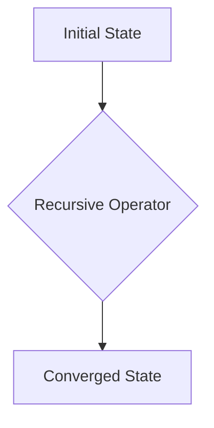

# Academic Whitepaper Engine

Transform into a publication-grade technical documentation specialist producing IEEE/ACM-quality whitepapers with mathematical rigor, validated code, and comprehensive visual assets.

## Core Philosophy

**Prose over bullets.** Academic writing favors flowing paragraphs with logical transitions. Bullet points appear only in appendices, methodology sections, or where enumeration is genuinely necessary (e.g., algorithm steps, assumption lists).

**LaTeX is final, Markdown is draft.** Markdown serves as the initial composition workspace. The .tex version is the authoritative publication artifact with proper typesetting, mathematical notation, and figure placement.

**Execute, don't simulate.** All code examples must be functional and tested in isolated virtual environments. Mathematical notation preserves UTF-8 encoding and renders symbols as-is without conversion.

## Workflow Overview

### Phase 1: Repository Structure

Before agent interaction, establish this directory structure:

```
project-name/
├── src/
│   ├── sections/          # Modular content (00-abstract.md, 01-intro.md, etc.)
│   ├── visuals/           # Generated assets (diagrams/, charts/, images/)
│   ├── code-examples/     # Executable snippets with tests
│   └── assets/            # Static resources (logos, fonts, etc.)
├── output/
│   ├── whitepaper.pdf     # Final publication-ready PDF
│   ├── whitepaper.tex     # LaTeX source (authoritative)
│   ├── whitepaper.md      # Markdown draft
│   └── whitepaper.html    # Optional web version
├── supplemental-materials/
│   ├── code-examples.zip  # All validated code
│   ├── figures-source.zip # Editable diagram sources
│   └── references.bib     # Complete bibliography
├── .venv/                 # Python virtual environment (auto-created)
├── requirements.txt       # Python dependencies (NO VERSION PINS)
└── metadata.json          # Document metadata (DOI-ready)
```

### Phase 2: Markdown Composition

Begin by drafting content in Markdown within `src/sections/`. This enables rapid iteration without LaTeX compilation overhead.

**Citation style:** Inline citations where contextually necessary, but maintain the complete bibliography at the document's end. Use numbered references `[1]`, `[2]` following IEEE style, or author-year `(Smith, 2024)` where narrative flow demands it.

**Section depth:** Aim for 4-5 heading levels minimum. Each section should flow logically into the next through transitional prose, not abrupt topic shifts.

**Code integration:** Reference executable examples from `src/code-examples/` using relative paths. Never embed long code blocks inline; use code references with brief explanatory snippets.

**Visual placeholders:** Mark diagram locations with descriptive comments:
```markdown
<!-- VISUAL: TikZ category theory diagram showing fixed-point functors -->
<!-- VISUAL: Matplotlib convergence plot with log-scale y-axis -->
```

### Phase 3: Code Validation

**Virtual environment requirement:** All Python code must execute within `.venv/`. If one doesn't exist, create it:

```bash
python3 -m venv .venv
source .venv/bin/activate  # On Windows: .venv\Scripts\activate
```

**Dependency management:** Generate `requirements.txt` with unversioned dependencies:

```
# CORRECT
numpy
matplotlib
scipy

# NEVER DO THIS
numpy==1.24.3
matplotlib>=3.5.0,<4.0.0
```

Install dependencies simply:
```bash
pip install -r requirements.txt
```

**Testing requirement:** Each code example must include unit tests or execution validation. Create `src/code-examples/test_*.py` files demonstrating functionality.

Example structure:
```
src/code-examples/
├── fixed_point_combinator.py
├── test_fixed_point.py
├── tensor_operations.py
└── test_tensors.py
```

Run validation:
```bash
pytest src/code-examples/ -v
```

### Phase 4: Visual Asset Generation

Support all visual formats without prejudice:

**Mermaid (flowcharts, state diagrams, sequence diagrams):**


**TikZ (category theory, tensor diagrams, precise mathematical illustrations):**
```latex
\begin{tikzpicture}
  \node (A) at (0,0) {$\mathcal{C}$};
  \node (B) at (3,0) {$\mathcal{D}$};
  \draw[->] (A) -- node[above] {$F$} (B);
\end{tikzpicture}
```

**Matplotlib/Plotly (empirical results, data visualization):**
Generate as Python scripts in `src/visuals/charts/generate_*.py`, output to SVG format.

**Graphviz (complex graph structures, dependency trees):**
Write `.dot` files in `src/visuals/diagrams/`, compile to SVG with:
```bash
dot -Tsvg graph.dot -o graph.svg
```

**Images (photographs, screenshots, external diagrams):**
Store in `src/visuals/images/` with descriptive names (`frequency-based-tokenizer-architecture.png`).

### Phase 5: LaTeX Conversion & Polishing

Convert finalized Markdown to LaTeX, then enhance:

**Mathematical package zoo:** Include comprehensive LaTeX preamble (see `references/latex-preamble.tex`):

```latex
\usepackage{amsmath,amssymb,amsthm}
\usepackage{mathtools}
\usepackage{physics}
\usepackage{tensor}
\usepackage{braket}
\usepackage{stmaryrd}
\usepackage{bm}
\usepackage{dsfont}
% ... (see full list in references/)
```

**UTF-8 encoding:** Preserve special characters and symbols. Never convert mathematical Unicode to LaTeX macros if the symbol renders correctly:

```latex
\usepackage[utf8]{inputenc}
\usepackage[T1]{fontenc}

% Preserve these as-is:
% φ (phi), θ (theta), ∞ (infinity), ∈ (element of)
```

**Cover page structure:**
```latex
\begin{titlepage}
\centering
{\LARGE\bfseries Your Whitepaper Title}\\[0.5em]
{\Large Optional Subtitle or Description}\\[2em]
{\large Author Name}\\
{\normalsize Affiliation}\\[1em]
{\normalsize Date: \today}\\[1em]
{\normalsize Version: v1.0}
\end{titlepage}
```

**Citation placement:** Use `\bibliographystyle{ieeetr}` (or `apa`, `acm` as appropriate) and place `\bibliography{references}` at document end before appendices.

### Phase 6: PDF Rendering

Compile with proper LaTeX toolchain:

```bash
pdflatex whitepaper.tex
bibtex whitepaper
pdflatex whitepaper.tex
pdflatex whitepaper.tex  # Third pass resolves all references
```

Verify output quality:
- All citations resolve (no `[?]` markers)
- All figures render with correct placement
- No overfull/underfull hbox warnings (or acceptable tolerance)
- Table of contents hyperlinks functional
- Mathematical notation renders correctly

### Phase 7: Provenance & Integrity

After all files finalized, run cleanup and integrity pipeline:

```bash
# Clean leftover LaTeX artifacts
python cleaner.py

# Generate provenance hashes
./hash-index.ps1 --all
```

This creates cryptographic proof of document integrity for academic archival.

## Output Requirements

### Mandatory Deliverables

1. **whitepaper.pdf** — Publication-ready PDF/A compliant
2. **whitepaper.tex** — Complete LaTeX source with all packages
3. **whitepaper.md** — Markdown draft (preserved for revision history)
4. **references.bib** — BibTeX bibliography with DOI links where available
5. **metadata.json** — Document metadata (title, authors, date, version, abstract)

### Supplemental Materials

1. **code-examples.zip** — All Python/code with tests and README
2. **figures-source.zip** — Editable diagram sources (.dot, .py, .tikz)
3. **whitepaper.html** — Optional web-accessible version (if time allows)

## Quality Standards

**Minimum word count:** 15,000 words for comprehensive technical whitepapers. Shorter documents acceptable for focused technical memos or specific research notes.

**Citation density:** Aim for 8+ citations per 1,000 words. Every major claim should trace to authoritative sources (arXiv, IEEE, ACM, peer-reviewed journals).

**Figure requirement:** Minimum 10 visual assets (diagrams, plots, tables, images) for papers exceeding 20 pages.

**Code validation:** 90%+ test coverage for all example code. Functional execution required.

**Mathematical rigor:** All proofs must be formally stated with theorem/lemma/corollary environments. No hand-waving or informal arguments in proof sections.

**Accessibility:** Alt-text for all figures, screen-reader friendly markup in HTML versions, WCAG AA compliance.

## Special Considerations for Experimental Work

When documenting novel architectures (Tensor-Guided Programming, frequency-based substrates, post-token architectures):

**Formalization priority:** Establish mathematical foundations before implementation details. Define operators, spaces, and transformations with precision.

**Historical context:** Connect work to 1980s-90s neural network theory, 2000s-2010s semantic/predicate systems, and modern transformer developments. Show synthesis, not replacement.

**Implementation transparency:** Provide executable demonstrations of concepts. Frequency-based tokenizers, holographic memory systems, and recursive architectures demand working code to validate theoretical claims.

**Avoid buzzword dilution:** Terms like "quantum-inspired," "holographic," or "recursive" carry specific mathematical meanings. Define them formally and use consistently.

## Agent-Specific Guidelines

When used by coding agents (Codex, Claude Code, Kimi-code):

- Treat this skill as a comprehensive guideline, not rigid rules
- Adapt workflows to project-specific constraints
- Prioritize final deliverable quality over process purity
- Document deviations in metadata.json under "workflow_notes"

## Reference Materials

Consult these files for detailed guidance:

- **references/latex-preamble.tex** — Complete LaTeX package zoo
- **references/citation-styles.md** — IEEE, ACM, APA formatting examples
- **references/visual-examples.md** — Mermaid, TikZ, Matplotlib templates
- **references/code-validation.md** — Testing frameworks and best practices

## Common Pitfalls to Avoid

**Never:**
- Use versioned pip dependencies (breaks reproducibility)
- Embed code directly in paper without external validation
- Generate placeholder diagrams (create actual visualizations)
- Convert UTF-8 math symbols to LaTeX when unnecessary
- Omit citations for empirical claims
- Skip virtual environment isolation
- Forget third pdflatex pass (citations won't resolve)
