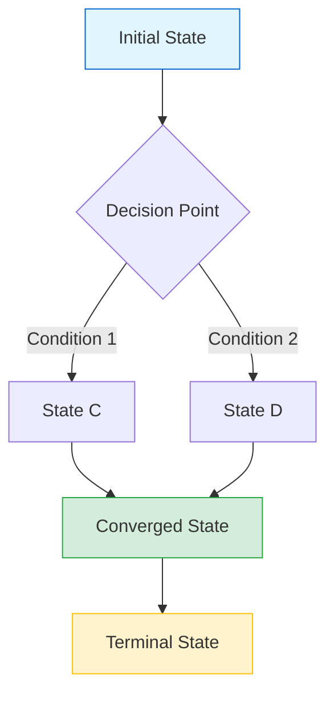
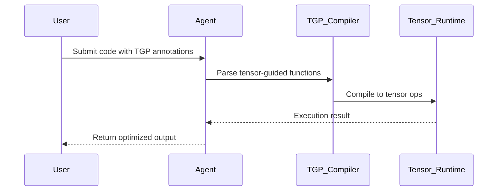
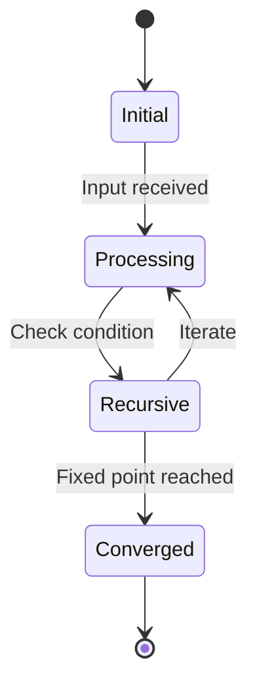
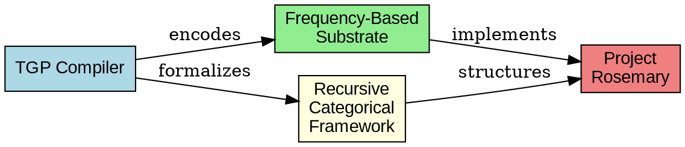
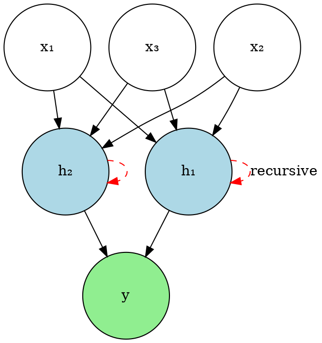

# Visual Asset Templates

Comprehensive examples for all supported visualization formats.

## Mermaid Diagrams

### Flowchart (State Transitions)


### Sequence Diagram (System Interactions)


### State Diagram (Recursive Process)


## TikZ Diagrams

### Category Theory Diagram (Functors)
```latex
\begin{tikzpicture}[node distance=3cm, auto]
  % Define styles
  \tikzstyle{category} = [draw, circle, minimum size=1.5cm]
  \tikzstyle{functor} = [->, thick]
  
  % Categories
  \node[category] (C) {$\mathcal{C}$};
  \node[category, right of=C] (D) {$\mathcal{D}$};
  \node[category, below of=C] (E) {$\mathcal{E}$};
  
  % Functors
  \draw[functor] (C) -- node {$F$} (D);
  \draw[functor] (C) -- node[left] {$G$} (E);
  \draw[functor] (E) -- node[below] {$H$} (D);
  
  % Natural transformation
  \node at (1.5, -1.5) {$\eta: G \Rightarrow H \circ F$};
\end{tikzpicture}
```

### Tensor Network Diagram
```latex
\begin{tikzpicture}
  % Define tensor nodes
  \node[draw, rectangle, minimum size=1cm] (T1) at (0,0) {$T_1$};
  \node[draw, rectangle, minimum size=1cm] (T2) at (3,0) {$T_2$};
  \node[draw, rectangle, minimum size=1cm] (T3) at (1.5,2) {$T_3$};
  
  % Connections (indices)
  \draw[thick] (T1.north) -- node[left] {$i$} (T3.south west);
  \draw[thick] (T2.north) -- node[right] {$j$} (T3.south east);
  \draw[thick] (T1.east) -- node[below] {$k$} (T2.west);
  
  % External indices
  \draw[thick] (T1.west) -- ++(-0.5,0) node[left] {$\alpha$};
  \draw[thick] (T2.east) -- ++(0.5,0) node[right] {$\beta$};
  \draw[thick] (T3.north) -- ++(0,0.5) node[above] {$\gamma$};
\end{tikzpicture}
```

### Fixed-Point Iteration Diagram
```latex
\begin{tikzpicture}
  % Axes
  \draw[->] (0,0) -- (5,0) node[right] {$n$ (iterations)};
  \draw[->] (0,0) -- (0,4) node[above] {$d(X_n, X^*)$};
  
  % Convergence curve
  \draw[thick, blue, domain=0:4.5, samples=100] 
    plot (\x, {3*exp(-0.5*\x)});
  
  % Fixed point line
  \draw[dashed, red] (0,0.1) -- (5,0.1) node[right] {$\epsilon$};
  
  % Labels
  \node at (2.5, 3.5) {Exponential convergence};
  \node at (4, 0.5) {$d(X_n, X^*) < \epsilon$};
\end{tikzpicture}
```

## Matplotlib/Python Visualizations

### Convergence Plot (Empirical Results)
```python
import matplotlib.pyplot as plt
import numpy as np

# Generate data
iterations = np.arange(0, 50)
distance = 10 * np.exp(-0.15 * iterations) + np.random.normal(0, 0.1, 50)

# Create plot
fig, ax = plt.subplots(figsize=(8, 5))
ax.semilogy(iterations, distance, 'o-', linewidth=2, markersize=4)
ax.axhline(y=0.1, color='r', linestyle='--', label='Threshold $\\epsilon$')

# Styling
ax.set_xlabel('Iteration $n$', fontsize=12)
ax.set_ylabel('Distance $d(X_n, X^*)$', fontsize=12)
ax.set_title('RCF Fixed-Point Convergence Rate', fontsize=14)
ax.grid(True, alpha=0.3)
ax.legend()

# Save as vector
plt.tight_layout()
plt.savefig('convergence-plot.svg', format='svg', dpi=300)
plt.close()
```

### Frequency Spectrum Visualization
```python
import matplotlib.pyplot as plt
import numpy as np

# Generate frequency data
frequencies = np.linspace(0, 100, 1000)
amplitude = np.abs(np.sin(frequencies / 5) * np.exp(-frequencies / 50))

# Create plot
fig, ax = plt.subplots(figsize=(10, 4))
ax.fill_between(frequencies, 0, amplitude, alpha=0.6, color='blue')
ax.plot(frequencies, amplitude, color='navy', linewidth=2)

# Styling
ax.set_xlabel('Frequency (Hz)', fontsize=12)
ax.set_ylabel('Amplitude', fontsize=12)
ax.set_title('Frequency-Based Substrate Spectrum', fontsize=14)
ax.grid(True, alpha=0.3, linestyle=':')

plt.tight_layout()
plt.savefig('frequency-spectrum.svg', format='svg', dpi=300)
plt.close()
```

### Heatmap (Tensor Operations)
```python
import matplotlib.pyplot as plt
import numpy as np

# Generate tensor data
data = np.random.randn(10, 10)
correlation = np.corrcoef(data)

# Create heatmap
fig, ax = plt.subplots(figsize=(8, 6))
im = ax.imshow(correlation, cmap='RdBu_r', vmin=-1, vmax=1)

# Colorbar
cbar = plt.colorbar(im, ax=ax)
cbar.set_label('Correlation Coefficient', rotation=270, labelpad=20)

# Labels
ax.set_xlabel('Tensor Dimension $i$', fontsize=12)
ax.set_ylabel('Tensor Dimension $j$', fontsize=12)
ax.set_title('Tensor Correlation Matrix', fontsize=14)

plt.tight_layout()
plt.savefig('tensor-heatmap.svg', format='svg', dpi=300)
plt.close()
```

## Graphviz (DOT Language)

### Dependency Graph


### Neural Architecture Graph


## Plotly Interactive Visualizations

### 3D Surface Plot (Tensor Landscape)
```python
import plotly.graph_objects as go
import numpy as np

# Generate 3D data
x = np.linspace(-5, 5, 100)
y = np.linspace(-5, 5, 100)
X, Y = np.meshgrid(x, y)
Z = np.sin(np.sqrt(X**2 + Y**2)) / np.sqrt(X**2 + Y**2 + 1)

# Create plot
fig = go.Figure(data=[go.Surface(z=Z, x=X, y=Y, colorscale='Viridis')])
fig.update_layout(
    title='Tensor Operator Landscape',
    scene=dict(
        xaxis_title='Dimension 1',
        yaxis_title='Dimension 2',
        zaxis_title='Operator Value'
    ),
    width=800,
    height=600
)

fig.write_html('tensor-landscape.html')
```

## Best Practices

### Resolution & Format
- **Vector formats preferred:** SVG for diagrams, PDF for LaTeX inclusion
- **Raster fallback:** PNG at 300 DPI minimum
- **File size:** Optimize SVGs, compress PNGs with `optipng`

### Accessibility
- **Alt-text:** Every figure must have descriptive alt-text
- **Color blindness:** Use ColorBrewer palettes (Set2, Paired)
- **High contrast:** WCAG AA minimum (4.5:1 for normal text)

### Consistency
- **Fonts:** Match paper font (Computer Modern for LaTeX, Open Sans for web)
- **Color scheme:** Consistent across all visualizations
- **Style:** Unified axis labels, grid styles, marker shapes

### LaTeX Integration
```latex
\begin{figure}[htbp]
  \centering
  \includesvg[width=0.8\textwidth]{path/to/diagram.svg}
  \caption{Descriptive caption with technical detail. 
           (a) Subfigure description. (b) Second part.}
  \label{fig:diagram-name}
\end{figure}
```

### Markdown Integration
```markdown


<!-- Reference in text -->
As shown in Figure 1, the convergence rate exhibits exponential decay...
```
