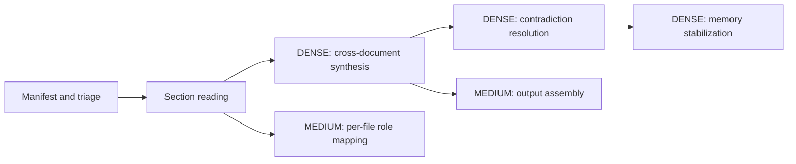
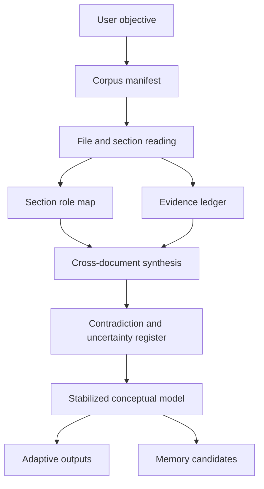

# TOPOLOGY — document omniscient

**Purpose**: Define the cognitive topology of large-corpus analysis so the skill reasons over structure, not just text fragments.

## Load-Bearing Concepts

### LBC 1: Corpus-level meaning
Definition: The meaning of a file is partly determined by its relationship to the other files in the set.

Why load-bearing: A document that looks trivial alone may be normative, obsolete, contradictory, or decisive when placed next to the rest of the corpus.

Common misunderstanding: Treat every file as an independent summary target.

Verification: State why each file exists in the set and what would be lost if it were removed.

### LBC 2: Section function
Definition: Every meaningful section has a job beyond its surface prose.

Why load-bearing: The same paragraph can serve as definition, caveat, rationale, legal shield, implementation note, historical residue, or political compromise.

Common misunderstanding: Extract what a section says without identifying what it is doing.

Verification: Label each important section by role as well as content.

### LBC 3: Coverage accountability
Definition: Exhaustiveness is a tracked property, not a feeling.

Why load-bearing: Large uploads invite confident skipping. Without explicit coverage accounting, missing sections become invisible failure sources.

Common misunderstanding: Assume that reading the beginning, heading structure, or a few dense pages is enough.

Verification: Maintain a manifest or ledger that records which files and sections were covered, sampled, deferred, or unread.

### LBC 4: Evidence provenance
Definition: Claims about the corpus need anchors in concrete documents, sections, tables, or figures.

Why load-bearing: Cross-document analysis becomes unreliable if the model cannot trace where a belief came from.

Common misunderstanding: Collapse repeated impressions into uncited certainty.

Verification: Tie important claims back to specific files and sections whenever possible.

### LBC 5: Concept stabilization before memory
Definition: Memory should capture durable structure only after contradictions and ambiguities have been processed.

Why load-bearing: Early memory writes freeze provisional interpretations into future bias.

Common misunderstanding: Save whatever seems important immediately after the first pass.

Verification: Produce a belief split between stable, provisional, and unresolved items before persisting anything.

### LBC 6: Environment-aware externalization
Definition: Use available tools to externalize state instead of pretending hidden context is enough.

Why load-bearing: Large-corpus analysis creates ledgers, tables, graphs, and timelines that exceed the reliability of pure conversational recall.

Common misunderstanding: Keep the whole corpus model implicit.

Verification: Use code execution, tables, artifacts, or durable files whenever they improve fidelity.

## Interface Map

### Inputs
- uploaded documents in chat
- project knowledge files
- linked or synced documents
- user framing about desired outcomes

### Outputs
- corpus map
- conceptual model
- contradiction and uncertainty register
- memory candidates or memory updates
- optional artifacts such as timelines, glossaries, ledgers, and synthesis memos

### Behavioral contract
- read deliberately
- make coverage visible
- explain significance, not only contents
- stop memory until the model stabilizes
- state confidence limits honestly

## Complexity Distribution

| Component | Density | Why |
|-----------|---------|-----|
| Manifest and triage | medium | Drives coverage and reading order |
| Section reading | medium | Requires discipline, less inference |
| Cross-document synthesis | dense | Meaning emerges here |
| Contradiction resolution | dense | Requires judgment and evidence control |
| Memory stabilization | dense | High risk of freezing wrong abstractions |
| Output assembly | medium | Important but derivative |

## Dependency Graph

## Baked-In Decisions

1. Corpus-first over file-first: isolated summaries are secondary to system understanding.
2. Coverage must be explicit: no silent skipping.
3. Tool use is part of reasoning quality, not an optional convenience.
4. Memory is downstream of stabilization, not upstream of reading.

## Anti-Concepts

| Looks Like It Belongs | Actually Doesn't | Why |
|-----------------------|-----------------|-----|
| A fast executive summary | Not by itself | Can hide skipped sections and unresolved contradictions |
| Per-file summaries only | Not sufficient | Misses why the files were assembled together |
| Immediate memory write | Not safe | Freezes premature interpretations |
| Purely local reading | Not enough | Corpus meaning often sits in the edges between files |

## Temporal Structure

| Component | Mutability | Change Cadence |
|-----------|------------|----------------|
| Uploaded corpus | fixed per run | changes when files are added or replaced |
| Project knowledge | semi-stable | evolves over time |
| Conceptual model | provisional then stabilized | should update as evidence grows |
| Memory entries | durable | only after stabilization |

## Failure Attractors

1. Premature neatness: the answer sounds polished before the corpus has been traversed.
2. File myopia: each file is understood locally, but the set is not understood globally.
3. Confidence drift: provisional patterns get described as settled facts.
4. Tool starvation: code execution or artifacts would help, but the model stays in plain chat mode.
5. Memory poisoning: unstable interpretations are persisted too early.
